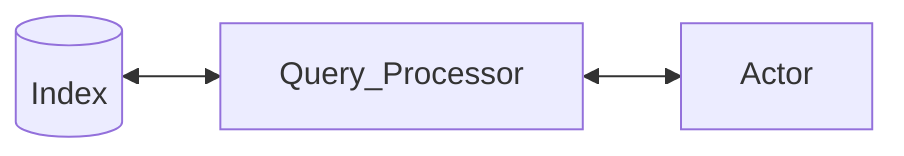
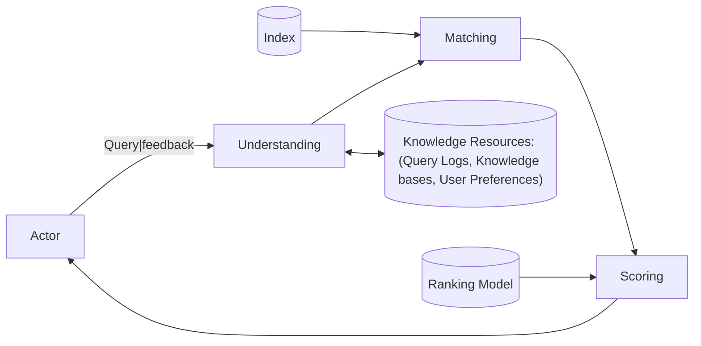
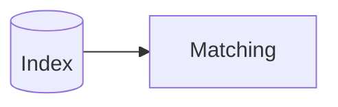
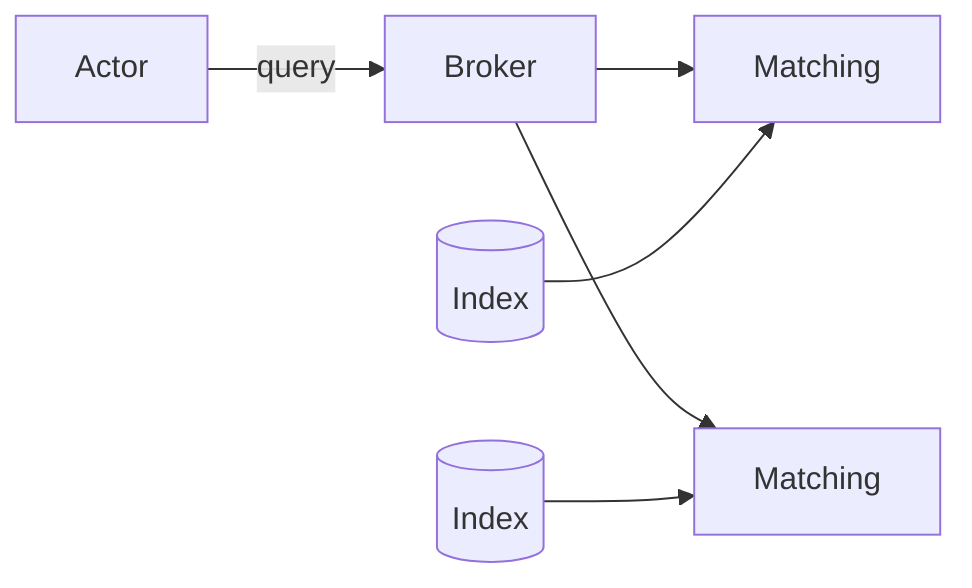

# Recuperação de Informação

- Professor: Rodrygo Luis Teodoro Santos
- Email: <rodrygo@dcc.ufmg.br>
- [Pre-Course Survey](https://docs.google.com/forms/d/e/1FAIpQLSfJK_YDa9bH8wzg-xKOWxyShF7MLR8DkvcCRyzEM1R5ofNmsQ/formResponse)

## Aula 01 - 12/03/2025

Essa é a área principal de pesquisa dele. Ele também tem foco nos sistemas de recomendação.

A última edição foi dois anos atrás.

A disciplina está passando por grandes mudanças devido as IAs.

> Information retrieval is a field concerned with the structure, analysis, organization, storage, searching, and retrieval of information.
> Gerard Salton, 1968

- Retrieval tasks
  - Search
    - 1 Query
  - Recommendation
    - 0 Query
  - Anticipation
    - -1 Query
  - Conversation
    - n queries

"O problema está longe de ser resolvido"

"O sistema é muito limitado em várias dimensões"

- Our focus: search
  - User's perspective: accessing information
    - Relevance, Speed
  - Advertiser's perspective: publicity
    - More attention, less ad costs.
  - Search Engine's perspective: monetization
    - More users, more ad revenue, less op costs

---

- O que uma máquina de busca faz?
  - Checagem de correção de ortografia
  - Busca mesmo em caso de erro
  - Query autocompletion and suggestion
  - Generated answers (Uso de IA)
  - Knowledge snippets (fragmentos de informação importantes.)
  - Resposta a perguntas frequentes
  - Buscas relacionadas
  - Personalização (respostas baseadas em informações específicas do usuário)

Busca vertical: buscar informações contidas em um subconjunto de itens diferentes. Ex.: Imagens, vídeos, produtos, etc.

O foco da disciplina será em busca textual.

Nosso foco é o dos "10 blue links". Suponho eu que seria conseguir encontrar os 10 links mais relevantes.

---

- The search problem:
  - Given: some ~~evidence of the user's need~~ query
  - Produce: ~~relevant information~~
  - Produce:
    - a list of matching ~~information items~~ documents
    - In decreasing order of relevance

- Pergunta: é preferível uma resposta direta ou uma lista de documentos?
  - Minha resposta: a resposta direta e objetiva
  - Outra resposta: lista de documentos, porque como as pessoas não sabem exatamente o que querem, é melhor ter uma lista de opções para escolher.
  - Outras resposta: lista de documentos para poder haver um fact checking

As IAs são excessivamente autoconfiantes. Idealmente as pessoas razoáveis verificariam as informações "mas o mundo é cheio de pessoas não razoáveis".

---

Apenas definir se é relevante ou não pode gerar uma quantidade excessiva de informações; então, além disso, é preciso ranquear as informações.

E então, é delegado ao usuário de que forma lidar com as informações que lhe foram passadas.

Com isso, é necessário estimar de quão relevantes são os documentos para determinada consulta.

$f(query, document)$

> E esse problema já não está resolvido? Por que ainda estudamos?
> "Google doesn't have all the answers"

<!-- Slides de PAA:
tinyurl.com/3na6t7dk
-->

- Search in numbers
  - A lot of people
  - From a lot of places
  - Using a lot of devices
    - Smartphones, smartwatch, TV, etc.
    - Exemplo de problemas por dispositivo: se eu estiver usando um speaker, não cabe o retorno de 10 links. Estragaria a experiência do usuário. O texto é muito mais informal e indefinido.
  - Looking for a lot of info
    - Problema: com modelos de imagem generativa, e agora é muito mais fácil de gerar conteúdos falsos.
  - Spread all over the internet
    - É um sistema distribuído; Para onde devo enviar essa query?

---

Nosso foco: Eficiência

- Eficiência é sobre fazer algo, seja boa ou ruim, de forma ótima (mais rápido ou com menos recursos)
- Indicadores chave de performance
  - Latência: demora por busca e muitos documentos
  - Throughput: quantos usuários simultaneamente?
  - Document latency: quão antigos são os documentos?

Eficácia/Efetividade

- Conseguir fazer a coisa certa; Conseguir encontrar os documentos que são relevantes ao usuário.
- Essa relevância é influenciada por vários fatores:
  - Por tópico vs por usuário
  - Por tarefa, contexto, novidade, estilo
  - Quem sabe ao certo a relevância, é o usuário. A máquina de busca apenas estima.

"Se não conseguimos ter certeza absoluta, como podemos nos aproximar o bastante disso?"

- Casamento de strings
  - As LLMs ajudaram bastante na área de casamento de strings.
    - Semântica distribucional
  - Casamento exato
  - Casamento fonético
  - Modificação por radicam (stemming)
  - Dicionário de sinônimos

Ranking models define **a view of** relevance.

- **Dúvida:** por que é usado o termo "documento" e não "página" ou "texto"?
  - "Documento" é um termo mais histórico. Em contexto de web "página" é muito usado, "information item" seria um outro termo genérico válido.

What do search engineers do?

---

- Search pipeline
  - Query
  - query representation
  - Matching + Scoring
  - ONLINE PROCESSING /\
  - OFFLINE PROCESSING \/
  - documento representation
  - Document

- "Já houve alguma pesquisa dizendo que metade das pesquisa feitas num dia são inéditas?"
  - Typos
  - Forma de perguntar
  - Fatos ocorridos recentemente
  - Informações pessoais (CPF)

---

(Continuous) offline processing

- Document acquisition
  - A web é enorme
    - Trillions of known URLs, billions fetched
  - The Web is constantly evolving
    - Updates, additions, deletions
    - Uma situação como o Twitter, até dá para manter um constante fluxo das novas informações e novas postagens, mas para a web como um todo acaba se tornando inviável.
  - Efficient crawling is key
    - Must aim for coverage, but also freshness
- Document understanding
  - Document carry meaning
    - Term-based matching as a first approximation
    - Several techniques to leverage semantics
    - É importante conseguir limpar as informações que se coletam, afinal, as informações de boilerplane não são tão relevantes.
  - Documents vary in quality
    - genuinely: accessibility, readability, authority, depth
    - maliciously: content/link farms, misinformation
- Document indexing
  - Efficient retrieval  through indexes
  - Indexes must be updated
    - New documents, updates, deletionsLike the index of book
      - For each word, a list of document it appears on
    - Broken up into shards of millions of documents
      - 1000s of shards for the web index
    - plus per-document metadata
    - Plus document embeddings

"Representações vetoriais de texto" para possibilitar casamento denso.

---

- Query understanding
  - keywords are poor descriptions of the user's need
    - Interaction and context also matter
  - Query understanding...
    - ...
    - Query scoping through semantic annotation
      - [**san jose** convetion center]
    - Query expansion through acronym expansion
      - [**gm** trucks] -> [**general motors** trucks]
      - [**gm** corns] -> [**genetically modified** corns]
      - "Qual é o ponto exato de corte entre ... e ...? Depende do contexto"
  - Matching and scoring
    - Send the query to all the shards
      - Each shard
        - Finds matching documents
        - Scores each query-document pair
        - Sends back the top n documents
      - Combine all the top documents and sort by score

- **Reflexão:** e se as informações fossem armazenada em hardware assim como são as memórias? Tudo ocorreria basicamente na velocidade da luz, não?

---

- Ranking evaluation
  - Relevance is a user's prerogative
    - We can observe changes in user behavior
    - Or directly ask user how we're doing
  - Evaluation is an empirical science
    - It must be scientifically rigorous
    - It must be economically viable

---

- Course Goals
  - Provide an introductory account of methods for building and evaluating search engines
  - ...
- Course Scope
  - System view
    - Crawling, indexing, retrieval
  - Modeling view
    - Ranking models ("Algumas coisas de machine learning")
  - Behavioral view
    - Ranking evaluation
- Out-of-scope
  - Recommender systems
  - Natural Language Processing
  - Data mining
  - ...
- Course grading (tentative)
  - 50% - Exams
  - 40% - Assignments
  - 10% - Seminars (Pro final da disciplina)
- Chamada
- Course Material: textbooks
  - Search engines: information retrieval in practice
  - Introduction to information retrieval
  - Modern information retrieval
  - Foundations and trends in information retrieval
  - Synthesis lectures on information concepts, retrieval, and services
- Other relevant material
  - General background
    - Algorithms and data structures
    - basic Statistics
    - Basic linear algebra
  - Advanced readings
    - Google Scholar
  - References
    - Search Engines: Information Retrieval in Practice - Ch. 1
    - How Google Works...
    - Pre-course survey

Semana que vem ele envia o material no Moodle.

---

Próxima aula: Search Architecture

## Aula 02 - 17/03/2025

### Slide: Search Architecture

#### Search Infrastructure

- Bandwidth: ...
- Storage: ...
- Processing: crawling, indexing...

Must scale from a single computer in one datacenter...
to huge clusters spread across availability zones

#### Financial costs

- Depreciation: old hardware
- maintenance: failure handling
- Operational: Energy cost

#### Search Architecture

A software achitectuer conssits of software components, the interfaces

- Effectuveness: ...
- Efficiency: ...

#### Search components

World Wide Web > Crawling > Indexing > Query Processing > Ranking > User Interface

- Crawler: é o que navega na internet. Ele gera um Corpus
- Corpus: uma cache da coleção original. Ele é importante para que os dados presentes nele sejam representativos, ou seja, ele filtra a massa de informações presentes na WWW e armazena localmente.
- Indexer: com o corpus, é gerado um índice para facilitar a busca. Um índice invertido é o mais comum.
- Index: serve como um proxy para o que está presente no Corpus, embora possa perder nos detalhes, apresenta um grande ganho na eficiência de busca posterior.
- Query Processor: A pesquisa feita pelo usuário e a forma como ele a busca.

Uma ou mais aulas sobre cada uma dessas coisas. Nessa aula de hoje ele deseja passar de forma mais aprofundade, mas ainda geral, sobre cada um delas.

##### Crawling overview

- Aquisição de documentos: o documento serve como uma generalização de todo o tipo de informação que pode ser buscada. Essa disciplina focará mais na parte textual.
  - BUilds a local corpus for searching
  - Many types - Web, enterprise, desktop

- Web crawlers follow links to find documents
  - Must efficiently find huge numbers of web pages (coverage) and keep them up-to-date (freshness)

---

- Controller: uma forma de definir o comportamento esperado
  - Frontier: uma fila de URLs a serem vasculhadas
- Fetcher: É o que vai buscar a informação da WWW e retorna pro Controller
  - DNS Resolver: uma das partes mais caras, que é a resolução de IP.

```mermaid
flowchart LR

[[Controller]] --> [(Frontier)] --> [[Fetcher]] <-> [[DNS Resolver]] & ((WWW))

[[Fetcher]] --> [[Controller]] --> [(Corpus)]
```

###### Key Challegnes: Crawling

- Web is huge and constantly changing
  - Not under the control of search providers

"O conteúdo em si é selvagem. Tem coisa boa, ruim, bem formatada, mal formatada"

- A lot of time is spent waiting for responses
  - Parallel crawling is essential

- Could potentially flood sites with requests
  - To avoid this problem, use politeness policies
    - [JV: o que seria isso?]
    - "As páginas têm interesse de ser coletados, porque máquinas de busca trazem tráfego. Porém requisições massivas reduzem a resposta de outros usuários, o que pode ser desagradável"

Dúvida de outro aluno: "Se o site é uma ilha: ninguém linka para o meu site e ele não tá indexado, como encontrá-lo?"

Professor: uma forma seriam pelos logs do chrome por exemplo. Se não tá indexado, mas pessoas o acessam, o Chrome talvez tenha algum log e pode informar pro seu BD sobre o site ilhado.

---

##### Indexing Overview

- Document representation
  - From raw text to index terms (Formas buscáveis de representar o texto)
    - Ex.: Autor, data de atualização, etc.
  - Annotations (Ex.: Entidades, categorias, embeddings)
  - Off-document evidente
    - Anchor text, link analysis
      - Texto de âncora é o texto presente...
        - `<a href="https://www.google.com">ESSE TEXTO AQUI</a>`
        - Esse tipo de informação é útil caso, por exemplo, se o site da UOL não citasse "notícias", mesmo que seja sobre notícias, porém, se nos anchor texts essa informação estivesse presente, seria possível inferir que o site é sobre notícias.
    - Social Network Signals

---

- Document representation
  - Topical Features: informações textuais presentes no documento
  - Quality Features: Incoming links, days since last update

---

```mermaid
flowchart lr

CP[(Crpus)]
PR[[Parser]]
TK[[Tokenizer]]
AN[[Analyser]]
WR[[Writer]]
ID[(Index)]

CP --> PR --> TK --> AN --> WR --> ID
```

- Corpus
- Parser: filtra de alguma forma o texto
- Tokenizer: separa em blocos de texto úteis [JV: é mais ou menos isso]
- Analyzer: processa mai
- Writer: armazena o que foi analizado de alguma forma
- Index: estoca os dados encontrados

###### Key challenges: Indexing

- Support effective retrieval
  - Extract meaningful document features
  - Both ropical and quality features
- Support efficient retrieval
  - ...

###### Index Structures

Uma das estruturas mais comuns é o índice invertido.

---

Example "Corpus"

Incidence Matrix: geralmente não se armazenam em matrizes por ocupar muito espaço.

O índice invertido é basicamente uma lista de adjacência.

Uma forma de enriquecer o índice é através da adição de frequência de cada uma das palavras.

Outro método poderia ser a informação da posição em que aparece a palavra. A importância disso é que, se o usuário está buscando por duas palavras, é esperado que essas duas palavras, caso encontradas no índice remissivo esteja próximas entre si.

- Inverted index: fields
  - Document structure is useful in search
    - field restrictions (date, from)
    - Some fields are more important than others
  - ...

- Auxiliary Structures
  - Vocabulary, dictionary, or lexicon
    - Lookup table from term to inverted list
      - Pode-se armazenar um mapa de determinada palavra para que se defina a posição na memória em que a informação está guardada
    - Either Hash table in memory or B-tree for disk
  - Additional strucures for document data
    - Basic statistics, static features, metadata
  - Additional strucutre for corpus statistics

##### Query Processing Overview

- Query representation
  - Infers user's need from a keyword query
- Document ranking
  - Matches...
- ...

---

```mermaid
flowchart LR

Person ((Actor))
Und[[Understanding]]
Know[[Knowledge Resources]]

Person -->|Query/Feedback| Und
Und <--> Know
...
```

- Query
  - Understanding
    - Knowledge Resources
      - Query Logs
      - Knowledge bases
      - User Preferences
  - Matching
    - Index
  - Scoring
    - Ranking Model
- Usuário

###### Key Challenges: Query Processing

- Queries are typically short, ill-specified
  - Long queries tend to be difficult
- Finding matching documents can be expensive
  - Particularly for common terms or long queries
- Ranking is a tough business
  - Different Queries, different requirements

---

###### Query Understanding

É basicamente uma mudança da consulta. Onde a máquina de busca muda o que foi pesquisado originalmente para melhorar a pesquisa.

- expand matches
  - Query relaxation: aumentar a chance de encontrar o que o usuário quer
    - [Information about tropical fish]
      - [Tropical Fish]
  - Query expansion: aumentar a chance de encontrar o que o usuário quer
    - [Tropical Fish]
- Narrow results
  - Query Segmentation
    - Tropical Fish captive breeding
      - ["Tropical fish" AND "captive breeding"]
  - Query Scoping
    - [Tropical fish hawaii]
      - [Category: "Tropical fish" place: hawaii]

---

##### Document Matching

- Scan postings lists for all query terms

"A Web é tão grande, que geralmente usa-se o AND, e mesmo assim encontra muita coisa."

- Scoring matching documents
  - $f(q, d) = \sum_{t \in q} f(t, d)$

---

- Many alternatives
  - Lexical models (bag-of-words)
  - Structural models (query + document structure)
  - Semantic models (implicit + explicit semantics)
  - Interactive models (user feedback)
  - Feature-based models (AKA learning to rank)

#### Summary

- Search is a tough business
  - Big data, big usage
- An architecture tailored for efficiency is crucial
  - Crawling, indexing, query processing
- Must also cater for effectiveness
  - Rule of thumb: don't throw anything away
  - "Mantenha tudo o que você puder manter. Só o que você não quiser manter, aí joga fora, caso esteja além do orçamento"

#### References

- Search Engines: Information Retrieval in Practice

#### Coming Next: Web Crawling

## Aula 03 - 19/03/2025

### Slide - 03-web-crawling

#### Web Crawling

- Outros nomes: spiders, harversters
- Funciona para fazer caches

---

##### Success measures

- Coverage: quanto da web foi coberto
- Freshness: quão atualizados estão
- Utility: qual fração das páginas úteis foram coletadas?
- Efficiency: bytes baixados por unidade de tempo

#### Crawling overview (2)

WWW -> Fetcher --> Controller -> Frontier -> Fetcher -> WWW

---

Pseudocódigo

Em casos de crawlers, a tendência é que o loop seja infinito. Ele tende a revisitar páginas já vistas. Além disso existe páginas dinâmicas que podem sempre direcionar a páginas seguintes. Talvez algo como a Biblioteca de Alexandria. Isso, desconsiderando a criação contínua de páginas.

No geral, os crawlers são feitos já com a intenção de serem executados continuamente.

```python
def crawler (frontier, corpus):
  while not frontier.empty():
    url = frontier.pop() # Control
    if crawlable(url): # Politeness
      content = fetch(url) # Networking
      corpus.store(url, content) # storage
      for outlink in parse (content): # Processing
        frontier.enqueue(outlink) # Control
```

- Control: definir como priorizar as urls
- Politeness: evitar floodar o site
- Networking:
- Storage: armazenar o conteúdo; Quanto? Quais? O quê?
- Processing: o que fazer com o conteúdo?

---

#### Crawl Seeding

- Quais URLs começar?
  - Que eu comece com HUBs, que são páginas que apontam para muitas outras páginas
  - Sitemaps
  - Seed URLs

#### Traversing

- Separar as filas por descoberta e atualização
  
  - Lista de busca
    - URLs que apontam para páginas baixadas.
    - O objetivo é aumentar a busca
  - Lista de atualização
    - URLs já baixadas.
    - O objetivo é manter a atualização

##### Enqueuing policy

- Deve-se manter um registro das URLs
  - Idealmente, a complexidade deve ser O(1), então um hash é uma boa alternativa.
  - Seria interessante então o uso de um SGBD que use Key-Value pair.
  - Preferencialmente que esteja em memória e não em disco pra não demorar tanto.

###### URL Keying

- Múltiplas URLs mapeiam para a mesma página
  - <http:/www.cnn.com:80/x/../index.html> -> <cnn.com>
    - Nome de domínio é case-insensitive;
    - Porta HTTP padrão pode ser ignorada;
    - WWW é desnecessário?
- A normalização auxilia a ter chaves únicas para uma mesma página
  - Remover fragmentos de foco como "#section"

"Existem mudanças que são mais ou menos perigosas de se alterar." Perigosas no sentido de que podem acabar atrapalhando o busca por páginas.

##### Dequeuing Policy

- O importante é encontrar as páginas importantes rapidamente
  - Tanto por descoberta, quando por revisitação.

[JV: Plus Flags: posso fazer um grafo de como as páginas estão interligadas. posso tentar botar um timestamp de momento em que foi pesquisado.]

- Políticas de descoberta
  - Aleatórias?
  - Em ordem (BFS)
  - Centralidade (indegree; PageRank)
    - Afinal, se eu já sei que uma página já tem um alto nível de indegree, por que ainda não a baixei? Ela já deveria ser baixada
- Políticas de revisitação
  - Aleatória
  - Centralidade (indegree, PageRank)
  - Impacto (clicks, quantidade de visualizações, likes, compartilhamentos)
  - Idade (tempo desde a última vez que foi vasculhada)
  - Longevidade (frequência de atualização)
    - Porém, se a página é atualizada com muita frequência, talvez não seja necessário revisitar com tanta frequência. Seria muito custoso.

##### Page fetching

[(Frontier)] -->|"foo.com/bar; foo.com/baz"| Fetcher -->|foo.com| DNS Server <--> [(DNS Cache)]

[(DNS Cache)] -->|208.77.188.166| Fetcher

Fetcher -->|Connect| WebServer

##### Multi-threading

- Crawling é uma tarefa limitada pela rede
  - Crawlers podem usar múltiplas threads para buscar várias páginas ao mesmo tempo
- Embora um nó possa rodar várias threads de crawling, a CPU por si só também tem suas limitações.
  - Então, isso tende a se tornar gargalo antes de exaurir a banda.

##### Politeness

- Requisições excessivas e não coordenadas podem gerar estresse aos servidores ou sub redes de determinada plataforma.

- Um craler "educado"
  - Mantém apenas uma conexão TCP-IP aberta por servidor
  - Adiciona um delay entre requisições consecutivas.

##### Robots exclusion protocol

- Um padrão da WWW desde os primórdios
  - robots.txt ajuda a guiar os web crawlers por onde sugerem ou não.
  - Esse aquivo não serve como uma regra, mas é um acordo de cavalheiros. É ideal que o coletor leia esse arquivo, processe, e entenda o que pode ou não fazer.
  - Indica quais comportamentos que os bots são aconselhados a ter.
  - A Google informou que não respeitaria mais o crawl-delay do robots.txt porque eles sabe o bastante para considerar que tende a ser mais prejudicial do que benéfico caso ele dê um delay maior.
  - "Ao invés da máquina de busca respeitar o site, o dono do site que reclame de abusos das máquinas de busca".

##### Mirror Sites

- Uma réplica do site, com tráfico reduzido mas com foco em disponibilidade.
- Sites Mirror podem ser detectados com a similaridade da URL, a estrutura de links e as similaridades de coonteúdo.

##### Sitemap protocol

- Sitemap.xml
  - Traz uma forma de índice do site

#### Crawling architecture

- Single node (não escalável)
  - CPU, RAM and disk becomes a bottleneck
- Multi-node (Escalável)
  - Distribuição de carga
  - Paralelismo
  - Redundância
- Distribuída geograficamente (escalável, latência reduzida)
  - Existem registros de geo-localização de IPs, então é possível saber onde estão os servidores.

##### Distributed Web Crawling

- Web partida por URL Hashing
  - Pode causar crawling impolite
- Web partida por host hashing
  - Politeness controlada pelo host
- Nós diferentes podem acabar coletando a mesma URL

[JV: Plus Flags: Uma AVL balanceada pelos pesos das páginas, pesos esses dados pela frequência com que uma certa página já foi visitada antes.]

Dúvida: como manter a rede TCP-IP ligada entre nós distribuídos?

##### Benefícios

- Maior crawling throughput
  - Proximidade geográfica que reduz a latência do crawling
- Aumento da politeness de rede
  - menor demanda nos roteadores
- Resiliência às partições da rede
  - Melhor cobertura e disponilidade alta

#### Parsing

- Texto é armazenado em diversos formatos incompatíveis
  - Raw text, RTF, HTML, XML, MS Word, ODF, PDF, ...
- Tipicamente use uma ferramenta de conversão do conteudo em algum formato de texto marcado
  - HTML, XML
  - Mantendo a informação relevante nessa estrutura

##### Character Encoding

- Conversão entre bits e glifos
  - Converter bits em caracteres na tela
  - Pode ser uma grande fonte de incompatibilidade

Existem técnicas para identificação de encodings.

- ASCII é um esquema de encoding padrão e simples pro Inglês
  - Unicode tenta unir todos os glifos comumentes usados.

##### Removing noise

- Remover textos, links e figuras que podem não estar relacionadas ao conteúdo da página.
  - Esse conteúdo noisy (barulhento), pode impactar negativamente o ranqueamento
- Existem várias técnicas que detectam esses blocos de conteúdos
  - Page content vs ads
  - Material que não é conteudo é ignorado ou flagged.

##### Content storage

- Armazenar o texto do documento
  - Extração eficiente da extração: Snippets
- Requisitos para os documentos do sistemas de armazenamento
  - Acesso randômico por hashed URL
  - Atualizações rápidas (modificações, anchor text)
  - Representação comprimida

##### Compression

- Texto é altamente redundante ou previsível
  - A compressão explora a redundância para fazer arquivos menores sem perder nada do conteúdo.
- Algoritmos populares conseguem comprimir HTML em 80%
  - DEFLATE(zip, gzip) and LZW (Unix Compress, PDF)
  - Comprimir arquivos grandes para tornar o acesso mais rápido

##### Focused Web Crawling

- O objetivo é buscar páginas temáticas
  - Tópico (Energia nuclear)
  - Gênero (music)
  - Type (forums)
  - Demographics (kids)

Ele comentou sobre uma startup que foca em dar notícias importantes para CEO's de empresas direcionadas a eles.

[JV: Dissertation: posso propor algo como um "sitemap" que consiga definir as características dos objetos. Acho que o BIM tem algo assim. RDF?]

##### Deep Web Crawling

- Crawling traditionally focused on the surface Web
  - Web pages accessible by following links
- Conteúdo escondido mas potencialmente útil
  - Páginas não linkadas
  - Sites Privados
  - Conteúdo Scriptado

- Ferramentas de exploração
  - Selenium
  - Microsoft Playride
- Uma máquina de busca conseguiria simular o uso de botões e formulários em páginas? Ele considera que sim.

### Summary - Aula 3

- O Scopus é um cache da Web que viabilida indexação e busca mais rápida
- A Web é um ambiente grande e dinâmico
- Deve-se visar a cobertura e atualização, preferencialmente mantendo o politeness
- Several open Challenges

### Referências

Search Engines: Information Retrieval in Practice, Ch. 3Croft et al., 2009

Scalability Challenges in Web Search Engines, Ch. 2Cambazoglu and Baeza-Yates, 2015

### Próxima aula: Document Understanding

## Aula 04 - 24/03/2025 - Document Understanding Slide: 04-???

### Search Components


### Indexing Overview (2)

```mermaid
flowchart LR
[(Corpus)] --> Document Understanding --> Writer --> Index
```

```mermaid
flowchart LR
subgraph Document Understanding
  Parser --> Tokenizer --> Analyzer
endsubgraph
```

- Por que não escrever diretamente no índice?

#### Document Understanding

- Entender o texto é desafiador
  - Nem sempre está claro o que é
  - Nem sempre está claro o que os termos significam
- ...

#### Documento Parsing

- Assumido previamente]
  - Sabemos o que o documento é
  - Podemos "machine-read" cada documetno

##### What is a document?

- Or, in IR parlance, what is our Retrieval Unit? ("Ou, em jargão de Recuperação de Informação, o que seria uma Unidade de Recuperação?")
  - Um arquivo simples?
  - Um email com 5 anexos?
  - Um livro com 15 capítulos?
- Quais tipos serão aceitos?
  - Text/html? Application/pdf? Word?

##### How to read a document?

- Idealmente deve lidar com estruturas
  - Texto vs binário, texto vs markup
- Nem sempre é bonito...

```html
<div id="foo">
  <div id="bar">
    <span> Test</span>
</div>
```

BeautifulSoup é um dos mais conhecidos pra lidar com isso.

---

- Must handle encoding
  - Traduzir entre bits e characteres
- às vezes, múltiplas, e não especificadas

ISO 88591 (?) para caracteres latinos

UTF=8 Tá se tornando mais popular

#### Document Tokenization

Agrupar palavras em grupos. Talvez várias palavras.

Podem ser várias palavras em um token, ou até subpalavras.

Um par de palavras seria um bigrama

##### How to Tokenize

- One simple strategy (early IR Systems)
  - Any sequence of 3+ alphanumeric charactes
  - Terminado em espaço
  - Ignorado lowercase e uppercase

###### What could go wrong

- Ex
  - Bigcorp's 2007 bi-annual report showed profits of 10%
  - Bigcorp s 2007 bi annual report showed profits of 10
  - Bigcorp 2007 annual report showed profits

- Muita informação perdida
  - Pequenas tokenização podem impactar muito à efetividade de algumas buscas

##### Token Length

- Palavras pequenas tendem a ser pouco representativas.
  - a, an, be, of, to
- Porém elas também ajudam a remover a disambiguation
  - ben e king, el paso, master p, world war ii
- Ou até crucial ao matching
  - xp, ma, pm, gm, j lo, c

##### Special Characters

- Apostrophes podem fazer parte da palavra, possessivo ou um erro
  - Rosie o'donnel, can't, don't, 80's, master's degree
- Acentos e diacríticos podem mudar o sentido
  - résumé vs resume, cocô vs coco

Uma solução pra isso seria considerar que algumas palavras cujo significado com acentuação são casos especiais e devem ser tratadas como tal.

---

- Periods podem ocorrer em números, abreviações, URLs, fim de frase, etc.
  - I.B.M.
- Hífens

##### Numbers and lowercasing

- Números podem ser importantes, inclusive os decimais
  - Nokia 3250, top 10 courses, united 93, quicktime 6.5

Com essa abordagem clássica, estamos tomando as rédeas de todo o processo. O que pode não ocorrer se delegarmos à uma LLM por exemplo

- Lowercasing can change meaning
  - Bush vs bush; Apple vs apple

##### Non-delimited tokens

- How to tokenize this?
  - White House aides wrestle with Trump's comments

Mas e tokens sem espaços?

- How about these?
  - whitehouse.gov, #ImpeachTrump
- And this?!
  - [Texto em Japonês]

Como quebrar  "Whitehouse"?

9 Pontos possíveis de quebra. Há uma combinação de possibilidades. Algumas estratégias de particionamento são mais prováveis que outras.

Quão provável é  "W" "hitehouse"? E "Whit", "ehou", "se"?

Pode-se fazer probabilisticamente com um log de [alguma coisa]

#### Token Analysis

...

##### Discriminative Power

É como definir quão importantes são as palavras pro contexto.

Document Frequency (in millions)

- Saltwater: 46
- Freshwater: 95
- Aquatic: 118
- Species: 377
- And: 25270
- In: 25270
- The: 25270

##### Stopping

- Discard poorly discriminative works (stopwords)
  - a, an, and, are, as, at, be, by, for, from, has, he, in, is, etc.

Mas e como determinar esse corte em uma linguagem arbitrária?

Determinar um limite, um threshold de frequência das palavras encontradas na nossa coleção.

- Pode ser padronizado ou automaticamente definida
  - Pode depender do domínio/contexto: "click" for anchor text

- Pergunta: Como separar as stopwords das entidades?
  - Na pipeline a função de detecção de entidades viria antes da de stopwords

---

- Reduzir espaço no índice e tempo de resposta
  - Pode aumentar a efetividade
- Desencorajado nas máquinas de busca modernas
  - Stopwords podem ser importantes quando combinadas
    - to be, or not to be: that is the question
      - Question

##### Equivalence classing

- Reduzir as palavras à sua forma canônica
  - Equivalência léxica
  - Equivalência fonética
  - Equivalência semântica

Geralmente apenas fazemos a busca de casamento exato das palavras.

###### Lexical Equivalence

- Many morphological variations of words
  - Inflectional: plural, tenses
  - Derivational: making verbs into nouns
- In most cases, these have very similar meanings
  - Swimming, swam -> Swim

---

- **Stemming**
  - Reduz morfologicamente as variáções ao seu stem (tronco)
    - Geralmente remove sufixos
  - ...Lemmatization...
  - **Porter's Stemmer**
    - SSESS -> SS
    - IES -> I
    - SS -> SS
    - S ->
  - **Stemming effectiveness**
    - Usualmente aumenta a quantidade de retornos
      - Porém, pode danificar a precisão da busca: aumenta tanto o retorno por trazer casamentos parecidos, porém pode gerar falsos positivos
    - Falsos positivos
      - Ex: universal, university, universe -> univers
    - Falso negativo
      - Alumnus -> Alumnu; Alumni -> alumni

###### Fonetic and semantic Equivalence

- Fonética
  - Reduz palavras que soam parecido à mesma forma
    - Hermann <-> Herman
- Semântica
  - diferentes paravas a um mesmo conceito

Pergunta do professor: se isso fosse uma API, como poderia funcionar

Resposta professor: basicamente retornaria a forma canônica da palavra, já tendo sido filtrada em todas as formas desejadas.

Minha resposta:

#### Phrasing

- Muitas queries são frases de 2-3 palavras
  - ...

---

- Estratégias:
  - Fraseamento sintático
  - ...

##### Syntactic phrasing

- Part-of-Speech (POS) taggers podem determinar as palavras de acordo com sua função sintática na linguagem natural
  - NN (Singular Noun), NNS (plural nouns), etc.
- ...

---

###### POS Tagging Example

[Texto]

Ele exemplificou casos de padrões frequentes no inglês onde NN seguido de NNS, por exemplo, seria um conceito padrão.

##### Statistical phrasing

- POS tagging é lento demais para coleções grandes
  - Realmente é necessária a análise sintática completa?
- Definição mais simples: frases como n-gramas
  - Unigrama - 1 palavra
  - Bigrama - 2 palavras
  - Trigrama - 3 palavras

---

- As frequências de N-gramas formam uma distribuição Zipf
  - Algumas muito frequentes, outras pouco
  - ...

---

- Google n-grams

#### Scoping

- Documentos geralmente têm uma estrutura
  - HTML tags: h1, h2, p, a
- Nem todas as partes são relevantes
  - Título, URL, metadado, seções do corpo
- ...

#### Summary - Aula 04

- O entendimento dos documentos aumenta na representação, um exemplo disso é casar coisas e não strings.
- Várias decisões importantes: talvez não se saiba o que seria importante durante a indexação.
  - Nesse caso, postergue. Não há necessidade de fazer tudo imediatamente, porém esteja preparado para arcar com o custo
- KISS (Keep It Simple, Stupid), but keep it all

---

- Indexing vs querying
  - Stopping VS Query Relaxation
  - Equivalence Classing VS Query Expansion
  - Phrasing VS Query segmentation
  - Scoping VS Query Scoping

#### Referências - Aula 04

#### Próxima aula

## Aula 05 - 26/03/2025 - Document Indexing | Slide - Indexing

- Trabalho Prático 1: Crawler
- Trabalho Prático 2: Buscador simples
- Research Challenge: Usar o Kaggle, testar várias coisas
- Replacement: Substitutiva, quase que uma segunda chamada, sem precisar de justificativa
- Provas: 2 provas, fechadas ou abertas; Ainda tá decidindo.

### Search Components (Aula 5)

...

---

...

#### Key challenges

...

#### Success Metrics

- Qualidade
  - Utilidade do conteúdo: pouco spam, bons matches
  - Efetividade
- Performance
  - Compactação: tamanho do índice em bytes
  - Custo do deployment: tempo para construir e atualizar o índice

### Document Prefiltering

- Detectar spams
  - Term spamming -> Text classification
  - Link Spamming -> trust propagation
    - PageRank: as páginas que recebem links
    - Dúvida: determinada página tem registro de quais são as páginas que tem inlinks para si?
      - Resposta: usualmente não. Blogs talvez sim tenham os backlinks
- Detectar documentos com conteúdo duplicado
  - Exact duplicates: compare hash
  - Near duplicates -> compare *shingles* instead

#### Near duplicates via $n$-shingling

- Pega diversos 2-gramas da página
- Efetua os hashes desses bigramas
- Seleciona o n-menores valores de cada um
- E então efetua o cálculo de Jaccard:
  - $J(A, B) = \frac{|A \cap B|}{|A \cup B|}$
  - Se $J(A, B) > \theta$, então são considerados near duplicates
  - $\theta$ é um threshold. No slide foi definido como sendo 0.5

### Document Features

- Features computed offline
  - **Conteúdo:** Spam score, domain quality score
  - **Web Graph:** PAgeRank, HostRank
  - **Usage:** click count, CTR, dwell time
    - Essas informações estariam disponíveis apenas para os hosts dos sites, ou donos das máquinas de busca e navegadores
- Features computed online
  - **Query-Documento similarity:** TF-IDF, BM25, etc.
    - [JV: Ele falou brevemente mas não me atentei]

### Indexing Overview (Aula 05)

...

---

...

### Document understanding (Aula 05)

- Parsing + tokenization
  - Turn raw text into indexing terms
- Token analysis
  - Discriminative power
  - Equivalence classing
  - Phrasing, scoping

### Document indexing

O objetivo é evitar fazer um grep em todas as páginas.

Dúvida: grep é para fazer a busca exata?

- Indexing makes crawled documents searchable
  - Efficient searching requires appropriate structures
- Abandoned indexing data structures
  - Suffix arrays, signature files
- Currently used data structure
  - Inverted index

#### Example "corpus"

##### Incidence Matrix

Problema: esparsidade da estrutura

##### Inverted index: incidence

Basicamente é uma lista de adjacência, onde cada elemento da lista se chama "posting". E o que armazenamos no "posting" é escolha nossa.

##### Inverted index: frequency

Uma das informações que podemos armazenar é a frequência de cada palavra.

Para isso, geralmente armazenamos o índice do documento (que tende a ser na casa dos milhares/milhões) e depois a frequência de ocorrência, que usualmente não passa da casa das centenas.

##### Inverted index: additional info

- Term positions
  - Exact phrases vs. proximity search
- Document structure
  - Field restrictions (e.g., date:, from:)
  - Some fields more important (e.g., title, h1)

#### Inverted List Compression

- Observação: a representação usual é custosa [Em relação a quantidade de bytes]

---

- Ideia base:
  - Representação sem perda de informação usando menos bits
  - Diversas abordagens [[Catena et al., ECIR 2014]](https://doi.org/10.1007/978-3-319-06028-6_30)
- Benefícios
  - Reduz o custo de espaço e rede/reduz o tempo de transferência de disco
  - Custo: overhead de descompressão

##### Example: unary encoding

- Algoritmo:
  - represente o número como sendo ele mesmo como esse número de zeros seguido do número 1
- Exemplo:
  - 5 -> 000001
  - 7 -> 00000001

##### Example: gamma encoding

- Algoritmo:
  - Unário primeiro baseado no...
    - binary digits of k minus 1: (conta todos os dígitos a partir do primeiro 1 à esquerda até a direita)
  - Seguindo dos l - 1 dígitos menos relevantes

[JV: explicar melhor depois]

#### Inverted List Compression (Round 2)

- Ao invés de armazenar o número do ID, armazene os deltas entre os índices:
  - fish: (1:2), (2:3), (3:2), (4:2)
  - fish: (1:2), (1:3), (1:2), (1:2) [passo 1]

#### Document Identifier Reordering

Basicamente faz um tipo de desfragmentações de forma a colocar os documentos similares mais próximos.

---

E como fazer isso? Caixeiro viajante.

E como resolver? Heurísticas

- Key idea: assign similar documents close docids
  - A term in one doc will likely be in similar docs
- Clustering similar documents
  - Assigns nearby IDs to documents in the same cluster
- Sorting URLs alphabetically
  - Pages from same site have high textual overlap

#### Index Construction

- function index(corpus)
  - index = map()
  - did = 0 # Doc Id
  - for document in corpus # Essa ordem é importante. Se estiver seguindo ordem alfabética: ótimo
    - did += 1
    - for (term, tf) in tokenize(document) # Term = Token; TF = Term Frequency
      - if term not in index.keys()
        - index[term] = list()
        - index[term].append((did, tf))
  - return index

---

- Equivalent to computing the transpose of a matrix
  - Parse direct (document-term) occurrences
  - Write out inverted (term-document) occurrences
- Trivial in-memory implementation
  - Does not scale even for moderately sized corpora
  - On-disk processing typically needed

##### External Indexing

- Merging addresses limited memory problem
  - Build the inverted list structure until memory runs out
  - Write partial index to disk, start making a new one
- At the end of this process
  - Merge many partial indexes in memory
  - Equivalent to an external mergesort

---

##### External Merging

---

##### Internal Merging

---

##### External Merging (Round 2)

---

#### Index maintenance

- Index merging efficient for large updates
  - Overhead makes it inefficient for small updates
- Instead, create separate index for new documents
  - Merge results from both indexes
- Could be in-memory, fast to update and search
  - Also works for updates and deletions

Basicamente seria utilizado um sistema de armazenamento mais parudo para guardar o grande volume de dados, e um outro, temporário, ou menor, que seria como um buffer, que, quando enchesse, seria jogado no maior.

#### Distributed indexing

- Distributed processing driven by need to index and analyze huge amounts of data (i.e., the Web)
  - Large numbers of inexpensive servers used rather than larger, more expensive machines
- MapReduce is a distributed programming tool designed for indexing and analysis tasks

##### The MapReduce framework [[Dean and Ghemawat, USENIX 2004](https://www.usenix.org/legacy/event/osdi04/tech/full_papers/dean/dean.pdf)]

- Key idea: keep data and processing together
  - Bring code to data!
- Map and reduce functions
  - Inspired by functional programming
- Constrained program structure
  - But massive parallelization!

Pode acabar terminando com vários sub índices que precisariam ser posteriormente agrupados.

##### Distributed indexing with MapReduce [[McCreadie et al. IP&M 2012](https://www.sciencedirect.com/science/article/pii/S0306457319304455)]

##### Index sharding and replication

Parece um pouco com o conceito de RAIDS de armazenamento.

- Multiple index shards
  - Reduce query response times
  - Scale with collection size
- Multiple shard replicas
  - Increase query throughput
  - Scale with query volume
  - Provide fault tolerance

###### Index Sharding

- Term-based sharding
  - Disjoint terms in different nodes
  - Single disk access per term
- Good for inter-query parallelism
  - Higher throughput (disjoint queries)
- Bad for load balancing and resilience
  - Nodes with popular terms overloaded
  - Entire inverted lists missed on node failures

---

- Document-based sharding
  - Disjoint documents in different nodes
  - Multiple (parallel) disk accesses per term
- Good for intra-query parallelism
  - Faster response (smaller indexes)
  - Throughput increased via replication
- Also good for load balancing and resilience
  - Some documents missed on node failures

#### Summary (Aula 05)

- Indexing makes search feasible at a web-scale
  - Effective search via carefully encoded postings
  - Efficient search via carefully chosen structures
- Several design choices
  - Prefiltering, feature extraction, text understanding
  - Posting design, ordering, compression, and more

---

- Efficient management
  - Memory-efficient, distributed construction
  - Near-real time updates via clever merging
  - Scalability via sharding and replication

#### References - Aula 05

- [Search Engines: Information Retrieval in Practice, Ch. 5 Croft et al., 2009](https://www.amazon.com/Search-Engines-Information-Retrieval-Practice/dp/0136072240)
- [Scalability Challenges in Web Search Engines, Ch. 3 Cambazoglu and Baeza-Yates, 2015](https://doi.org/10.2200/S00662ED1V01Y201508ICR045)

#### Próxima aula: Query Understanding

## Aula 06 - 31/03/2025 - Query Understanding

### Trabalho Prático

### Search Components (Aula 6)


---



### Query Processing Overview (Aula 6)



A ideia é que a gente, a partir da consulta, consigamos enriquecer a pesquisa com informações adicionais pressupostas.

Depois case com as informações esperadas

Por fim ranqueie as informações encontradas.

### Queries and Information Needs

- A query can represent very different information needs
  - May require different search techniques and ranking algorithms to produce the best rankings
- A query is often a poor representation of a need
  - Users may find it difficult to express what they want
  - Users may assume the search engine will guess

Engenharia de Promps em LLM: como formatar sua query da melhor forma possível para que o modelo consiga entender o que você quer.

Uma máquina de busca muito robusta, consegue processar bem e deduzir o que o usuário quer. Isso desincentiva o usuário a explicar melhor o que deseja, porém, indica que a máquina de busca está cada vez mais inteligente.

#### Complexity Matters

- Head Queries <--> Tail Queries
  - Head Queries: Shorter, More popular, Less complex
    - Navegacional: quero acessar a página X
  - Tail Queries: Longer, Less popular, More complex
    - Informacional: quero informações sobre XYZ

#### Query Length

- Power law distribution:
  - $p(k) = Ck^{-s}$ for $k \geq k_0$
  - $C$ is a normalizing constant, $s$ is a slope, $k_0$ is a lower bound from which power law holds

Entendimento: consultas pequenas são **muito** mais frequentes que consultas grandes.

##### Long Queries

- Yahoo! (2006) claimed 17% queries with 5+ words
  - Current trend toward longer queries

Um exemplo disso são as pesquisa por voz. E também as assistentes pessoais como o Google, Siri e Alexa. Ah, é mencionado logo abaixo.

- Task-oriented search
  - Question answering, literature search, cut-and-paste
- Voice-activated search
  - Microsoft Cortana, Apple Siri, Google Assistant

#### Complex queries

- Long queries are also complex
  - Rarity of verbose queries
  - High degree of query specificity
  - Term redundancy or extraneous terms (lot of noise)
  - Lack of sufficient natural language parsing
  - Hard to distinguish key and complementary concepts

Uma das principais vantagens de uma LLM nos dias de hoje seria nessa parte. A parte de entendimentos de consulta foi um dos que mais avançou.

#### Context matters

- "It's raining"
  - ... says the weatherman, conveying the weather
  - ... writes the poet, conveying sadness in their work
  - ... says your mom, indicating you should put on a coat
  - ... says one bored person to another

"Uma mesma expressão depende do contexto" A máquina de busca pode não saber desse contexto extra.

### Query understanding

- About what happens **before** ranking
  - How users express their queries
  - How we can interpret their needs
- Queries as first-class citizens
  - ~~How to improve ranking regardless of query~~
  - How to improve query regardless of ranking

"Atualmente já se saturou quanto às técnicas de ranqueamento. O que se busca é melhorar a consulta."

### A host of techniques

- Query preprocessing
  - Language detection
  - Character filtering
  - Query tokenization
  - Spelling correction
  - Inflection handling

Identificar o idioma para direcionar mais. Tratar acentos? O que fazer com a pontuação?

- Query rewriting
  - Query relaxation
  - Query expansion
  - Query segmentation
  - Query scoping

Como ser mais acertivo para encontrar aquili que desejo?

### Spelling correction

- 10-15% of all web queries have spelling errors
  - For today’s searchers, a search engine without robust spelling correction simply doesn’t work

---

- How to (mis)spell "Britney Spears"
  - britney spears
  - brittany spears
  - brittney spears
  - britany spears
  - britny spears
  - briteny spears
  - britteny spears
  - briney spears
  - brittny spears
  - brintey spears
  - britanny spears
  - britiny spears
  - britnet spears
  - britiney spears
  - britaney spears
  - britnay spears
  - brithney spears
  - ...

---

- Identify misspelled query words
  - Those not found in a spelling dictionary

Espera-se que a mais frequentemente pesquisada seja a correta.

- Identify candidate corrections
  - Dictionary words similar to the misspelled word

Usar um vetor denso para representar as palavras e calcular a distância do significado delas pode não ser uma boa ideia pois poderia acabar gerando um problema. Não queremos similaridade semântica, mas a sintática.

Distância de Edição entre strings.

- Display candidate corrections
  - Ideally, the single best one

### Identifying candidate corrections

- Compute edit distance
  - Minimum number of insertions, deletions, substitutions, or transpositions of single characters
- extenssions $\to$ extensions (insertion error)
- poiner $\to$ pointer (deletion error)
- marshmellow $\to$ marshmallow (substitution error)
- brimingham $\to$ birmingham (transposition error)

Como baratear o custo de calcular a distância de edição de uma palavra errada com todas as palavras corretas?

Possibilidade 1: Palavras que tenham a mesma substring

Possibilidade 2: Palavras que tenham o mesmo tamanho ou próximo

Se não estiver encontrando nenhuma solução apropriada, pode-se afrouxar os critérios.

---

- Edit distance calculation can be sped up
  - Restrict to words starting with same character
  - Restrict to words of same or similar length
  - Restrict to words that sound the same

#### Phonetic encoding (Soundex)

1. Keep the 1st letter (in uppercase)
2. Replace with hyphens: a, e, i, o, u, y, h, w $\to$ –
3. Replace with numbers:
   1. b, f, p, v $\to$ 1
   2. c, g, j, k, q, s, x, z $\to$ 2
   3. d, t $\to$ 3
   4. l $\to$ 4
   5. m, n $\to$ 5
   6. r $\to$ 6
4. Delete adjacent repeats of a number
5. Delete hyphens
6. Keep first 3 numbers and pad with zeros

|    # | extenssions | extensions |
| ---: | ----------- | ---------- |
|    1 | Extenssions | Extensions |
|    2 | Ext–nss––ns | Ext–ns––ns |
|    3 | E23–522––52 | E23–52––52 |
|    4 | E23–52––52  | E23–52––52 |
|    5 | E235252     | E235252    |
|    6 | E235        | E235       |

---

Contraexemplo: falso negativo

|    # | poiner | pointer |
| ---: | ------ | ------- |
|    1 | Poiner | Pointer |
|    2 | P––n–r | P––nt–r |
|    3 | P––5–6 | P––53–6 |
|    4 | P––5–6 | P––53–6 |
|    5 | P56    | P536    |
|    6 | P560   | P536    |

### Displaying the best correction

- There might be several candidate corrections
  - We can display only one ("Did you mean ...")

Isso por questão de custo e também por interface.

- Best correction depends on context
  - lawers $\to$ lowers, lawyers, layers, lasers, lagers
  - trial lawers $\to$ trial lawyers

Ele pode computar a probabilidade de *lawers* se válido para cada um dos contextos retornados baseado em erros passados de usuários que, quando direcionados para uma das buscas próximas fez com que o usuário entrasse em algum dos sites mostrados.

- Could mine query logs or other corpora for stats

### Handling word inflections

- Option #1
  - Stem both documents and query
    - [rock climbing] $\to$ [rock climb]

Problema: reduzir radicais de palavras bem diferentes: Univesal, universitário, etc.

- Option #2
  - Expand query with inflection variants
    - [rock climbing] $\to$ [rock {climbing climb}]

Busca qualquer uma das duas possibilidades. Poderia haver um thesauro que armazena palavras similares.

Poderia mapear todas as palavras que mapeiam a quais radicais, e depois fazer o reverso, colocando todas as palavras geradas do radical como alternativas na busca.

### Query-based stemming

- Delay stemming until we see a query
  - Improved flexibility, effectiveness
- Leverage context from surrounding words
  - [logistic manager] $\to$ [{logistic logistics} manager]
  - [logistic regression] $\to$ [logistic regression]

#### Stem classes

- Stem classes identified by stemming large corpora
  - bank: { bank banked banking bankings banks }
  - ocean: { ocean oceaneering oceanic oceanics oceanization oceans }
  - polic: { polic polical polically police policeable policed policement policer policers polices policial policically policier policiers ... }
- Often too big and inaccurate
  - Modify using analysis of word co-occurrence

### Query rewriting

- Rewriting for recall
  - Query relaxation
  - Query expansion
- Rewriting for precision
  - Query segmentation
  - Query scoping

#### Query rewriting for recall

- Some queries may return very limited sets of results
  - Some may return nothing (aka null queries)
- Vocabulary mismatch problem
  - Searcher and publisher’s vocabularies may differ
- Solution: bridge the gap by tuning query specificity
  - Either remove or add terms as required

##### Query relaxation

- Rather than a verbose query, fire a shorter version!
  - [ideas for breakfast menu for a staff meeting]
    - [breakfast meeting menu ideas]
  - [Provide information on international support provided to either side in the Spanish Civil War]
    - [spanish civil war]

COmo escolher quais palavras deletar para encontrar melhores resultados?

###### Query relaxation approaches

- How to discard useless (or keep useful) terms?
  - Several feature-based machine learning approaches
- (classification, regression, clustering)
- Key considerations
  - How to identify sub-query candidates?
  - What features best describe a sub-query?

###### Identifying sub-query candidates

- Individual words
- Sequences of 2+ words
- Combinations of 2+ words
- Salient phrases (noun phrases, named entities)
- Right part of the query

###### Sub-query features

- Frequency statistics (TF, MI) in multiple corpora
  - Google n-grams, Wiki titles, query logs
- Linguistic features
  - POS tags, entities, acronyms, stopwords
- Sub-query features
  - Length, category, similarity/position wrt query

##### Query expansion

- Bridge vocabulary mismatch with added words
  - Adding alternative words
- [vp marketing] $\to$ [(vp OR vice president) marketing]
- [laptop repair] $\to$ [(laptop OR computer) repair]
  - Adding related words
- [tropical fish] $\to$ [tropical fish aquarium exotic]

Essa notação é por inconsistência. Aquela de {chave chav chaves} com palavras similares tem a mesma ideia.

###### Alternative words expansion

- Acronyms matched in dictionaries
  - VP: Vice President
  - VP: Vice Principal
- Acronyms mined from text
  - > **Business intelligence (BI)** combines a broad set of data analysis applications, including **online analytical processing (OLAP)**, and **data warehousing (DW)**.

---

- Synonyms matched in dictionaries
  - laptop: computer
  - laptop: notebook
- Synonyms mined via similar contexts
  - Cosine of word embeddings

###### Related words expansion

- Relatedness via word co-occurrence
  - Either in the entire document collection, a large collection of queries, or the top-ranked documents
- Several co-occurrence measures
  - Mutual information, Pearson’s Chi-squared, Dice

###### Interactive query expansion

- Require user’s (explicit, implicit) feedback
  - Rated, clicked, viewed documents

Uma possibilidade é pegar os top documentos ranqueados, minerar as palavras mais frequentes deles, e acrescentar essas palavras à pesquisa e então refazer a pesquisa, assim gerando um novo resultado de pesquisa.

#### Query rewriting for precision

- Query relaxation and expansion improve recall
  - Avoid small or empty result sets
- We also want to improve precision
  - Avoid large and noisy result sets
- Solution: improve the focus of the query
  - Identify key segments and scopes

##### Query segmentation

- Queries often contain multiple semantic units
  - [new battery charger for hp pavilion notebook]
    - [**new** *battery charger* **hp pavilion** *notebook*]
- Leverage query structure via segmentation
  - Identify multiple segments
  - Process segments separately

---

- A query with $n$ tokens has $n - 1$ split points
  - We can have a total of $2^{n-1}$ possible segmentations
- How to find the best segmentation?
- [**machine learning toolkit**]
- [**machine** learning toolkit]
- [**machine learning** toolkit]
- [**machine** learning *toolkit*]

###### Query segmentation approaches

- Several approaches
  - Dictionary-based approaches
  - Statistical approaches
  - Machine-learned approaches

###### # Dictionary-based segmentation

- Simplest approach
  - A segment is a phrase in a dictionary
- Drawback #1: dictionary coverage
  - e.g., machine learning not found
- Drawback #2: segment overlap
  - e.g., both machine learning and learning toolkit found

###### # Statistical segmentation

- Exploits word collocations
  - A word is in a segment if it co-occurs with the other
- words already in the segment above a threshold
- Drawback: threshold sensitivity
  - Threshold determines a trade-off (precision vs. recall)
  - Threshold is corpus and language specific

###### # Machine-learned segmentation

- A binary classification approach
  - Each token either continues a segment or not
- Tokens represented as feature vectors
  - e.g., token frequency, mutual information, POS tags
- Drawback: data labeling for training
  - Must manually segment lots of queries

##### Query scoping

- Add a tag to each query segment
  - Attributes in structured domains
    - [black michael kors dress]
      - [black:color michael kors:brand dress:category]
  - Semantic annotations in open domains
    - [microsoft ceo]
      - [microsoft:company-3467 ceo:occupation-7234]

###### Tagging query segments

- Segment tagging as non-binary, sequential prediction
  - Classes known in advance (e.g., document fields,
- product attributes, knowledge base entries)
- Several approaches
  - Dictionary-based approaches
  - Graphical modeling approaches

###### Exploiting tagged scopes

- Attribute scoping
  - Match each segment against its tagged attribute
- Semantic scoping
  - Promote semantically related matches (e.g.: documents with entities close to the query entity)

### Summary (Aula 06)

- Users provide limited evidence of their needs
  - And yet expect fantastic search results
- Query understanding helps bridge the gap
  - Better recall through relaxation and expansion
  - Better precision through segmentation and scoping
- Open up possibilities for effective ranking!

### References (Aula 06)

- [Information Retrieval with Verbose Queries Gupta and Bendersky, FnTIR 2015](http://dx.doi.org/10.1561/1500000050)
- [Search Engines: Information Retrieval in Practice, Ch. 6 Croft et al., 2009](https://www.amazon.com/Search-Engines-Information-Retrieval-Practice/dp/0136072240)
- [Introduction to Information Retrieval, Ch. 3 Manning et al., 2008](https://www.amazon.com/Introduction-Information-Retrieval-Christopher-Manning/dp/0521865719)

---

- [Query Understanding Tunkelang, 2017](https://queryunderstanding.com/?gi=c690650eed78)

### Coming Next: Document Matching

## Aula 07 - 02/04/2025 - Document Matching - Slide: 07-documento-matching

### Search Components (Aula 07)


---


#### Query Processing Overview (Aula 07)


---



Aqui busca-se ser "exato", para que encontremos tudo que possa vir a ser útil na pesquisa.

---

### Document Matching (Aula 07)

- Scan postings lists for all query terms
  - [aquarium fish]

| Terms       | Postings           |
| ----------- | ------------------ |
| and         | 1:1                |
| aquarium    | 3:1                |
| are         | 3:1, 4:1           |
| ...         | ...                |
| environment | 1:1                |
| fish        | 1:2, 2:3, 3:2, 4:2 |

---

- Score matching documents
  - $f(q, d) = \sum_{t \in q} f(t, d)$

### Key Challenge

- Matching must operate under strict time constraints
  - Even a slightly slower search (0.2s-0.4s) can lead to a dramatic drop in the perceived quality of the results
- What makes it so costly?
  - Must score billions (or trillions?) of documents
  - Must answer thousands of concurrent queries

Essa tende a ser a parte mais custosa, visto que é a parte mais computacionalmente custoso

Deve-se considerar que enquanto um usuário tá acessando certa informação, diversos outros usuários podem estar tentando acessar o exato mesmo documento.

#### Solution #1: Bypass Scoring

- Query distributions similar to Zipf
◦ Popular queries account for majority of traffic
- Caching can significantly improve efficiency
◦ Cache search results, or at least inverted lists
- Problem: cache misses will happen eventually
◦ New queries, index updates

As consultas mais repetidas podem ser armazenadas em um cache, e assim, quando um usuário fizer uma consulta que já foi feita antes, o resultado pode ser retornado mais rapidamente.

Talvez, não a pesquisa específica tenha sido feita, mas uma consulta bem similar. Então poderia-se buscar alguma pesquisa parecida e retornar o resultado dela ou uma versão atualizada dela.

Em algum momento precisamos expirar a cache por ela já não ser mais tão relevante.

#### Solution #2: Distribute the Burden

- Indexes are often distributed in a cluster
◦ Too large to fit in a single machine
◦ Replication helps load balancing

Índices grandes já não são comportados em um único computador, logo já estarão distribuídos. Assim, cada máquina também acaba precisando acessar outras máquinas.

---



Pode haver então um **broker** que agrupa os resultados dos índices para retornar ao usuário.

---

- Indexes are often distributed in a cluster
◦ Too large to fit in one machine
◦ Replication helps load balancing
- Problem: cannot scale indefinitely
◦ Costly resources (hardware, energy)
◦ Intra-node efficiency still crucial

Ainda precisa se preocupar quanto ao nível de eficiência em cada um dos computadores individualmente.

#### Solution #3: Score Parsimoniously

- Some ranking models can be expensive
◦ Infeasible to score billions of documents
- Ranking as a multi-stage cascade
◦ Stage #1: Boolean matching (billions)
◦ Stage #2: Unsupervised scoring (millions)
◦ Stage #3: Supervised scoring (thousands)

Podemos trabalhar com apenas parte do índice.

Podemos usar técnicas computacionalmente caras, desde que usemos em volumes pequenos de dados.

### Why is it still so costly?

- Inherent cost of matching documents to queries
◦ Query length (number of posting lists)
◦ Posting lists length (number of postings per list)

| Term     | Postings           |
| -------- | ------------------ |
| aquarium | 3:1                |
| fish     | 1:2, 2:3, 3:2, 4:2 |

De cima pra baixo reduz-se o comprimento da query.

Da esquerda pra direita aumenta-se o tamanho da lista de postings

Acaba sendo necessário varrer as listas. Então quanto mais frequentes foram as palavras, mais custosa será a pesquisa.

### How to Traverse Postings?

#### Term-at-a-time (TAAT)

- Inverted lists processed in sequence
◦ Partial document scores accumulated

| Term     | Postings      |
| -------- | ------------- |
| salt     | 1:1, 4:1      |
| water    | 1:1, 2:1, 4:1 |
| tropical | 1:2, 2:2, 3:1 |

Podemos varrer um item por ver. Varrendo linha e depois coluna, ou coluna e depois linha. Sendo que a linha representa o termo e a coluna representa o documento.

Mas ao varrer sequencialmente ainda não temos um score global, apenas o parcial que vai sendo acumulado a medida que for percorrido.

---

| Term      | Postings      |
| --------- | ------------- |
| salt      | **1:1, 4:1**  |
| water     | 1:1, 2:1, 4:1 |
| tropical  | 1:2, 2:2, 3:1 |
| **SCORE** | **1:1, 4:1**  |

---

| Term      | Postings          |
| --------- | ----------------- |
| salt      | 1:1, 4:1          |
| water     | **1:1, 2:1, 4:1** |
| tropical  | 1:2, 2:2, 3:1     |
| **SCORE** | **1:2, 2:1, 4:2** |

---

| Term      | Postings               |
| --------- | ---------------------- |
| salt      | 1:1, 4:1               |
| water     | 1:1, 2:1, 4:1          |
| tropical  | **1:2, 2:2, 3:1**      |
| **SCORE** | **1:4, 2:3, 3:1, 4:2** |

---

```python
def taat(query, index, k):
  scores = map()
  results = heap(k)
  for term in tokenize(query):
    postings = index[term]
    for (docid, weight) in postings:
      if docid not in scores.keys():
        scores[docid] = 0
      scores[docid] += weight
  for docid in scores.keys():
    results.add(docid, scores[docid])
  return results
```

- Funcionamento

1. Inicialização:
   - Cria um mapa vazio para armazenar os scores dos documentos
   - Cria uma heap de tamanho k para armazenar os k melhores resultados
2. Processamento por termo:
   - Para cada termo na consulta:
     - Obtém a lista de postings (documentos) associada ao termo
     - Para cada documento na lista:
       - Se o documento ainda não está no mapa de scores, inicializa seu score como 0
       - Adiciona o peso do termo naquele documento ao score acumulado
3. Seleção final:
   - Percorre todos os documentos no mapa de scores
   - Adiciona cada documento e seu score final à heap
   - Retorna os k documentos com maiores score

Características
Processa um termo por vez
Mantém scores parciais em memória
Adequado para consultas com poucos termos
Requer mais memória devido ao armazenamento dos scores parciais
O algoritmo é uma alternativa ao DAAT (Document-at-a-Time) e é especialmente eficiente para acesso sequencial às listas invertidas, embora use mais memória para os acumuladores de scores.

#### Document-at-a-time (DAAT)

- Inverted lists processed in parallel.
  - One document scored at a time.

| X    | Y        |
| ---- | -------- |
| salt | 1:1, 4:1 |

...

---

Ao varrer todo um documento, já temos o valor de seu score.

---

```python
function daat(query, index, k):
  results = heap(k)
  targets = {docid for term in tokenize(query)
                   for docid in index[term]}
  lists = [index[term] for term in tokenize(query)]
  for target in targets:
    score = 0
    for postings in lists:
      for (docid, weight) in postings:
        if docid == target:
          score += weight
    results.add(target, score)
  return results
```

Uma das ineficiências dessa implementação é ter que marcar cada um dos índices que estamos percorrendo no momento.

Outra ineficiência é a inexistência de um iterador que marca o último índice que foi lido´.

### Optimization Techniques

- No clear winner between TAAT and DAAT.
  - TAAT is more memory efficient (sequential access).
  - DAAT uses less memory (no accumulators).

Apesar de TAAT ser mais eficiente, num caso onde uma das palavras da cache seja muito recorrente, acaba sendo muito custoso ainda assim.

Geralmente o DAAT é preferível.

- Naïve versions can be improved:
  - Calculate scores for fewer documents (conjunctions).
  - Read less data from inverted lists (skipping).

Poderia-se fazer a pesquisa por conjunção (interseção), ou seja, apenas os documentos que possuem todas as palavras.

#### Matching Semantics

- **Disjunctive Matching**
  - Documents must contain **at least one** query term (lower precision).

...

---

- **Conjunctive Matching**: Documents must contain **all** query terms (higher precision).
  - Preferred for short queries.
  - Combined with relaxation for long queries.

...

Uma flexibilização interessante seria...

$Conj \cup (Disj - Conj)$

Pode-se também definir quais termos são mais importantes que outros, assim flexibilizando apenas as buscas conjuntivas desses termos que sobraram.

---

#### Skipping

- Linear scanning is inefficient.
- **Solution**: Store skip pointers in the index.

Um problema da compressão é o caso de termos armazenado apenas os deltas dos docIds. Então seria realmente necessário varrer todos os deltas anteriores para saber onde estamos.

...

##### Skip Pointers

Pode-se criar algumas informações adicionais para facilitar a busca. Locais onde se têm o valor acumulado de determinado delta em tal posição da lista encadeada.

##### Skipping Example

| Inverted List | 34      | 36     | 37     | 45     | 48  | 51  | 52  | 57  | 80  | 89  |
| ------------- | ------- | ------ | ------ | ------ | --- | --- | --- | --- | --- | --- |
| Delta Gaps    | 9       | 2      | 1      | 8      | 3   | 3   | 1   | 5   | 23  | 9   |
| Skip Pointers | (52,12) | (17,3) | (34,6) | (45,9) |     |     |     |     |     |     |

How to skip to docid 37?

Pergunta de aluno: E porque é armazenado o valor do acumulado do anterior e não do próprio índice?

---

How to skip to docid 54?

### Other Approaches

- Unsafe Early Termination:
  - Ignore high-frequency words in TAAT.
  - Ignore documents at the end of lists in DAAT.

Uma alternativa seria ordenar por relevância do documento, tentando manter aqueles com melhores scores no começo. O problema disso é que a relevância depende muito de termo pra termo.

- Index Tiering
  - Postings ordered by quality (e.g., PageRank).
  - Postings ordered by score (e.g., BM25).

Uma forma interessante de garantir o tempo do processamento é definir um tempo máximo de processamento para cada um dos documentos. Assim, se o tempo acabar, não se processa mais aquele documento.

### Summary (Aula 07)

- Document matching is **challenging** due to long inverted lists.
- Several complementary approaches:
  - **Caching**
  - **Distribution**
  - **Cascading**
- Efficient **index traversal** remains crucial.

### References (Aula 07)

- *Search Engines: Information Retrieval in Practice*, Ch. 5 - Croft et al., 2009
- *Scalability Challenges in Web Search Engines*, Ch. 4 - Cambazoglu and Baeza-Yates, 2015
- *Efficient Query Processing Infrastructures* - Tonellotto and Macdonald, SIGIR 2018
  - [Amazon Link](https://www.amazon.com/Search-Engines-Information-Retrieval-Practice/dp/0136072240)
  - [DOI Link 1](https://doi.org/10.2200/S00662ED1V01Y201508ICR045)
  - [DOI Link 2](https://doi.org/10.1145/3209978.3210191)

### Coming Next... Efficient Matching

### Perguntas (Aula 07)

- Poderia usar um tipo de busca binária alternativa para buscar entre valores parcialmente desconhecidos?
  - Depois que se tem os limites inferiores e superiores,
  - Poderia-se fazer uma busca binária entre os dois limites, baseado no valor esperado nesse meio do caminho
  - Talvez deduzindo alguma linearidade
- Devo engajar menos na aula para dar brecha pros outros alunos?
  - Resposta: a preocupação é natural, mas não o está incomodando e ele não sente que a turma está incomodada com isso. Posso continuar o quanto achar devido.

### Coisas para pesquisar posteriormente (Aula 07)

- Zipf

## Aula XX - 07/04/2025 - Efficient Matching - Aula cancelada

## Aula 08 - 09/04/2025 - Efficient Matching

## Aula 09 - 14/04/2025 - Vector Space Models

### The ranking problem


## Aula 10 - 16/04/2025 - Language Models

## Aula 11 - 21/04/2025 - Experimental Methods

## Aula 12 - 23/04/2025 - Offline Evaluation

## Aula 13 - 28/04/2025 - Exam #1

## Aula 14 - 30/04/2025 - Quality Models

## Aula 15 - 05/05/2025 - Feedback Models

## Aula 16 - 07/05/2025 - Diversification Models

## Aula 17 - 12/05/2025 - Learning to Rank: Fundamentals

## Aula 18 - 14/05/2025 - Learning to Rank: Algorithms

## Aula 19 - 19/05/2025 - Neural Models: Reranking

## Aula 20 - 21/05/2025 - Neural Models: Retrieval

## Aula 21 - 26/05/2025 - Online Evaluation

## Aula 22 - 28/05/2025 - Online Learning to Rank

## Aula 23 - 02/06/2025 - Seminars

## Aula 24 - 04/06/2025 - Seminars

## --- - 09/06/2025 - Exam #2

## Aula 25 - 11/06/2025 - Recess: Corpus Christi

## Aula 26 - 16/06/2025 - RC Development (off-class)

## Aula 27 - 18/06/2025 - RC Presentations

## Aula 28 - 23/06/2025 - RC Presentations

## Aula 29 - 25/06/2025 - Replacement Exam

## Aula 30 - 30/06/2025 - Replacement Exam
