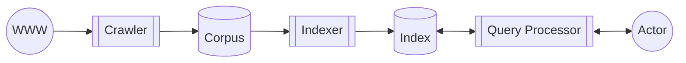
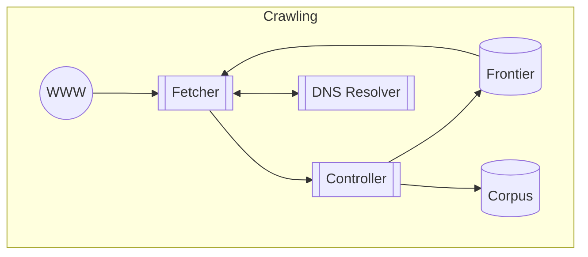
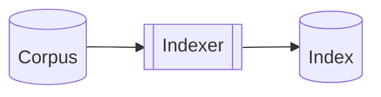
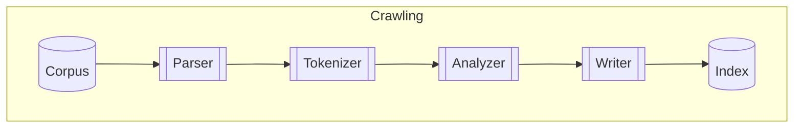
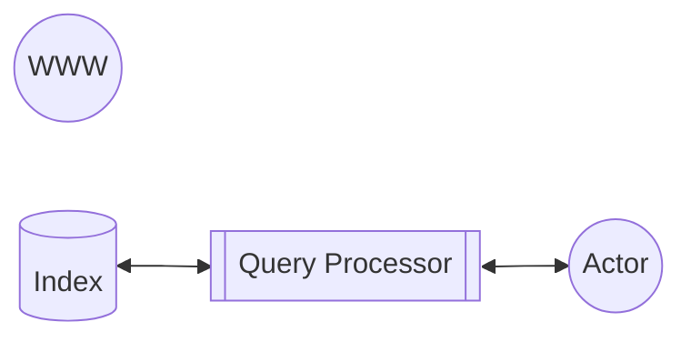
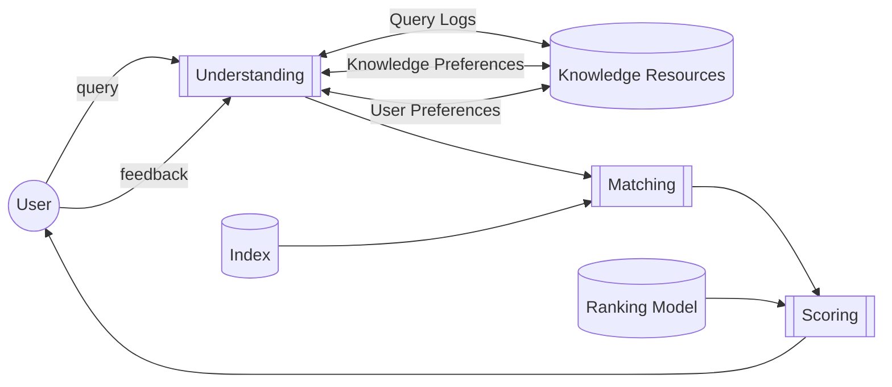

# Resumo pra P1

## Slide 01 - Introdução

> Information retrieval is a field concerned with the structure, analysis, organization, storage, searching, and retrieval of information.
>
> - Gerard Salton, 1968

- Tarefas

  1. Pesquisa (1 query)
  2. Recomendação (0 query)
  3. Antecipação (-1 query)
  4. Conversação (n query)

- > Rodrygo: "O problema está longe de ser resolvido"
- > Rodrygo: "O sistema é muito limitado em várias dimensões"

### Pesquisa

- O principal a considerar é satisfazer o usuário através de sua perspectiva durante o processo de acesso à informação considerando a relevância e velocidade do que ele busca.
- Pelo anunciante, tendo maior publicidade, tende a ganhar mais dinheiro.
- E por parte do motor de busca, ao satisfazer o usuário ele tende a retornar mais e motivar ainda mais o anunciante a investir mais.

### Tarefas do motor de busca

1. Correção ortográfica
2. Completar consulta
3. Sugestão de consulta
   - A diferença entre o 2 e o 3 é que o 2 é quando o usuário já começou a digitar e o 3 é quando ele não digitou nada ainda.
4. Resultados de pesquisa vertical (ex: imagens, vídeos, notícias, etc)
5. Respostas geradas (IA)
6. Snippets de conhecimento (Blocos de informação já estruturada)
7. Pesquisas relacionadas (ex: "pessoas também perguntam")
8. Personalização (ex: "baseado no que você pesquisou"|"Onde você está")

Ou, de uma forma geral: Com as informações obtidas, produzir as informações mais relevantes.

#### Desafios do motor de busca

Porém, aqui resumiremos ao problema de ranqueamento, que é, dada uma query, listar os itens (frequentemente denominados "documentos") que coincidam com o interesse da pesquisa ordenados em ordem decrescente de relevância.

- Uma tarefa famosa para o motor de busca é o problema dos 10 blue links, que é onde o motor de busca tem que apresentar 10 links para o usuário. A dificuldade é encontrar os itens mais relevantes para o usuário, no menor tempo possível e com o menor custo computacional possível.

1. Muitas pessoas
2. De muitos lugares
3. usando vários dispositivos (Ex: Alexa)
4. Procurando por muitas informações (Com LLM, agora é fácil gerar informações falsas)
5. Espalhada por toda a internet

E para superar isso tudo de uma boa forma, é necessário eficiência.

### Análise de performance

#### Eficiência

Eficiência é a capacidade de fazer algo com o menor custo possível, e isso pode ser medido em termos de tempo ou quantidade de recursos utilizados.

- Alguns fatores de análise de performance são:
  - Velocidade de resposta da pesquisa em bilhões de documentos,
  - Fluxo de resposta para servir diversos usuários ao mesmo tempo,
  - Disponibilidade de conteúdo recente.

#### Efetividade

Apesar de ser importante encontrar a informação de forma eficiente, é também importante que a informação encontrada seja relevante para o usuário. Isso é o que chamamos de efetividade.

Porém, mesmo a relevância pode ser relativa, isso porque ela ocorre em diferentes dimensões:

- Relevância no tópico;
- Relevância no tempo;
- Relevância pro usuário;
- Etc.

Os modelos de ranqueamento irão apenas se limitar a uma visão dessas dimensões.

### SALA: Metade das pesquisas são inéditas

Isso se dá por diversos fatores:

- Typos;
- Formas individuais de escrever;
- Línguas diferentes;
- Fatos recentes;
- Informações pessoais;
- Etc.

### Search Engineering

- Sequência da query:
  - Representação da consulta
  - Encontrar e ranquear
  - Apresentar os resultados

### Aquisição dos itens

Deve-se considerar que a web é enorme com trilhões de URLs conhecidos. Ela está continuamente mudando, com novos documentos sendo adicionados, alterados e removidos.

Para isso, como dito antes, a eficiência de crawl é importante. Deve-se visar a amplitude de busca, mas também a novidade.

E como podemos encontrar esas informações relevantes? De diversas formas, como: casamento de strings: exato, fonético, radicais, sinônimos, etc.

### Entendimento do documento

Outro fator crucial é entender o que se está buscando, ou melhor, o que quer dizer o objeto buscado.

Os documentos dispõe de algo além do seu texto, eles têm significado. O matching por termos é o mais simples, mas existem também métodos para utilizar da semântica.

Considera-se também que os documentos podem ser genuínos com informações verdadeiras, acessíveis, legíveis, com profundidade de informação e autoridade de quem escreveu. Ou maliciosas usando de fazendas de conteúdo/links e espalhando desinformação.

### Indexação do documento

Uma das tarefas é já ter processado os documetos e armazenado suas informações relevantes em um índice de tal forma que seja mais fácil de encontrar e ranquear os documentos relevantes para a consulta.

Esse índice, também chamado de **índice invertido**, é, assim como em um livro, um método de direcionar a busca para o local correto. Desse modo, as informações ficam distribuídas em fragmentos.

Há também o método de representação vetorial de texto, permitindo um casamento denso entre termos que apresentem relações semânticas similares.

### Entendimento da consulta

Palavras chaves, embora objetivas, não representam tão bem o que o usuário quer. A interação e o contexto também importam. E para isso, existem métodos para se tentar extrair potenciais informações relevantes da consulta, como:

- Segmentação da consulta (ex: "cachorro quente" -> "cachorro" e "quente")
- Query Scoping (ex: Definir o escopo da pesquisa, como "manga (fruta)" ou "manga (roupa)")
- Query Expansion (ex: "PO" -> "Product Owner" ou "Pesquisa Operacional")
- Query Relaxation (ex: "cachorro quente com queijo e presunto" -> "cachorro quente")
- Query Embedding

> **Reflexão:** e se as informações fossem armazenada em hardware assim como são as memórias? Tudo ocorreria basicamente na velocidade da luz, não?

### Matching and Scoring

Entendida a consulta, ela é enviada aos fragmentos dos documentos indexados, e então, cada fragmento encontrará os documentos casados, eles serão pontuados e então os mais relevantes serão retornados. Todos os documentos retornados são agrupados e ranqueados por sua pontuação.

### Avaliação do ranqueamento

Como dito anteriormente, a relevância é relativa e pode ser vista de diferentes formas, mas apesar disso, dependerá do usuário, então, idealmente, o usuário deve ser envolvido no processo de avaliação. Porém, como usualmente não é viável consultar todos os usuários se as informações retornadas são relevantes, existem indicadores que podem ser utilizados para avaliar a relevância dos documentos retornados.

Uma delas é observar de que forma o usuário interage com os resultados. Ele clicou em quantos? Quanto tempo ele ficou na página? Ele voltou para a pesquisa? Reformulou a pesquisa? Etc.

Apesar dessa avaliação ser empírica, deve-se seguir o rigor científico e ser economicamente viável.

## Slide 02 - Search Architecture

As máquinas de busca são sistemas intensos em uso de recursos, isso porque elas precisam de grande **Largura de Banda** para lidar com o fluxo de requisições e crawling; **Armazenamento** para guardar todos os documentos, índices e metadados; e **Processamento** pro crawling, indexação e recuperação desses documentos. E esses fluxos devem ser escaláveis de um computador até diversos clusters em várias zonas de disponibilidade.

### Custos

Aqui consideramos os custos físicos necessários para manter o sistema funcionando, como:

- **Depreciação:** Hardware antigo deve ser substituído
- **Manutenção:** Manter o hardware funcionando
- **Operacional:** Custos de energia, refrigeração, espaço físico, etc

### A arquitetura da Busca

Porém, a arquitetura da busca em si não é composta apenas por hardware, mas também por software. Devemos levar em consideração que cada componente do software funciona como blocos de encaixe em que cada um deles interage com alguns dos outros de determinada forma. Lembrando de sempre priorizar a qualidade dos resultados (Efetividade) e a velocidade de resposta (Eficiência).

#### Componentes

##### Crawler

O crawler lidar com a coleta de informações, ou melhor, de documentos. A intenção é que ao buscar, armazene-o em um corpus local para busca posterior.

O tipo de crawler focado aqui é o **Web Crawler**, que é um robô que navega na web coletando páginas. Ele utiliza dos links presentes nas páginas para navegar e coletar mais páginas. Duas métricas importantes para o Web Crawler são:

- **Cobertura:** A quantidade e variedade de páginas coletadas.
- **Frescor:** A frequência com que as páginas são atualizadas.

O fluxo de funcionamento do crawler é:

1. O **Controller** inicia o processo de crawling, ele é responsável por gerenciar o fluxo de trabalho do crawler.
2. Com **Seeds** (URLs iniciais) ele criará uma **Frontier** que consiste em um conjunto de URLs a serem visitadas.
3. Para cara URL na Frontier, o **Fetcher** utilizará do **DNS Resolver** para resolver o nome do domínio e obter o endereço IP do servidor, para que, com isso, ele possa fazer uma requisição HTTP para o servidor e obter o conteúdo da página. O conteúdo então é retornado para o **Controller**.
4. O **Controller** então processa o conteúdo da página, extraindo links e outros metadados relevantes. Esses links são adicionados à Frontier para serem visitados posteriormente. E o conteúdo e seus metadados são armazenados no **Corpus**.

###### Desafios do Crawler

- A internet é enorme e está sempre mudando.
- Muit tempo é gasto esperando a resposta do servidor. Para isso, é essencial o paralelismo.
- Dependendo da implementação, pode acabar inundando sites com requisições, o que pode levar a bloqueios, para isso é importante respeitar o **robots.txt** e implementar um controle de taxa de requisições.

> - "O conteúdo em si é selvagem. Tem coisa boa, ruim, bem formatada, mal formatada"
>
> - "Se o site é uma ilha: ninguém linka para o meu site e ele não tá indexado, como encontrá-lo?"
>   - Resposta: uma forma seriam pelos logs do chrome por exemplo. Se não tá indexado, mas pessoas o acessam, o Chrome talvez tenha algum log e pode informar pro seu BD sobre o site ilhado.

##### Indexer

O **Indexer** visa representar os documentos encontrados de forma relevante e, como sempre, eficiente. Para isso, deve converter o texto bruto em termos do índice. Pode-se também utilizar algumas anotações para que se categorize o documento.

Além de armazenar as informações presentes especificamente no documento, o indexer também pode armazernar outras informações como o **Anchor Text** que direcionam até determinado documento. Outra possibilidade é analizar a própria semântica da URL.

O fluxo de funcionamento do indexer é:

1. Partindo do **Corpus**, que foi previamente preenchido pelo **Crawler**, o **Parser** processa o conteúdo bruto do documento, extraindo informações relevantes como título, corpo do texto, links, etc.
2. Essas informações são então passadas para o **Tokenizer**, que divide o texto em tokens (palavras ou termos individuais). Esses tokens não necessariamente são palavras, mas também conjuntos de palavras, símbolos, etc.
3. Os tokens são então analisados pelo **Analyzer**, que aplica técnicas de normalização, como stemming (reduzir palavras a suas raízes) e remoção de stop words (palavras comuns que não agregam valor semântico).
4. Após a análise, os tokens são passados para o **Writer**, que os armazena no **Index**. O índice é uma estrutura de dados otimizada para busca rápida e eficiente, permitindo que o sistema encontre documentos relevantes com base em consultas.

###### Desafios do Indexer

- Encontrar características significantes.
- Agilizar o processo de cálculo de score.

###### Estruturas do índice

Como seu objetivo é tornar a busca mais rápida, são necessárias estruturas de dados específicas para este fim.

A estrutura de dados mais comum é o **índice invertido**, que armazena uma lista de documentos para cada termo. Isso permite que o sistema encontre rapidamente todos os documentos que contêm um determinado termo. O termo "Índice Invertido" na verdade é um termo genérico que se refere a uma classe de estruturas.

Para determinado **Corpus**, poderíamos fazer uma matriz de incidência, similar ao conceito de Matriz de Adjacência. Porém este método tende a não ser eficiente pois a matriz tende a ser muito esparsa. Uma alternativa é utilizar uma lista encadeada com o id dos documentos que contém o termo. Chamaremos cada um dos nós dessa lista de **Posting**.

Mas, como já visto, é importante que armazenemos diversas informações relevantes. Uma delas seria o **Term Frequency** (TF), que é a quantidade de vezes que o termo aparece no documento. Outra informação importante é a posição em que o termo aparece no documento, isso pode ser importante para determinar a relevância do termo em relação ao contexto do documento.

Como existem vários campos possíveis de informação, pode ser interessante utilizar um índice invertido por campo.

Existem diversas outras estruturas de dados que podem ser utilizadas, como vocabulários, dicionários, lexicons; Estatísticas sobre os documentos, características estáticas, metadados; Estatísticas do corpus, etc.

##### Query Processor

O papel do **Query Processor** é processar a consulta do usuário e conseguir compreender o que ele realmente quer. Ou seja, deve inferir a sua necessidade à partir da consulta por palavras chaves. Ele então deve conseguir encontrar os documentos relevantes para a consulta presentes no **Index**. Por fim, deve também lidar com o feedback do usuário, ou seja, o que ele achou dos resultados retornados.

O fluxo de funcionamento do **query processor** é:

1. O **User** envia uma consulta que deve ser entendida pelo **Understanding**.
2. O **Understanding** armazena e utiliza das informações do **Knowledge Resources** para entender o que o usuário quer.
3. A partir desse entendimento, o **Matching** irá buscar os documentos relevantes no **Index**.
4. Os documentos relevantes são então passados para o **Scoring**, que irá calcular a relevância de cada documento em relação à consulta do usuário, que por sua vez recebe o resultado e pode fornecer feedback para o **Understanding** para melhorar o processo de busca posterior.

###### Desafios do Query Processor

As queries geralmente são curtas e mal especificadas, o que torna difícil entender o que o usuário realmente quer. Por outro lado, queries longas são mais difíceis de processar.

Encontrar documentos relevantes é desafiador, principalmente para queries longas ou termos muito comuns.

Ranquear, por sua vez, também é complexo, visto que cada query tende a ter um escopo de ranqueamento diferente.

- **Query Understanding:**
  - **Expansão:** pode-se **relaxar** a query e analisar apenas parte da mesma. Ou então, **expandir** a query para que ela especifique melho o que é que está sendo buscado.
  - **Redução:** pose-se **segmentar** a query em partes menores que sejam mais fáceis de serem processadas. Ou então definir um **escopo** para a query, como por exemplo, definir que a pesquisa é apenas para imagens ou vídeos.
- **Query Matching**
  - **Term Matching:** Percorre-se o índice invertido e busca-se os documentos que possuem os termos da query. Existem diversos outros métodos já mencionados superficialmente, mas por enquanto nos ateremos à simplicidade.
- **Ranking**
  - Soma-se a frequência de cada termo em cada documento e então ranqueia-se os documentos pela soma total.
  - Existem diversos outros métodos como: Modelos léxicos, estruturas, semânticos, interativos e baseados em features.
