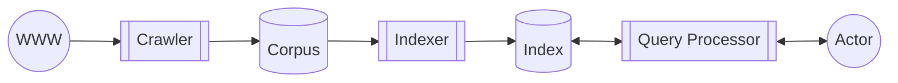
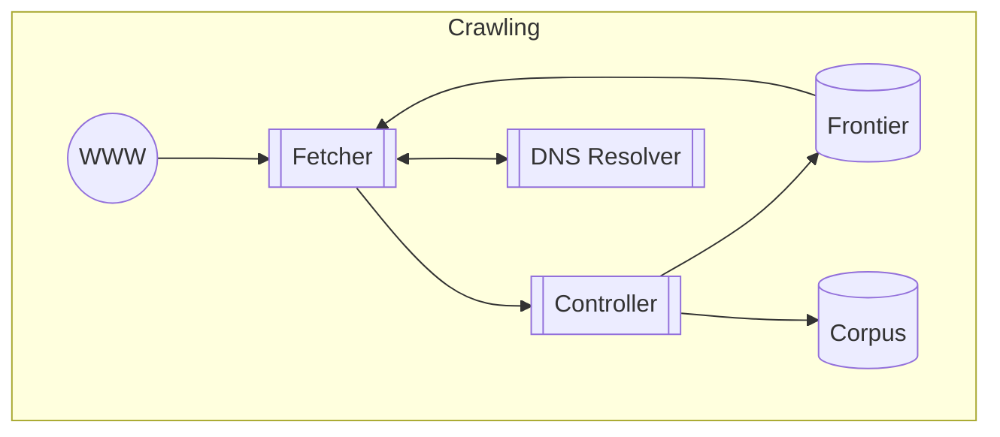
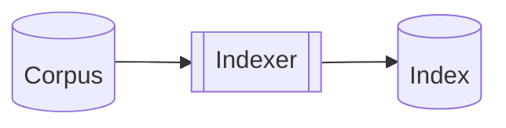
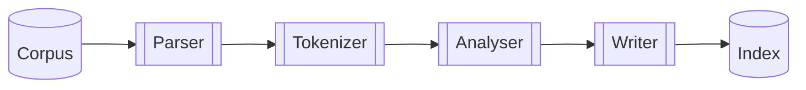
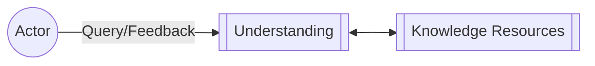

# Aula 02 - 17/03/2025

## Slide: Search Architecture

### Search Infrastructure

- Search engines run on resource-intensive regimes
  - **Bandwidth** for handling crawling and search traffic
  - **Storage** for persisting documents, indexes, metadata
  - **Processing** for crawling, indexing and retrieval
- Must scale from a single computer in one datacenter...
  - ... to huge clusters spread across availability zones

### Financial costs

- Depreciation: old hardware
- maintenance: failure handling
- Operational: Energy cost

### Search Architecture

A software achitectuer conssits of software components, the interfaces

- Effectiveness: ...
- Efficiency: ...

### Search components

- Crawler: é o que navega na internet. Ele gera um Corpus
- Corpus: uma cache da coleção original. Ele é importante para que os dados presentes nele sejam representativos, ou seja, ele filtra a massa de informações presentes na WWW e armazena localmente.
- Indexer: com o corpus, é gerado um índice para facilitar a busca. Um índice invertido é o mais comum.
- Index: serve como um proxy para o que está presente no Corpus, embora possa perder nos detalhes, apresenta um grande ganho na eficiência de busca posterior.
- Query Processor: A pesquisa feita pelo usuário e a forma como ele a busca.

Uma ou mais aulas sobre cada uma dessas coisas. Nessa aula de hoje ele deseja passar de forma mais aprofundade, mas ainda geral, sobre cada um delas.

#### Crawling overview

- Aquisição de documentos: o documento serve como uma generalização de todo o tipo de informação que pode ser buscada. Essa disciplina focará mais na parte textual.

  - BUilds a local corpus for searching
  - Many types - Web, enterprise, desktop

- Web crawlers follow links to find documents
  - Must efficiently find huge numbers of web pages (coverage) and keep them up-to-date (freshness)

---

- Controller: uma forma de definir o comportamento esperado
  - Frontier: uma fila de URLs a serem vasculhadas
- Fetcher: É o que vai buscar a informação da WWW e retorna pro Controller
  - DNS Resolver: uma das partes mais caras, que é a resolução de IP.

##### Key Challegnes: Crawling

- Web is huge and constantly changing
  - Not under the control of search providers

"O conteúdo em si é selvagem. Tem coisa boa, ruim, bem formatada, mal formatada"

- A lot of time is spent waiting for responses

  - Parallel crawling is essential

- Could potentially flood sites with requests
  - To avoid this problem, use politeness policies
    - [JV: o que seria isso?]
    - "As páginas têm interesse de ser coletados, porque máquinas de busca trazem tráfego. Porém requisições massivas reduzem a resposta de outros usuários, o que pode ser desagradável"

Dúvida de outro aluno: "Se o site é uma ilha: ninguém linka para o meu site e ele não tá indexado, como encontrá-lo?"

Professor: uma forma seriam pelos logs do chrome por exemplo. Se não tá indexado, mas pessoas o acessam, o Chrome talvez tenha algum log e pode informar pro seu BD sobre o site ilhado.

---

#### Indexing Overview

- Document representation
  - From raw text to index terms (Formas buscáveis de representar o texto)
    - Ex.: Autor, data de atualização, etc.
  - Annotations (Ex.: Entidades, categorias, embeddings)
  - Off-document evidente
    - Anchor text, link analysis
      - Texto de âncora é o texto presente...
        - `<a href="https://www.google.com">ESSE TEXTO AQUI</a>`
        - Esse tipo de informação é útil caso, por exemplo, se o site da UOL não citasse "notícias", mesmo que seja sobre notícias, porém, se nos anchor texts essa informação estivesse presente, seria possível inferir que o site é sobre notícias.
    - Social Network Signals

---

- Document representation
  - Topical Features: informações textuais presentes no documento
  - Quality Features: Incoming links, days since last update

---

- Corpus
- Parser: filtra de alguma forma o texto
- Tokenizer: separa em blocos de texto úteis [JV: é mais ou menos isso]
- Analyzer: processa mais
- Writer: armazena o que foi analizado de alguma forma
- Index: estoca os dados encontrados

##### Key challenges: Indexing

- Support effective retrieval
  - Extract meaningful document features
  - Both ropical and quality features
- Support efficient retrieval
  - ...

##### Index Structures

Uma das estruturas mais comuns é o índice invertido.

---

Example "Corpus"

Incidence Matrix: geralmente não se armazenam em matrizes por ocupar muito espaço.

O índice invertido é basicamente uma lista de adjacência.

Uma forma de enriquecer o índice é através da adição de frequência de cada uma das palavras.

Outro método poderia ser a informação da posição em que aparece a palavra. A importância disso é que, se o usuário está buscando por duas palavras, é esperado que essas duas palavras, caso encontradas no índice remissivo esteja próximas entre si.

- Inverted index: fields

  - Document structure is useful in search
    - field restrictions (date, from)
    - Some fields are more important than others
  - ...

- Auxiliary Structures
  - Vocabulary, dictionary, or lexicon
    - Lookup table from term to inverted list
      - Pode-se armazenar um mapa de determinada palavra para que se defina a posição na memória em que a informação está guardada
    - Either Hash table in memory or B-tree for disk
  - Additional strucures for document data
    - Basic statistics, static features, metadata
  - Additional strucutre for corpus statistics

#### Query Processing Overview

- Query representation
  - Infers user's need from a keyword query
- Document ranking
  - Matches...
- ...

---

- Query
  - Understanding
    - Knowledge Resources
      - Query Logs
      - Knowledge bases
      - User Preferences
  - Matching
    - Index
  - Scoring
    - Ranking Model
- Usuário

##### Key Challenges: Query Processing

- Queries are typically short, ill-specified
  - Long queries tend to be difficult
- Finding matching documents can be expensive
  - Particularly for common terms or long queries
- Ranking is a tough business
  - Different Queries, different requirements

---

##### Query Understanding

É basicamente uma mudança da consulta. Onde a máquina de busca muda o que foi pesquisado originalmente para melhorar a pesquisa.

- expand matches
  - Query relaxation: aumentar a chance de encontrar o que o usuário quer
    - [Information about tropical fish]
      - [Tropical Fish]
  - Query expansion: aumentar a chance de encontrar o que o usuário quer
    - [Tropical Fish]
- Narrow results
  - Query Segmentation
    - Tropical Fish captive breeding
      - ["Tropical fish" AND "captive breeding"]
  - Query Scoping
    - [Tropical fish hawaii]
      - [Category: "Tropical fish" place: hawaii]

---

#### Document Matching

- Scan postings lists for all query terms

"A Web é tão grande, que geralmente usa-se o AND, e mesmo assim encontra muita coisa."

- Scoring matching documents
  - $f(q, d) = \sum_{t \in q} f(t, d)$

---

- Many alternatives
  - Lexical models (bag-of-words)
  - Structural models (query + document structure)
  - Semantic models (implicit + explicit semantics)
  - Interactive models (user feedback)
  - Feature-based models (AKA learning to rank)

### Summary

- Search is a tough business
  - Big data, big usage
- An architecture tailored for efficiency is crucial
  - Crawling, indexing, query processing
- Must also cater for effectiveness
  - Rule of thumb: don't throw anything away
  - "Mantenha tudo o que você puder manter. Só o que você não quiser manter, aí joga fora, caso esteja além do orçamento"

### References

- Search Engines: Information Retrieval in Practice

### Coming Next: Web Crawling
