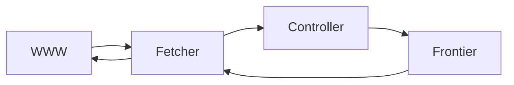
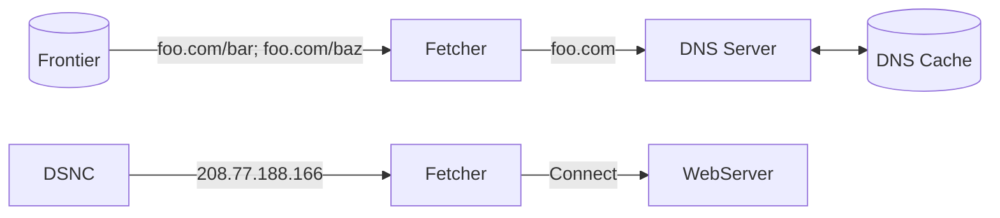

# Aula 03 - 19/03/2025

## Slide - 03-web-crawling

### Web Crawling

- Outros nomes: spiders, harversters
- Funciona para fazer caches

#### Success measures

- Coverage: quanto da web foi coberto
- Freshness: quão atualizados estão
- Utility: qual fração das páginas úteis foram coletadas?
- Efficiency: bytes baixados por unidade de tempo

### Crawling overview (2)



---

Pseudocódigo

Em casos de crawlers, a tendência é que o loop seja infinito. Ele tende a revisitar páginas já vistas. Além disso existe páginas dinâmicas que podem sempre direcionar a páginas seguintes. Talvez algo como a Biblioteca de Alexandria. Isso, desconsiderando a criação contínua de páginas.

No geral, os crawlers são feitos já com a intenção de serem executados continuamente.

```python
def crawler (frontier, corpus):
  while not frontier.empty():
    url = frontier.pop() # Control
    if crawlable(url): # Politeness
      content = fetch(url) # Networking
      corpus.store(url, content) # storage
      for outlink in parse (content): # Processing
        frontier.enqueue(outlink) # Control
```

- Control: definir como priorizar as urls
- Politeness: evitar floodar o site
- Networking:
- Storage: armazenar o conteúdo; Quanto? Quais? O quê?
- Processing: o que fazer com o conteúdo?

### Crawl Seeding

- Quais URLs começar?
  - Que eu comece com HUBs, que são páginas que apontam para muitas outras páginas
  - Sitemaps
  - Seed URLs

### Traversing

- Separar as filas por descoberta e atualização

  - Lista de busca
    - URLs que apontam para páginas baixadas.
    - O objetivo é aumentar a busca
  - Lista de atualização
    - URLs já baixadas.
    - O objetivo é manter a atualização

#### Enqueuing policy

- Deve-se manter um registro das URLs
  - Idealmente, a complexidade deve ser O(1), então um hash é uma boa alternativa.
  - Seria interessante então o uso de um SGBD que use Key-Value pair.
  - Preferencialmente que esteja em memória e não em disco pra não demorar tanto.

##### URL Keying

- Múltiplas URLs mapeiam para a mesma página
  - <http:/www.cnn.com:80/x/../index.html> $\to$ <cnn.com>
    - Nome de domínio é case-insensitive;
    - Porta HTTP padrão pode ser ignorada;
    - WWW é desnecessário?
- A normalização auxilia a ter chaves únicas para uma mesma página
  - Remover fragmentos de foco como "#section"

"Existem mudanças que são mais ou menos perigosas de se alterar." Perigosas no sentido de que podem acabar atrapalhando o busca por páginas.

#### Dequeuing Policy

- O importante é encontrar as páginas importantes rapidamente
  - Tanto por descoberta, quando por revisitação.

[JV: Plus Flags: posso fazer um grafo de como as páginas estão interligadas. posso tentar botar um timestamp de momento em que foi pesquisado.]

- Políticas de descoberta
  - Aleatórias?
  - Em ordem (BFS)
  - Centralidade (indegree; PageRank)
    - Afinal, se eu já sei que uma página já tem um alto nível de indegree, por que ainda não a baixei? Ela já deveria ser baixada
- Políticas de revisitação
  - Aleatória
  - Centralidade (indegree, PageRank)
  - Impacto (clicks, quantidade de visualizações, likes, compartilhamentos)
  - Idade (tempo desde a última vez que foi vasculhada)
  - Longevidade (frequência de atualização)
    - Porém, se a página é atualizada com muita frequência, talvez não seja necessário revisitar com tanta frequência. Seria muito custoso.

#### Page fetching



<!-- %% Front[(Frontier)] -->|"foo.com/bar; foo.com/baz"| Fetcher -->|foo.com| DNS Server <--> [(DNS Cache)] -->

#### Multi-threading

- Crawling é uma tarefa limitada pela rede
  - Crawlers podem usar múltiplas threads para buscar várias páginas ao mesmo tempo
- Embora um nó possa rodar várias threads de crawling, a CPU por si só também tem suas limitações.
  - Então, isso tende a se tornar gargalo antes de exaurir a banda.

#### Politeness

- Requisições excessivas e não coordenadas podem gerar estresse aos servidores ou sub redes de determinada plataforma.

- Um craler "educado"
  - Mantém apenas uma conexão TCP-IP aberta por servidor
  - Adiciona um delay entre requisições consecutivas.

#### Robots exclusion protocol

- Um padrão da WWW desde os primórdios
  - robots.txt ajuda a guiar os web crawlers por onde sugerem ou não.
  - Esse aquivo não serve como uma regra, mas é um acordo de cavalheiros. É ideal que o coletor leia esse arquivo, processe, e entenda o que pode ou não fazer.
  - Indica quais comportamentos que os bots são aconselhados a ter.
  - A Google informou que não respeitaria mais o crawl-delay do robots.txt porque eles sabe o bastante para considerar que tende a ser mais prejudicial do que benéfico caso ele dê um delay maior.
  - "Ao invés da máquina de busca respeitar o site, o dono do site que reclame de abusos das máquinas de busca".

#### Mirror Sites

- Uma réplica do site, com tráfico reduzido mas com foco em disponibilidade.
- Sites Mirror podem ser detectados com a similaridade da URL, a estrutura de links e as similaridades de coonteúdo.

#### Sitemap protocol

- Sitemap.xml
  - Traz uma forma de índice do site

### Crawling architecture

- Single node (não escalável)
  - CPU, RAM and disk becomes a bottleneck
- Multi-node (Escalável)
  - Distribuição de carga
  - Paralelismo
  - Redundância
- Distribuída geograficamente (escalável, latência reduzida)
  - Existem registros de geo-localização de IPs, então é possível saber onde estão os servidores.

#### Distributed Web Crawling

- Web partida por URL Hashing
  - Pode causar crawling impolite
- Web partida por host hashing
  - Politeness controlada pelo host
- Nós diferentes podem acabar coletando a mesma URL

[JV: Plus Flags: Uma AVL balanceada pelos pesos das páginas, pesos esses dados pela frequência com que uma certa página já foi visitada antes.]

Dúvida: como manter a rede TCP-IP ligada entre nós distribuídos?

#### Benefícios

- Maior crawling throughput
  - Proximidade geográfica que reduz a latência do crawling
- Aumento da politeness de rede
  - menor demanda nos roteadores
- Resiliência às partições da rede
  - Melhor cobertura e disponilidade alta

### Parsing

- Texto é armazenado em diversos formatos incompatíveis
  - Raw text, RTF, HTML, XML, MS Word, ODF, PDF, ...
- Tipicamente use uma ferramenta de conversão do conteudo em algum formato de texto marcado
  - HTML, XML
  - Mantendo a informação relevante nessa estrutura

#### Character Encoding

- Conversão entre bits e glifos
  - Converter bits em caracteres na tela
  - Pode ser uma grande fonte de incompatibilidade

Existem técnicas para identificação de encodings.

- ASCII é um esquema de encoding padrão e simples pro Inglês
  - Unicode tenta unir todos os glifos comumentes usados.

#### Removing noise

- Remover textos, links e figuras que podem não estar relacionadas ao conteúdo da página.
  - Esse conteúdo noisy (barulhento), pode impactar negativamente o ranqueamento
- Existem várias técnicas que detectam esses blocos de conteúdos
  - Page content vs ads
  - Material que não é conteudo é ignorado ou flagged.

#### Content storage

- Armazenar o texto do documento
  - Extração eficiente da extração: Snippets
- Requisitos para os documentos do sistemas de armazenamento
  - Acesso randômico por hashed URL
  - Atualizações rápidas (modificações, anchor text)
  - Representação comprimida

#### Compression

- Texto é altamente redundante ou previsível
  - A compressão explora a redundância para fazer arquivos menores sem perder nada do conteúdo.
- Algoritmos populares conseguem comprimir HTML em 80%
  - DEFLATE(zip, gzip) and LZW (Unix Compress, PDF)
  - Comprimir arquivos grandes para tornar o acesso mais rápido

#### Focused Web Crawling

- O objetivo é buscar páginas temáticas
  - Tópico (Energia nuclear)
  - Gênero (music)
  - Type (forums)
  - Demographics (kids)

Ele comentou sobre uma startup que foca em dar notícias importantes para CEO's de empresas direcionadas a eles.

[JV: Dissertation: posso propor algo como um "sitemap" que consiga definir as características dos objetos. Acho que o BIM tem algo assim. RDF?]

#### Deep Web Crawling

- Crawling traditionally focused on the surface Web
  - Web pages accessible by following links
- Conteúdo escondido mas potencialmente útil

  - Páginas não linkadas
  - Sites Privados
  - Conteúdo Scriptado

- Ferramentas de exploração
  - Selenium
  - Microsoft Playride
- Uma máquina de busca conseguiria simular o uso de botões e formulários em páginas? Ele considera que sim.

### Summary - Aula 3

- O Scopus é um cache da Web que viabilida indexação e busca mais rápida
- A Web é um ambiente grande e dinâmico
- Deve-se visar a cobertura e atualização, preferencialmente mantendo o politeness
- Several open Challenges

### Referências

Search Engines: Information Retrieval in Practice, Ch. 3Croft et al., 2009

Scalability Challenges in Web Search Engines, Ch. 2Cambazoglu and Baeza-Yates, 2015

### Próxima aula: Document Understanding
