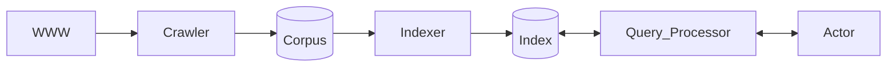
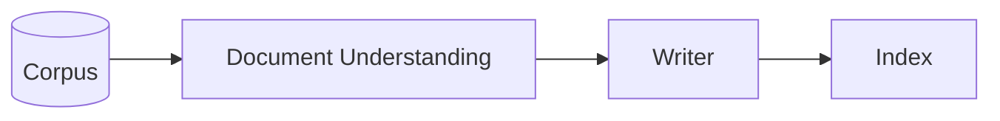
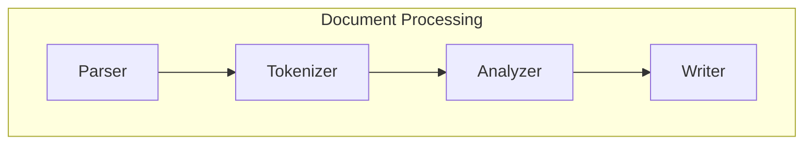

# Aula 04 - 24/03/2025 - Document Understanding Slide: 04-???

## Search Components



## Indexing Overview (2)





- Por que não escrever diretamente no índice?

### Document Understanding

- Entender o texto é desafiador
  - Nem sempre está claro o que é
  - Nem sempre está claro o que os termos significam
- ...

### Documento Parsing

- Assumido previamente
  - Sabemos o que o documento é
  - Podemos "machine-read" cada documetno

#### What is a document?

- Or, in IR parlance, what is our Retrieval Unit? ("Ou, em jargão de Recuperação de Informação, o que seria uma Unidade de Recuperação?")
  - Um arquivo simples?
  - Um email com 5 anexos?
  - Um livro com 15 capítulos?
- Quais tipos serão aceitos?
  - Text/html? Application/pdf? Word?

#### How to read a document?

- Idealmente deve lidar com estruturas
  - Texto vs binário, texto vs markup
- Nem sempre é bonito...

```html
<div id="foo">
  <div id="bar">
    <span> Test</span>
  </div>
</div>
```

BeautifulSoup é um dos mais conhecidos pra lidar com isso.

---

- Must handle encoding
  - Traduzir entre bits e characteres
- às vezes, múltiplas, e não especificadas

ISO 88591 (?) para caracteres latinos

UTF=8 Tá se tornando mais popular

### Document Tokenization

Agrupar palavras em grupos. Talvez várias palavras.

Podem ser várias palavras em um token, ou até subpalavras.

Um par de palavras seria um bigrama

#### How to Tokenize

- One simple strategy (early IR Systems)
  - Any sequence of 3+ alphanumeric charactes
  - Terminado em espaço
  - Ignorado lowercase e uppercase

##### What could go wrong

- Ex

  - Bigcorp's 2007 bi-annual report showed profits of 10%
  - Bigcorp s 2007 bi annual report showed profits of 10
  - Bigcorp 2007 annual report showed profits

- Muita informação perdida
  - Pequenas tokenização podem impactar muito à efetividade de algumas buscas

#### Token Length

- Palavras pequenas tendem a ser pouco representativas.
  - a, an, be, of, to
- Porém elas também ajudam a remover a disambiguation
  - ben e king, el paso, master p, world war ii
- Ou até crucial ao matching
  - xp, ma, pm, gm, j lo, c

#### Special Characters

- Apostrophes podem fazer parte da palavra, possessivo ou um erro
  - Rosie o'donnel, can't, don't, 80's, master's degree
- Acentos e diacríticos podem mudar o sentido
  - résumé vs resume, cocô vs coco

Uma solução pra isso seria considerar que algumas palavras cujo significado com acentuação são casos especiais e devem ser tratadas como tal.

---

- Periods podem ocorrer em números, abreviações, URLs, fim de frase, etc.
  - I.B.M.
- Hífens

#### Numbers and lowercasing

- Números podem ser importantes, inclusive os decimais
  - Nokia 3250, top 10 courses, united 93, quicktime 6.5

Com essa abordagem clássica, estamos tomando as rédeas de todo o processo. O que pode não ocorrer se delegarmos à uma LLM por exemplo

- Lowercasing can change meaning
  - Bush vs bush; Apple vs apple

#### Non-delimited tokens

- How to tokenize this?
  - White House aides wrestle with Trump's comments

Mas e tokens sem espaços?

- How about these?
  - whitehouse.gov, #ImpeachTrump
- And this?!
  - [Texto em Japonês]

Como quebrar "Whitehouse"?

9 Pontos possíveis de quebra. Há uma combinação de possibilidades. Algumas estratégias de particionamento são mais prováveis que outras.

Quão provável é "W" "hitehouse"? E "Whit", "ehou", "se"?

Pode-se fazer probabilisticamente com um log de [alguma coisa]

### Token Analysis

...

#### Discriminative Power

É como definir quão importantes são as palavras pro contexto.

Document Frequency (in millions)

- Saltwater: 46
- Freshwater: 95
- Aquatic: 118
- Species: 377
- And: 25270
- In: 25270
- The: 25270

#### Stopping

- Discard poorly discriminative works (stopwords)
  - a, an, and, are, as, at, be, by, for, from, has, he, in, is, etc.

Mas e como determinar esse corte em uma linguagem arbitrária?

Determinar um limite, um threshold de frequência das palavras encontradas na nossa coleção.

- Pode ser padronizado ou automaticamente definida

  - Pode depender do domínio/contexto: "click" for anchor text

- Pergunta: Como separar as stopwords das entidades?
  - Na pipeline a função de detecção de entidades viria antes da de stopwords

---

- Reduzir espaço no índice e tempo de resposta
  - Pode aumentar a efetividade
- Desencorajado nas máquinas de busca modernas
  - Stopwords podem ser importantes quando combinadas
    - to be, or not to be: that is the question
      - Question

#### Equivalence classing

- Reduzir as palavras à sua forma canônica
  - Equivalência léxica
  - Equivalência fonética
  - Equivalência semântica

Geralmente apenas fazemos a busca de casamento exato das palavras.

##### Lexical Equivalence

- Many morphological variations of words
  - Inflectional: plural, tenses
  - Derivational: making verbs into nouns
- In most cases, these have very similar meanings
  - Swimming, swam $\to$ Swim

---

- **Stemming**
  - Reduz morfologicamente as variáções ao seu stem (tronco)
    - Geralmente remove sufixos
  - ...Lemmatization...
  - **Porter's Stemmer**
    - SSESS $\to$ SS
    - IES $\to$ I
    - SS $\to$ SS
    - S ->
  - **Stemming effectiveness**
    - Usualmente aumenta a quantidade de retornos
      - Porém, pode danificar a precisão da busca: aumenta tanto o retorno por trazer casamentos parecidos, porém pode gerar falsos positivos
    - Falsos positivos
      - Ex: universal, university, universe $\to$ univers
    - Falso negativo
      - Alumnus $\to$ Alumnu; Alumni $\to$ alumni

##### Fonetic and semantic Equivalence

- Fonética
  - Reduz palavras que soam parecido à mesma forma
    - Hermann <--> Herman
- Semântica
  - diferentes paravas a um mesmo conceito

Pergunta do professor: se isso fosse uma API, como poderia funcionar

Resposta professor: basicamente retornaria a forma canônica da palavra, já tendo sido filtrada em todas as formas desejadas.

Minha resposta:

### Phrasing

- Muitas queries são frases de 2-3 palavras
  - ...

---

- Estratégias:
  - Fraseamento sintático
  - ...

#### Syntactic phrasing

- Part-of-Speech (POS) taggers podem determinar as palavras de acordo com sua função sintática na linguagem natural
  - NN (Singular Noun), NNS (plural nouns), etc.
- ...

##### POS Tagging Example

[Texto]

Ele exemplificou casos de padrões frequentes no inglês onde NN seguido de NNS, por exemplo, seria um conceito padrão.

#### Statistical phrasing

- POS tagging é lento demais para coleções grandes
  - Realmente é necessária a análise sintática completa?
- Definição mais simples: frases como n-gramas
  - Unigrama - 1 palavra
  - Bigrama - 2 palavras
  - Trigrama - 3 palavras

---

- As frequências de N-gramas formam uma distribuição Zipf
  - Algumas muito frequentes, outras pouco
  - ...

---

- Google n-grams

### Scoping

- Documentos geralmente têm uma estrutura
  - HTML tags: h1, h2, p, a
- Nem todas as partes são relevantes
  - Título, URL, metadado, seções do corpo
- ...

### Summary - Aula 04

- O entendimento dos documentos aumenta na representação, um exemplo disso é casar coisas e não strings.
- Várias decisões importantes: talvez não se saiba o que seria importante durante a indexação.
  - Nesse caso, postergue. Não há necessidade de fazer tudo imediatamente, porém esteja preparado para arcar com o custo
- KISS (Keep It Simple, Stupid), but keep it all

---

- Indexing vs querying
  - Stopping VS Query Relaxation
  - Equivalence Classing VS Query Expansion
  - Phrasing VS Query segmentation
  - Scoping VS Query Scoping

### Referências - Aula 04

### Próxima aula
