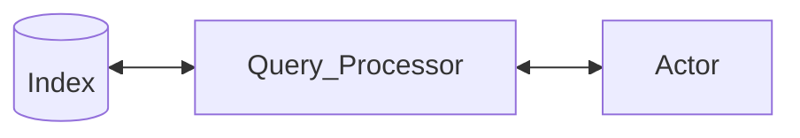
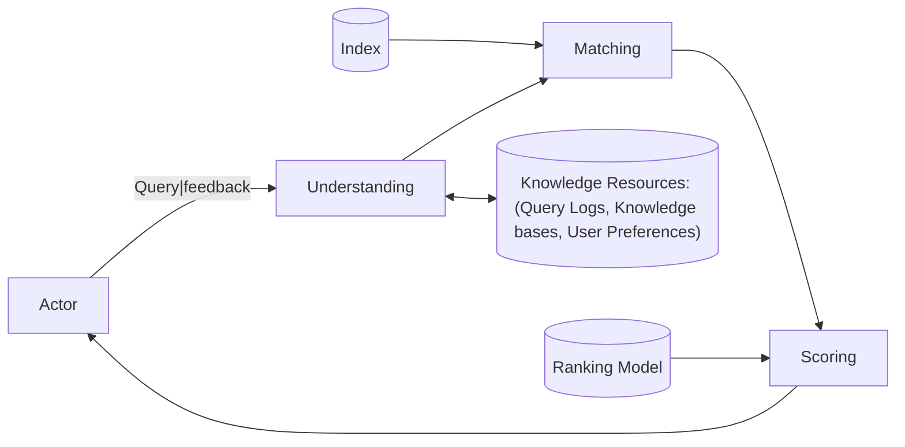

# Aula 06 - 31/03/2025 - Query Understanding

## Trabalho Prático

## Search Components (Aula 6)

---

## Query Processing Overview (Aula 6)

A ideia é que a gente, a partir da consulta, consigamos enriquecer a pesquisa com informações adicionais pressupostas.

Depois case com as informações esperadas

Por fim ranqueie as informações encontradas.

## Queries and Information Needs

- A query can represent very different information needs
  - May require different search techniques and ranking algorithms to produce the best rankings
- A query is often a poor representation of a need
  - Users may find it difficult to express what they want
  - Users may assume the search engine will guess

Engenharia de Promps em LLM: como formatar sua query da melhor forma possível para que o modelo consiga entender o que você quer.

Uma máquina de busca muito robusta, consegue processar bem e deduzir o que o usuário quer. Isso desincentiva o usuário a explicar melhor o que deseja, porém, indica que a máquina de busca está cada vez mais inteligente.

### Complexity Matters

- Head Queries <--> Tail Queries
  - Head Queries: Shorter, More popular, Less complex
    - Navegacional: quero acessar a página X
  - Tail Queries: Longer, Less popular, More complex
    - Informacional: quero informações sobre XYZ

### Query Length

- Power law distribution:
  - $p(k) = Ck^{-s}$ for $k \geq k_0$
  - $C$ is a normalizing constant, $s$ is a slope, $k_0$ is a lower bound from which power law holds

Entendimento: consultas pequenas são **muito** mais frequentes que consultas grandes.

#### Long Queries

- Yahoo! (2006) claimed 17% queries with 5+ words
  - Current trend toward longer queries

Um exemplo disso são as pesquisa por voz. E também as assistentes pessoais como o Google, Siri e Alexa. Ah, é mencionado logo abaixo.

- Task-oriented search
  - Question answering, literature search, cut-and-paste
- Voice-activated search
  - Microsoft Cortana, Apple Siri, Google Assistant

### Complex queries

- Long queries are also complex
  - Rarity of verbose queries
  - High degree of query specificity
  - Term redundancy or extraneous terms (lot of noise)
  - Lack of sufficient natural language parsing
  - Hard to distinguish key and complementary concepts

Uma das principais vantagens de uma LLM nos dias de hoje seria nessa parte. A parte de entendimentos de consulta foi um dos que mais avançou.

### Context matters

- "It's raining"
  - ... says the weatherman, conveying the weather
  - ... writes the poet, conveying sadness in their work
  - ... says your mom, indicating you should put on a coat
  - ... says one bored person to another

"Uma mesma expressão depende do contexto" A máquina de busca pode não saber desse contexto extra.

## Query understanding

- About what happens **before** ranking
  - How users express their queries
  - How we can interpret their needs
- Queries as first-class citizens
  - ~~How to improve ranking regardless of query~~
  - How to improve query regardless of ranking

"Atualmente já se saturou quanto às técnicas de ranqueamento. O que se busca é melhorar a consulta."

## A host of techniques

- Query preprocessing
  - Language detection
  - Character filtering
  - Query tokenization
  - Spelling correction
  - Inflection handling

Identificar o idioma para direcionar mais. Tratar acentos? O que fazer com a pontuação?

- Query rewriting
  - Query relaxation
  - Query expansion
  - Query segmentation
  - Query scoping

Como ser mais acertivo para encontrar aquili que desejo?

## Spelling correction

- 10-15% of all web queries have spelling errors
  - For today's searchers, a search engine without robust spelling correction simply doesn't work

---

- How to (mis)spell "Britney Spears"
  - britney spears
  - brittany spears
  - brittney spears
  - britany spears
  - britny spears
  - briteny spears
  - britteny spears
  - briney spears
  - brittny spears
  - brintey spears
  - britanny spears
  - britiny spears
  - britnet spears
  - britiney spears
  - britaney spears
  - britnay spears
  - brithney spears
  - ...

---

- Identify misspelled query words
  - Those not found in a spelling dictionary

Espera-se que a mais frequentemente pesquisada seja a correta.

- Identify candidate corrections
  - Dictionary words similar to the misspelled word

Usar um vetor denso para representar as palavras e calcular a distância do significado delas pode não ser uma boa ideia pois poderia acabar gerando um problema. Não queremos similaridade semântica, mas a sintática.

Distância de Edição entre strings.

- Display candidate corrections
  - Ideally, the single best one

## Identifying candidate corrections

- Compute edit distance
  - Minimum number of insertions, deletions, substitutions, or transpositions of single characters
- extenssions $\to$ extensions (insertion error)
- poiner $\to$ pointer (deletion error)
- marshmellow $\to$ marshmallow (substitution error)
- brimingham $\to$ birmingham (transposition error)

Como baratear o custo de calcular a distância de edição de uma palavra errada com todas as palavras corretas?

Possibilidade 1: Palavras que tenham a mesma substring

Possibilidade 2: Palavras que tenham o mesmo tamanho ou próximo

Se não estiver encontrando nenhuma solução apropriada, pode-se afrouxar os critérios.

---

- Edit distance calculation can be sped up
  - Restrict to words starting with same character
  - Restrict to words of same or similar length
  - Restrict to words that sound the same

### Phonetic encoding (Soundex)

1. Keep the 1st letter (in uppercase)
2. Replace with hyphens: a, e, i, o, u, y, h, w $\to$ –
3. Replace with numbers:
   1. b, f, p, v $\to$ 1
   2. c, g, j, k, q, s, x, z $\to$ 2
   3. d, t $\to$ 3
   4. l $\to$ 4
   5. m, n $\to$ 5
   6. r $\to$ 6
4. Delete adjacent repeats of a number
5. Delete hyphens
6. Keep first 3 numbers and pad with zeros

|   # | extenssions | extensions |
| --: | ----------- | ---------- |
|   1 | Extenssions | Extensions |
|   2 | Ext–nss––ns | Ext–ns––ns |
|   3 | E23–522––52 | E23–52––52 |
|   4 | E23–52––52  | E23–52––52 |
|   5 | E235252     | E235252    |
|   6 | E235        | E235       |

---

Contraexemplo: falso negativo

|   # | poiner | pointer |
| --: | ------ | ------- |
|   1 | Poiner | Pointer |
|   2 | P––n–r | P––nt–r |
|   3 | P––5–6 | P––53–6 |
|   4 | P––5–6 | P––53–6 |
|   5 | P56    | P536    |
|   6 | P560   | P536    |

## Displaying the best correction

- There might be several candidate corrections
  - We can display only one ("Did you mean ...")

Isso por questão de custo e também por interface.

- Best correction depends on context
  - lawers $\to$ lowers, lawyers, layers, lasers, lagers
  - trial lawers $\to$ trial lawyers

Ele pode computar a probabilidade de _lawers_ se válido para cada um dos contextos retornados baseado em erros passados de usuários que, quando direcionados para uma das buscas próximas fez com que o usuário entrasse em algum dos sites mostrados.

- Could mine query logs or other corpora for stats

## Handling word inflections

- Option #1
  - Stem both documents and query
    - [rock climbing] $\to$ [rock climb]

Problema: reduzir radicais de palavras bem diferentes: Univesal, universitário, etc.

- Option #2
  - Expand query with inflection variants
    - [rock climbing] $\to$ [rock {climbing climb}]

Busca qualquer uma das duas possibilidades. Poderia haver um thesauro que armazena palavras similares.

Poderia mapear todas as palavras que mapeiam a quais radicais, e depois fazer o reverso, colocando todas as palavras geradas do radical como alternativas na busca.

## Query-based stemming

- Delay stemming until we see a query
  - Improved flexibility, effectiveness
- Leverage context from surrounding words
  - [logistic manager] $\to$ [{logistic logistics} manager]
  - [logistic regression] $\to$ [logistic regression]

### Stem classes

- Stem classes identified by stemming large corpora
  - bank: { bank banked banking bankings banks }
  - ocean: { ocean oceaneering oceanic oceanics oceanization oceans }
  - polic: { polic polical polically police policeable policed policement policer policers polices policial policically policier policiers ... }
- Often too big and inaccurate
  - Modify using analysis of word co-occurrence

## Query rewriting

- Rewriting for recall
  - Query relaxation
  - Query expansion
- Rewriting for precision
  - Query segmentation
  - Query scoping

### Query rewriting for recall

- Some queries may return very limited sets of results
  - Some may return nothing (aka null queries)
- Vocabulary mismatch problem
  - Searcher and publisher's vocabularies may differ
- Solution: bridge the gap by tuning query specificity
  - Either remove or add terms as required

#### Query relaxation

- Rather than a verbose query, fire a shorter version!
  - [ideas for breakfast menu for a staff meeting]
    - [breakfast meeting menu ideas]
  - [Provide information on international support provided to either side in the Spanish Civil War]
    - [spanish civil war]

Como escolher quais palavras deletar para encontrar melhores resultados?

##### Query relaxation approaches

- How to discard useless (or keep useful) terms?
  - Several feature-based machine learning approaches
- (classification, regression, clustering)
- Key considerations
  - How to identify sub-query candidates?
  - What features best describe a sub-query?

##### Identifying sub-query candidates

- Individual words
- Sequences of 2+ words
- Combinations of 2+ words
- Salient phrases (noun phrases, named entities)
- Right part of the query

##### Sub-query features

- Frequency statistics (TF, MI) in multiple corpora
  - Google n-grams, Wiki titles, query logs
- Linguistic features
  - POS tags, entities, acronyms, stopwords
- Sub-query features
  - Length, category, similarity/position wrt query

#### Query expansion

- Bridge vocabulary mismatch with added words
  - Adding alternative words
- [vp marketing] $\to$ [(vp OR vice president) marketing]
- [laptop repair] $\to$ [(laptop OR computer) repair]
  - Adding related words
- [tropical fish] $\to$ [tropical fish aquarium exotic]

Essa notação é por inconsistência. Aquela de {chave chav chaves} com palavras similares tem a mesma ideia.

##### Alternative words expansion

- Acronyms matched in dictionaries
  - VP: Vice President
  - VP: Vice Principal
- Acronyms mined from text
  - > **Business intelligence (BI)** combines a broad set of data analysis applications, including **online analytical processing (OLAP)**, and **data warehousing (DW)**.

---

- Synonyms matched in dictionaries
  - laptop: computer
  - laptop: notebook
- Synonyms mined via similar contexts
  - Cosine of word embeddings

##### Related words expansion

- Relatedness via word co-occurrence
  - Either in the entire document collection, a large collection of queries, or the top-ranked documents
- Several co-occurrence measures
  - Mutual information, Pearson's Chi-squared, Dice

##### Interactive query expansion

- Require user's (explicit, implicit) feedback
  - Rated, clicked, viewed documents

Uma possibilidade é pegar os top documentos ranqueados, minerar as palavras mais frequentes deles, e acrescentar essas palavras à pesquisa e então refazer a pesquisa, assim gerando um novo resultado de pesquisa.

### Query rewriting for precision

- Query relaxation and expansion improve recall
  - Avoid small or empty result sets
- We also want to improve precision
  - Avoid large and noisy result sets
- Solution: improve the focus of the query
  - Identify key segments and scopes

#### Query segmentation

- Queries often contain multiple semantic units
  - [new battery charger for hp pavilion notebook]
    - [**new** _battery charger_ **hp pavilion** _notebook_]
- Leverage query structure via segmentation
  - Identify multiple segments
  - Process segments separately

---

- A query with $n$ tokens has $n - 1$ split points
  - We can have a total of $2^{n-1}$ possible segmentations
- How to find the best segmentation?
- [**machine learning toolkit**]
- [**machine** learning toolkit]
- [**machine learning** toolkit]
- [**machine** learning _toolkit_]

##### Query segmentation approaches

- Several approaches
  - Dictionary-based approaches
  - Statistical approaches
  - Machine-learned approaches

##### # Dictionary-based segmentation

- Simplest approach
  - A segment is a phrase in a dictionary
- Drawback #1: dictionary coverage
  - e.g., machine learning not found
- Drawback #2: segment overlap
  - e.g., both machine learning and learning toolkit found

##### # Statistical segmentation

- Exploits word collocations
  - A word is in a segment if it co-occurs with the other
- words already in the segment above a threshold
- Drawback: threshold sensitivity
  - Threshold determines a trade-off (precision vs. recall)
  - Threshold is corpus and language specific

##### # Machine-learned segmentation

- A binary classification approach
  - Each token either continues a segment or not
- Tokens represented as feature vectors
  - e.g., token frequency, mutual information, POS tags
- Drawback: data labeling for training
  - Must manually segment lots of queries

#### Query scoping

- Add a tag to each query segment
  - Attributes in structured domains
    - [black michael kors dress]
      - [black:color michael kors:brand dress:category]
  - Semantic annotations in open domains
    - [microsoft ceo]
      - [microsoft:company-3467 ceo:occupation-7234]

##### Tagging query segments

- Segment tagging as non-binary, sequential prediction
  - Classes known in advance (e.g., document fields,
- product attributes, knowledge base entries)
- Several approaches
  - Dictionary-based approaches
  - Graphical modeling approaches

##### Exploiting tagged scopes

- Attribute scoping
  - Match each segment against its tagged attribute
- Semantic scoping
  - Promote semantically related matches (e.g.: documents with entities close to the query entity)

## Summary (Aula 06)

- Users provide limited evidence of their needs
  - And yet expect fantastic search results
- Query understanding helps bridge the gap
  - Better recall through relaxation and expansion
  - Better precision through segmentation and scoping
- Open up possibilities for effective ranking!

## References (Aula 06)

- [Information Retrieval with Verbose Queries Gupta and Bendersky, FnTIR 2015](http://dx.doi.org/10.1561/1500000050)
- [Search Engines: Information Retrieval in Practice, Ch. 6 Croft et al., 2009](https://www.amazon.com/Search-Engines-Information-Retrieval-Practice/dp/0136072240)
- [Introduction to Information Retrieval, Ch. 3 Manning et al., 2008](https://www.amazon.com/Introduction-Information-Retrieval-Christopher-Manning/dp/0521865719)

---

- [Query Understanding Tunkelang, 2017](https://queryunderstanding.com/?gi=c690650eed78)

## Coming Next: Document Matching
