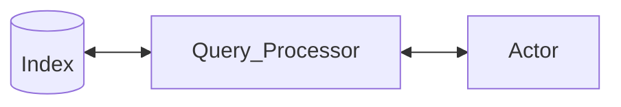
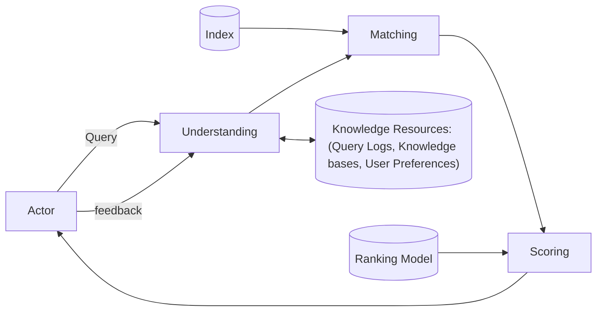
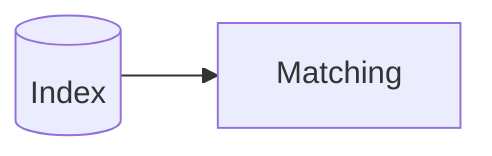
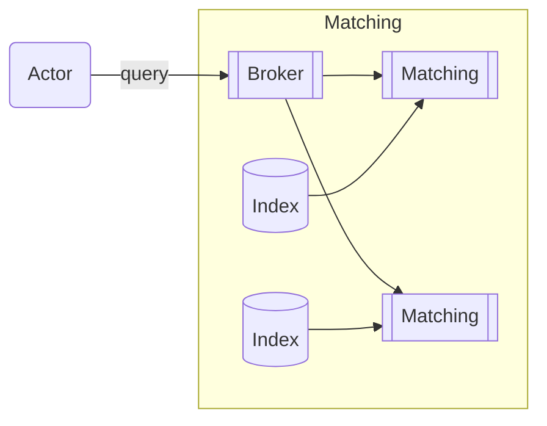

# Aula 07 - 02/04/2025 - Document Matching - Slide: 07-documento-matching

## Search Components (Aula 07)


---



### Query Processing Overview (Aula 07)



---



Aqui busca-se ser "exato", para que encontremos tudo que possa vir a ser útil na pesquisa.

## Document Matching (Aula 07)

- Scan postings lists for all query terms
  - [aquarium fish]

| Terms       | Postings           |
| ----------- | ------------------ |
| and         | 1:1                |
| aquarium    | 3:1                |
| are         | 3:1, 4:1           |
| ...         | ...                |
| environment | 1:1                |
| fish        | 1:2, 2:3, 3:2, 4:2 |

---

- Score matching documents
  - $f(q, d) = \sum_{t \in q} f(t, d)$

## Key Challenge

- Matching must operate under strict time constraints
  - Even a slightly slower search (0.2s-0.4s) can lead to a dramatic drop in the perceived quality of the results
- What makes it so costly?
  - Must score billions (or trillions?) of documents
  - Must answer thousands of concurrent queries

Essa tende a ser a parte mais custosa, visto que é a parte mais computacionalmente custosa

Deve-se considerar que enquanto um usuário tá acessando certa informação, diversos outros usuários podem estar tentando acessar o exato mesmo documento.

### Solution #1: Bypass Scoring

- Query distributions similar to Zipf
  - Popular queries account for majority of traffic
- Caching can significantly improve efficiency
  - Cache search results, or at least inverted lists
- Problem: cache misses will happen eventually
  - New queries, index updates

As consultas mais repetidas podem ser armazenadas em um cache, e assim, quando um usuário fizer uma consulta que já foi feita antes, o resultado pode ser retornado mais rapidamente.

Talvez, não a pesquisa específica tenha sido feita, mas uma consulta bem similar. Então poderia-se buscar alguma pesquisa parecida e retornar o resultado dela ou uma versão atualizada dela.

Em algum momento precisamos expirar a cache por ela já não ser mais tão relevante.

### Solution #2: Distribute the Burden

- Indexes are often distributed in a cluster
  - Too large to fit in a single machine
  - Replication helps load balancing

Índices grandes já não são comportados em um único computador, logo já estarão distribuídos. Assim, cada máquina também acaba precisando acessar outras máquinas.

---



Pode haver então um **broker** que agrupa os resultados dos índices para retornar ao usuário.

---

- Indexes are often distributed in a cluster
  - Too large to fit in one machine
  - Replication helps load balancing
- Problem: cannot scale indefinitely
  - Costly resources (hardware, energy)
  - Intra-node efficiency still crucial

Ainda precisa se preocupar quanto ao nível de eficiência em cada um dos computadores individualmente.

### Solution #3: Score Parsimoniously

- Some ranking models can be expensive
  - Infeasible to score billions of documents
- Ranking as a multi-stage cascade
  - Stage #1: Boolean matching (billions)
  - Stage #2: Unsupervised scoring (millions)
  - Stage #3: Supervised scoring (thousands)

Podemos trabalhar com apenas parte do índice.

Podemos usar técnicas computacionalmente caras, desde que usemos em volumes pequenos de dados.

## Why is it still so costly?

- Inherent cost of matching documents to queries
  - Query length (number of posting lists)
  - Posting lists length (number of postings per list)

| Term     | Postings           |
| -------- | ------------------ |
| aquarium | 3:1                |
| fish     | 1:2, 2:3, 3:2, 4:2 |

De cima pra baixo reduz-se o comprimento da query.

Da esquerda pra direita aumenta-se o tamanho da lista de postings

Acaba sendo necessário varrer as listas. Então quanto mais frequentes foram as palavras, mais custosa será a pesquisa.

## How to Traverse Postings?

### Term-at-a-time (TAAT)

- Inverted lists processed in sequence
  - Partial document scores accumulated

| Term     | Postings      |
| -------- | ------------- |
| salt     | 1:1, 4:1      |
| water    | 1:1, 2:1, 4:1 |
| tropical | 1:2, 2:2, 3:1 |

Podemos varrer um item por ver. Varrendo linha e depois coluna, ou coluna e depois linha. Sendo que a linha representa o termo e a coluna representa o documento.

Mas ao varrer sequencialmente ainda não temos um score global, apenas o parcial que vai sendo acumulado a medida que for percorrido.

---

| Term      | Postings      |
| --------- | ------------- |
| salt      | **1:1, 4:1**  |
| water     | 1:1, 2:1, 4:1 |
| tropical  | 1:2, 2:2, 3:1 |
| **SCORE** | **1:1, 4:1**  |

---

| Term      | Postings          |
| --------- | ----------------- |
| salt      | 1:1, 4:1          |
| water     | **1:1, 2:1, 4:1** |
| tropical  | 1:2, 2:2, 3:1     |
| **SCORE** | **1:2, 2:1, 4:2** |

---

| Term      | Postings               |
| --------- | ---------------------- |
| salt      | 1:1, 4:1               |
| water     | 1:1, 2:1, 4:1          |
| tropical  | **1:2, 2:2, 3:1**      |
| **SCORE** | **1:4, 2:3, 3:1, 4:2** |

---

```python
def taat(query, index, k):
  scores = map()
  results = heap(k)
  for term in tokenize(query):
    postings = index[term]
    for (docid, weight) in postings:
      if docid not in scores.keys():
        scores[docid] = 0
      scores[docid] += weight
  for docid in scores.keys():
    results.add(docid, scores[docid])
  return results
```

- Funcionamento

  1. Inicialização:
     - Cria um mapa vazio para armazenar os scores dos documentos
     - Cria uma heap de tamanho k para armazenar os k melhores resultados
  2. Processamento por termo:
     - Para cada termo na consulta:
       - Obtém a lista de postings (documentos) associada ao termo
       - Para cada documento na lista:
         - Se o documento ainda não está no mapa de scores, inicializa seu score como 0
         - Adiciona o peso do termo naquele documento ao score acumulado
  3. Seleção final:
     - Percorre todos os documentos no mapa de scores
     - Adiciona cada documento e seu score final à heap
     - Retorna os k documentos com maiores score

  - Características:
    - Processa um termo por vez
    - Mantém scores parciais em memória
    - Adequado para consultas com poucos termos
    - Requer mais memória devido ao armazenamento dos scores parciais
    - O algoritmo é uma alternativa ao DAAT (Document-At-A-Time) e é especialmente eficiente para acesso sequencial às listas invertidas, embora use mais memória para os acumuladores de scores.

### Document-at-a-time (DAAT)

- Inverted lists processed in parallel.
  - One document scored at a time.

| X    | Y        |
| ---- | -------- |
| salt | 1:1, 4:1 |

...

---

Ao varrer todo um documento, já temos o valor de seu score.

---

```python
function daat(query, index, k):
  results = heap(k)
  targets = {docid for term in tokenize(query)
                   for docid in index[term]}
  lists = [index[term] for term in tokenize(query)]
  for target in targets:
    score = 0
    for postings in lists:
      for (docid, weight) in postings:
        if docid == target:
          score += weight
    results.add(target, score)
  return results
```

Uma das ineficiências dessa implementação é ter que marcar cada um dos índices que estamos percorrendo no momento.

Outra ineficiência é a inexistência de um iterador que marca o último índice que foi lido.

## Optimization Techniques

- No clear winner between TAAT and DAAT.
  - TAAT is more memory efficient (sequential access).
  - DAAT uses less memory (no accumulators).

Apesar de TAAT ser mais eficiente, num caso onde uma das palavras da cache seja muito recorrente, acaba sendo muito custoso ainda assim.

Geralmente o DAAT é preferível.

- Naïve versions can be improved:
  - Calculate scores for fewer documents (conjunctions).
  - Read less data from inverted lists (skipping).

Poderia-se fazer a pesquisa por conjunção (interseção), ou seja, apenas os documentos que possuem todas as palavras.

### Matching Semantics

- **Disjunctive Matching**
  - Documents must contain **at least one** query term (lower precision).

...

---

- **Conjunctive Matching**: Documents must contain **all** query terms (higher precision).
  - Preferred for short queries.
  - Combined with relaxation for long queries.

...

Uma flexibilização interessante seria...

$Conj \cup (Disj - Conj)$

Pode-se também definir quais termos são mais importantes que outros, assim flexibilizando apenas as buscas conjuntivas desses termos que sobraram.

### Skipping

- Linear scanning is inefficient.
- **Solution**: Store skip pointers in the index.

Um problema da compressão é o caso de termos armazenado apenas os deltas dos docIds. Então seria realmente necessário varrer todos os deltas anteriores para saber onde estamos.

...

#### Skip Pointers

Pode-se criar algumas informações adicionais para facilitar a busca. Locais onde se têm o valor acumulado de determinado delta em tal posição da lista encadeada.

#### Skipping Example

| Inverted List | 34      | 36     | 37     | 45     | 48  | 51  | 52  | 57  | 80  | 89  |
| ------------- | ------- | ------ | ------ | ------ | --- | --- | --- | --- | --- | --- |
| Delta Gaps    | 9       | 2      | 1      | 8      | 3   | 3   | 1   | 5   | 23  | 9   |
| Skip Pointers | (52,12) | (17,3) | (34,6) | (45,9) |     |     |     |     |     |     |

How to skip to docid 37?

Pergunta de aluno: E porque é armazenado o valor do acumulado do anterior e não do próprio índice?

---

How to skip to docid 54?

## Other Approaches

- Unsafe Early Termination:
  - Ignore high-frequency words in TAAT.
  - Ignore documents at the end of lists in DAAT.

Uma alternativa seria ordenar por relevância do documento, tentando manter aqueles com melhores scores no começo. O problema disso é que a relevância depende muito de termo pra termo.

- Index Tiering
  - Postings ordered by quality (e.g., PageRank).
  - Postings ordered by score (e.g., BM25).

Uma forma interessante de garantir o tempo do processamento é definir um tempo máximo de processamento para cada um dos documentos. Assim, se o tempo acabar, não se processa mais aquele documento.

## Summary (Aula 07)

- Document matching is **challenging** due to long inverted lists.
- Several complementary approaches:
  - **Caching**
  - **Distribution**
  - **Cascading**
- Efficient **index traversal** remains crucial.

## References (Aula 07)

- _Search Engines: Information Retrieval in Practice_, Ch. 5 - Croft et al., 2009
- _Scalability Challenges in Web Search Engines_, Ch. 4 - Cambazoglu and Baeza-Yates, 2015
- _Efficient Query Processing Infrastructures_ - Tonellotto and Macdonald, SIGIR 2018
  - [Amazon Link](https://www.amazon.com/Search-Engines-Information-Retrieval-Practice/dp/0136072240)
  - [DOI Link 1](https://doi.org/10.2200/S00662ED1V01Y201508ICR045)
  - [DOI Link 2](https://doi.org/10.1145/3209978.3210191)

## Coming Next... Efficient Matching

## Perguntas (Aula 07)

- Poderia usar um tipo de busca binária alternativa para buscar entre valores parcialmente desconhecidos?
  - Depois que se tem os limites inferiores e superiores,
  - Poderia-se fazer uma busca binária entre os dois limites, baseado no valor esperado nesse meio do caminho
  - Talvez deduzindo alguma linearidade
- Devo engajar menos na aula para dar brecha pros outros alunos?
  - Resposta: a preocupação é natural, mas não o está incomodando e ele não sente que a turma está incomodada com isso. Posso continuar o quanto achar devido.

## Coisas para pesquisar posteriormente (Aula 07)

- Zipf
