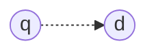

# Aula 09 - 23/04/2025 - Vector Space Models

## The ranking problem

- Given
  - Some evidence of the user's need
- Produce
  - A list of matching information items
  - In decreasing order of relevance

---

- Given
  - Some evidence of the user's need query
- Produce
  - A list of matching information items documents
  - In decreasing order of relevance

---

- $f(q, d)$

## Why rank?

- Couldn't $f(q,d)$ be just an indicator function?

## Document selection vs. ranking

[IMAGEM]

- [JV]
  - A seleção é um ranqueamento binário. Ela pode inclusive ter falsos positivos e falsos negativos.
  - No caso do ranqueamento, ele precisa definir um corte.

## Why not select?

- The classifier is unlikely accurate
  - Over-constrained: no relevants returned
  - Under-constrained: too many relevants returned
  - Hard to find an appropriate threshold
- Not all relevant documents are equally relevant!
  - Prioritization is needed

## Probability Ranking Principle (PRP)

- > Ranking documents by decreasing probability of relevance results in optimal effectiveness, provided that probabilities are estimated (1) with certainty and (2) independently.

  - Robertson, 1977

- [JV]
  - Num caso de ranqueamento, onde os mais relevantes estão no topo, às vezes, não necessariamente o segundo colocado é de fato tão relevante. Isso porque, talvez, o primeiro colocado já cobre o conteúdo do segundo.

## Ranking effectiveness

- Effectiveness is about doing the right thing; it's about finding documents that are relevant to the user
- Relevance is influenced by many factors
  - Topical relevance vs. user relevance
  - [JV] Uma pesquisa como "Natal Rio Grande do Norte" pode ter uma variação de relevância devido a localização do usuário (de BH? Do RJ?), ao que ele busca (Passagens? Hotel? História?)
  - Task, context, novelty, style
  - [JV] Atualmente LLMs processam o texto de forma muito poderosa.
- Ranking models define a view of relevance
  - [JV] No final, é sempre o usuário que diz se a função de ranking é boa ou não.

## Ranking models

- Provide a mathematical framework for ranking
  - Each model builds upon different assumptions
- Progress in ranking models has corresponded with improvements in effectiveness

  - An effective model should score relevant documents higher than non-relevant documents

- [JV]
  - Essa é uma das partes mais focadas na pesquisa porque os outros problemas são mais objetivos, já este acaba sendo mais subjetivo porque depende do usuário.

## Fundamental elements

- f(q="**presidential** campaign _news_", d)
  - "Bag of Words"
    - g("**presidential**", d)
    - g("campaign", d)
    - g("_news_", d)
  - How many times does "**presidential**" occur in $d$?
    - **Term Frequency (TF):** c("**presidential**", d)
  - How long is $d$?
    - **Document length:** $|d|$
  - How often do we see "**presidential**" in the entire collection?
    - **Document Frequency:** df("**presidential**")
    - P("**presidential**"|collection)

## Many classical models

- Similarity-based models: $f(q, d) = sim(q, d)$
  - Vector space models
  - [JV]
    - Baseado em álgebra linear
- Probabilistic models: $f(d, q) = p(R = 1|d, q)$
  - Classic probabilistic models
  - Language models
  - Information-theoretic models

## Many extended models

- Structural models
  - Beyond bags-of-words
  - [JV]
    - De que forma as palavras estão dispostas em sequência no texto
    - Alguma tag em cada uma das palavras
- Semantic models
  - Beyond lexical matching
  - [JV]
    - Além do casamento exato, buscaria-se palavras que têm significado similar, onde tendem a representar a mesma coisa.
- Contextual models
  - Beyond queries
  - [JV]
    - Historicamente nas buscas do usuário, essa query é relevante?

## Vector Space Model (VSM)

[Imagem gráfico $\mathbb{R}^3$ (Programming, Library, Presidential)]

- [JV]
  - Existem estruturas para armazenar vetores densos.
  - Busca-se encontrar o documento nesse espaço vetorial.
  - Cada dimensão é uma palavra do documento único.

## VSM is a framework

- Queries and documents as term vectors
  - Term as the basic concept (e.g., word or phrase)
    - [JV]
      - Poderiam ser usados outros conceitos para definir as dimensões, como sinônimos, bigramas, trigramas, etc.
- A vocabulary $V$ defines a $|V|$-dimensional space
  - Vector components as real-valued term weights
- Relevance estimated as $f(q, d) = sim(q, d)$
  - $q = (x_1, \dots, x_{|V|})$ and $d = (y_1, \dots, y_{|V|})$
    - [JV]
      - Mas como escolho qual valor colocar em cada eixo?
      - Há algum grau de prioridade entre os eixos?

## What VSM doesn't say

- How to define vector dimensions
  - Concepts are assumed to be orthogonal
- How to place vectors in the space
  - Term weight in query indicates importance of term
  - Term weight in document indicates topicality
- How to define the similarity measure

---

- [Imagem gráfico $\mathbb{R}^3$ (?, ?, ?)]
  - $q = (x_1, \dots, x_{|V|}), x_i = ?$
  - $d = (y_1, \dots, y_{|V|}), y_i = ?$
  - $sim(q, d) = ?$

## Dimensions as a bag of words (BOW)

- Vocabulary: $V = (w_1, \dots, w_{|V|})$
- [Imagem gráfico $R^3$ $(w_1, w_2, w_3)$]

### Vectors placed as bit vectors

- $x_i, y_i \in {0,1}$

  - 1: word $w_i$ is present
  - 0: word $w_i$ is absent

- [Imagem gráfico $R^3$ $(w_1, w_2, w_3)$]
  - $q = (1, 1, 1)$
  - $d = (0, 1, 1)$

## Similarity as dot product

- $sim(q, d)$

  - $= q \cdot d$
  - $= x_1 y_1 + \dots + x_{|V|} y_{|V|}$
  - $= \sum_{i=1}^{|V|} x_i y_i$

- [Imagem gráfico $R^3$ $(w_1, w_2, w_3)$]

  - $q = (1, 1, 1)$
  - $d = (0, 1, 1)$

- [JV]
  - Essa multiplicação representa a quantidade de palavras que a query tem que o documento também tem.
  - Embora simples, ainda assim é bastante prática e útil.

## Simplest VSM = BOW + bit vectors + dot

- $q = (x_1, \dots, x_{|V|})$
- $d = (y_1, \dots, y_{|V|})$
- $x_i, y_i \in {0,1}$
  - 1: word $w_i$ is present
  - 0: word $w_i$ is absent
- $sim(q, d)$

  - $= q \cdot d$
  - $= x_1 y_1 + \dots + x_{|V|} y_{|V|}$
  - $= \sum_{i=1}^{|V|} x_i y_i$

- What does this ranking function intuitively capture?
- Is this a good ranking function?

## How would you rank these documents?

- $q$ = [ news about presidential campaign ]
- $d_1$ = [ ... **news about** ... ]
- $d_2$ = [ ... **news about** organic food **campaign** ... ]
- $d_3$ = [ ... **news** of **presidential campaign** ... ]
- $d_4$ = [ ... **news** of **presidential candidate** ... **presidential** candidate ... ]
- $d_5$ = [ ... **news** of organic food **campaign** ... **campaign** ... **campaign** ... **campaign** ... ]

- [JV]
  - $d_1$, $d_2$ e $d_5$ Seriam irrelevantes.

---

| Document | Ideal rank |
| -------- | ---------- |
| $d_1$    | $d_4 +$    |
| $d_2$    | $d_3 +$    |
| $d_3$    | $d_1 -$    |
| $d_4$    | $d_2 -$    |
| $d_5$    | $d_5 -$    |

## Ranking using the simplest VSM

- $q$ = [ news about presidential campaign ]
- $d_1$ = [ ... **news about** ... ]
- $d_3$ = [ ... **news** of **presidential campaign** ... ]
- $V = { news, about, presidential, campaign, food, ... }$
  - $q = (1, 1, 1, 1, 0, \dots )$
  - $d_1 = (1, 1, 0, 0, 0, \dots )$: $sim(q, q_1) = 2$
  - $d_3 = (1, 0, 1, 1, 0, \dots )$: $sim(q, q_3) = 3$

## Is it effective?

- $q$ = [ news about presidential campaign ]
- $d_1$ = [ ... **news about** ... ]
- $d_2$ = [ ... **news about** organic food **campaign** ... ]
- $d_3$ = [ ... **news** of **presidential campaign** ... ]
- $d_4$ = [ ... **news** of **presidential candidate** ... **presidential** candidate ... ]
- $d_5$ = [ ... **news** of organic food **campaign** ... **campaign** ... **campaign** ... **campaign** ... ]

| Document | $f(q, d)$ |
| -------: | --------: |
|    $d_1$ |         2 |
|    $d_2$ |         3 |
|    $d_3$ |         3 |
|    $d_4$ |         3 |
|    $d_5$ |         2 |

| ranking |   Ideal |
| ------: | ------: |
|   $d_2$ | $d_4 +$ |
|   $d_3$ | $d_3 +$ |
|   $d_4$ | $d_1 -$ |
|   $d_1$ | $d_2 -$ |
|   $d_5$ | $d_5 -$ |

- [JV]
  - Poderiam ser feitos swaps para alternar as ordenações para melhorar.

## What's wrong with it?

- $q$ = [ news about presidential campaign ]
- $d_3$ = [ ... **news** of **presidential campaign** ... ]
- $d_4$ = [ ... **news** of **presidential candidate** ... **presidential** candidate ... ]

| Document | $f(q, d)$ | ranking |   Ideal |
| -------: | --------: | ------: | ------: |
|    $d_1$ |         2 |   $d_2$ | $d_4 +$ |
|    $d_2$ |         3 |   $d_3$ | $d_3 +$ |
|    $d_3$ |         3 |   $d_4$ | $d_1 -$ |
|    $d_4$ |         3 |   $d_1$ | $d_2 -$ |
|    $d_5$ |         2 |   $d_5$ | $d_5 -$ |

- Matching "presidential" **more times** deserves more credit!

## Vectors placed as tf (Term Frequency (?)) vectors

- $x_i, y_i \in \mathbb{N}$
  - $x_i: tf_{w_{i, q}}$
  - $y_i: tf_{w_{i, d}}$
- [Imagem gráfico $R^3$ $(w_1, w_2, w_3)$]
  - $q = (1, 1, 1)$
  - $d = (2, 0, 5)$

## Ranking using VSM with tf vectors

- $q$ = [ news about presidential campaign ]
- $d_3$ = [ ... **news** of **presidential campaign** ... ]
- $d_4$ = [ ... **news** of **presidential candidate** ... **presidential** candidate ... ]

- $V = \{ news, about, presidential, campaign, food, \dots \}$
  - $q = (1, 1, 1, 1, 0, \dots )$
    - [JV] É comum que as buscas acabem tendendo a ter uma pesquisa parecida com binária nessa representação de frequência.
  - $d_3$ = (1, 0, 1, 1, 0, $\dots$ ): $sim(q, d_3) = 3$
  - $d_4$ = (1, 0, 2, 1, 0, $\dots$ ): $sim(q, d_4) = 4$

## What's wrong with it? (2)

- $q$ = [ news about presidential campaign ]
- $d_2$ = [ ... **news about** organic food **campaign** ... ]
- $d_3$ = [ ... **news** of **presidential campaign** ... ]

| Document | $f(q, d)$ | ranking |  Ideal  |
| :------: | :-------: | :-----: | :-----: |
|    -     |     -     |  $d_2$  | $d_4 +$ |
|  $d_2$   |     3     |  $d_3$  | $d_3 +$ |
|  $d_3$   |     3     |  $d_4$  | $d_1 -$ |
|    -     |     -     |  $d_1$  | $d_2 -$ |
|    -     |     -     |  $d_5$  | $d_5 -$ |

- Matching "presidential" is **more important** than matching "about"!

- [JV]
  - Presidential acaba sendo mais raro que about, logo, mais significativo.

## Vectors placed as tf-idf vectors

- $x_i, y_i \in \mathbb{R}$
  - $x_i: tf_{w_{i, q}} \cdot idf_{w_i}$
  - $y_i: tf_{w_{i, d}} \cdot idf_{w_i}$
  - [JV]
    - $tf$ é o inteiro, a frequência que já temos calculado
    - $idf$ será o peso real.
      - Existem várias aplicações dela na literatura.
- [Imagem gráfico $\mathbb{R}^3$ $(w_1, w_2, w_3)$]
  - $q = (1, 1, 1)$
  - $d = (2, 0, 5)$

## Inverse document frequency (idf)

- $idf_w = \log \frac{n+1}{n_w}$
  - [JV] O $i$ é de inversa.
  - $n$: number of documents in the corpus
  - $n_w$: number of documents where $w$ appears

## Why a log-based penalization?

- [Imagem gráfico $\mathbb{R}^2: (n_w, idf_w = \log \frac{n+1}{n_w})$]
  - Rapid decay after a small fraction of the corpus
  - [JV]
    - Esse decaimento rápido busca rapidamente penalizar a existência de repetições.
    - Dúvida: ora, mas e se uma palavra ocorrer por acaso em um documento, mas em n outros mais importantes ela aparecer algumas poucas vezes a mais, nesse caso, nesses mais relevantes, eles em si teriam um peso menor nesse cálculo. Não seria interessante uma outra curva diferente de log?
      - Resposta: "In the big scheme of things", ou em português, "no frigir dos ovos", esses casos podem acabar sendo mais raros, então não impactaria tanto.

## Ranking using VSM with tf-idf vectors

- $q$ = [ news about presidential campaign ]
- $d_2$ = [ ... **news about** organic food **campaign** ... ]
- $d_3$ = [ ... **news** of **presidential campaign** ... ]
- $V = \{ news, about, presidential, campaign, food, \dots \}$
- $idf = (1.5, 1.0, 2.5, 3.1, 1.8, \dots)$

  - $q = (1, 1, 1, 1, 0, \dots )$
  - $d_2 =$ (1 \* 1.5, **1 \* 1.0**, 0, 1 \* 3.1, 0, $\dots$): $sim(q, d_2) = 5.6$
  - $d_3 =$ (1 \* 1.5, 0, **1 \* 2.5**, 1 \* 3.1, 0, $\dots$): $sim(q, d_3) = 7.1$

- [JV]:

| **V** | News     | About        | Presidential | Campaign | Food | $\dots$ |
| ----- | -------- | ------------ | ------------ | -------- | ---- | ------- |
| $idf$ | 1.5      | 1.0          | 2.5          | 3.1      | 1.8  | $\dots$ |
| $d_2$ | 1 \* 1.5 | **1 \* 1.0** | 0            | 1 \* 3.1 | 0    | $\dots$ |
| $d_3$ | 1 \* 1.5 | 0            | **1 \* 2.5** | 1 \* 3.1 | 0    | $\dots$ |

## Is it effective? (2)

- $q$ = [ news about presidential campaign ]
- $d_1$ = [ ... **news about** ... ]
- $d_2$ = [ ... **news about** organic food **campaign** ... ]
- $d_3$ = [ ... **news** of **presidential campaign** ... ]
- $d_4$ = [ ... **news** of **presidential candidate** ... **presidential** candidate ... ]
- $d_5$ = [ ... **news** of organic food **campaign** ... **campaign** ... **campaign** ... **campaign** ... ]

| Document | $f(q, d)$ |
| :------: | --------: |
|  $d_1$   |       2.5 |
|  $d_2$   |       5.6 |
|  $d_3$   |       7.1 |
|  $d_4$   |       9.6 |
|  $d_5$   |      13.9 |

| ranking |  Ideal  |
| :-----: | :-----: |
|  $d_5$  | $d_4 +$ |
|  $d_4$  | $d_3 +$ |
|  $d_3$  | $d_1 -$ |
|  $d_2$  | $d_2 -$ |
|  $d_1$  | $d_5 -$ |

---

- $q$ = [ news about presidential campaign ]
- $d_4$ = [ ... **news** of **presidential candidate** ... **presidential** candidate ... ]
- $d_5$ = [ ... **news** of organic food **campaign** ... **campaign** ... **campaign** ... **campaign** ... ]

- $V = \{ news, about, presidential, campaign, food, \dots \}$
- $idf = (1.5, 1.0, 2.5, 3.1, 1.8, \dots)$
  - $q = (1, 1, 1, 1, 0, \dots )$
- $q$ = [ news about presidential campaign ]
- $d_4$ = [ ... **news** of **presidential candidate** ... **presidential** candidate ... ]
- $d_5$ = [ ... **news** of organic food **campaign** ... **campaign** ... **campaign** ... **campaign** ... ]

## Ranking using VSM with tf-idf vectors (2)

- $q$ = [ news about presidential campaign ]
- $d_4$ = [ ... **news** of **presidential candidate** ... **presidential** candidate ... ]
- $d_5$ = [ ... **news** of organic food **campaign** ... **campaign** ... **campaign** ... **campaign** ... ]

- $V = \{ news, about, presidential, campaign, food, \dots \}$
- $idf = (1.5, 1.0, 2.5, 3.1, 1.8, \dots)$

  - $q = (1, 1, 1, 1, 0, \dots )$
  - $d_4 =$ (1 \* 1.5, 0, 2 \* 2.5, 1 \* 3.1, 0, $\dots$): $sim(q, d_4) = 9.6$
  - $d_5 =$ (1 \* 1.5, 0, 0, **4 \* 3.1**, 1 \* 1.8, $\dots$): $sim(q, d_5) = 13.9$

## Transforming tf

[Imagem Gráfico $\mathbb{R}^2$ $(c(w, d), tf_{w, d})$]

- $tf_{w, d} = c(w, d)$
- $tf_{w, d} = \log(1 + c(w, d))$
- $tf_{w, d} = \log(1 + \log(1 + c(w, d)))$
- $tf_{w, d} = 1(c(w, d) > 0)$

- [JV] Estamos saturando a utilidade de determinado documento

## What about document length?

- q = [news about presidential campaign]
- $d_4$: [... **news** of **presidential campaign** ... **presidential** candidate ...]: 100 words
- $d_6$: [... **campaign** ... **campaign** ... ... **news** ... ... ... **news** ... ... **presidential** ... **presidential** ... ]: 5000 words

- $f(q, d_6) > f(q, d_4)$?

## Document length normalization

- Penalize long documents
  - [JV] Embora possa penalizar bons documentos, essa heurística muitas vezes funciona.
  - Avoid matching by chance
  - Must also avoid over-penalization
- A document is long because
  - It uses more words $\to$ more penalization
  - It has more content $\to$ less penalization

## Pivoted length normalization (pln)

- $pln_d = (1-b) + b \frac{|d|}{avdl}$
  - $|d|$: document length in tokens
  - $avdl$: average document length in the corpus
  - $b \in [0,1]$: parameter

---

- $pln_d = (1-b) + b \frac{|d|}{avdl}$

[Imagem: gráfico $\mathbb{R}^2$ $(|d|, pln_d)$, relação entre recompensa e penalização. Recompensa quando é menor que avdl e penalização quando é maior que avdl]

- [JV]
  - Inclusive isso me lembra um pouco o PID.
  - A ideia é que, quando o documento é menor que a média, ele acaba sendo mais relevante, então a recompensa é maior. Quando ele é maior que a média, ele acaba sendo penalizado.

## State-of-the-art VSM ranking

- Pivoted length normalization VSM [Singhal et al. 1996]
  - $f(q, d) = \sum_{w \in q} c(w, q) \frac{\ln (1 + \ln(1 + c(w, d)))}{(1 - b) + b \frac{|d|}{avgdl}} \log \frac{n+1}{n_w}$
- Okapi/BM25 [Robertson and Walker, 1994]

  - $f(q, d) = \sum_{w \in q} c(w, q) \frac{(k_1 + 1)(c(w, d) + k_1)}{c(w, d) + k_1 ((1-b) + b \frac{|d|}{avgdl})} \log \frac{n+1}{n_w}$

- [JV] Não decorem as fórmulas, mas as feature emergentes das fórmulas

## Summary - Aula 09

- Fundamental ranking components
  - Term and document frequency
  - Document length
- VSM is a framework
  - Components as term and document weights
  - Relevance as query-document similarity

---

- Lack of theoretical justification
  - Axiomatic approaches, probabilistic approaches
- Room for further improvement
  - Structure, semantics, feedback, context
  - Feature-based models

## References - Aula 09

- [Pivoted document length normalization Singhal et al., SIGIR 1996][Link_1996]
- [Some simple effective approximations to the 2-Poisson model for probabilistic weighted retrieval Robertson and Walker, SIGIR 1994][Link_1994]
- [The probability ranking principle in IR Robertson, J. Doc. 1977][Link_1977]

[Link_1996]: https://dl.acm.org/doi/10.1145/243199.243206
[Link_1994]: https://dl.acm.org/doi/10.5555/188490.188561
[Link_1977]: https://www.emerald.com/insight/content/doi/10.1108/eb026647/full/html

## Coming Next... Language Models
