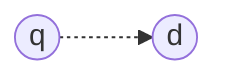

# Aula 10 - 24/04/2025 - Language Models - Slide: 10-language-models

## The ranking problem (Aula 10)

- $f(q, d)$

## Ranking models recap

- **Boolean model**
  - Boolean query
  - Set-based retrieval (no actual ranking)
- **Vector space models**
  - Query and documents as vectors
  - Similarity-based ranking

## Language modeling approach

- **Key intuition**
  - Users who try to think of a good query, think of words that are likely to appear in relevant documents
  - A document is a good match to a query if it uses the same underlying language as the query

## Statistical language model

- A probability distribution over word sequences
  - $P(``Today\ is\ Wednesday") \approx 0.001$
  - $P(``Today\ Wednesday\ is") \approx 0.0000000000001$
  - $P(``The\ eigenvalue\ is\ positive") \approx 0.00001$
- Can also be regarded as a probabilistic mechanism for "generating" text, thus also called a "generative" model

## Types of language models

- Full dependence model

  - $P(w_1 \dots  w_k) = P(w_1) P(w_2 | w_1) \dots P(w_k | w_1 \dots w_{k-1})$
  - [JV]
    - Estimar essas probabilidades é complexo e muito caro
    - Acaba que por falta de contexto, pode-se estimar erroneamente a probabilidade de uma palavra

- Infeasible in practice

  - Expensive computation
  - Weak estimates (data sparsity)

---

- Tunable dependence via n-grams
  - 3-gram ("trigram")
    - $P(w_1 \dots  w_k) = P(w_1)\,P(w_2 | w_1)\, \dots \,P(w_k | w_{k-2}, w_{k-1})$
  - 2-gram ("bigram")
    - $P(w_1 \dots  w_k) = P(w_1)\,P(w_2 | w_1)\, \dots \,P(w_k | w_{k-1})$
  - 1-gram ("unigram")
    - $P(w_1 \dots  w_k) = P(w_1)\,P(w_2)\, \dots \,P(w_k)$

## Unigram language model

- The simplest language model

  - A one-state probabilistic finite automaton

- State Emission Probabilities

| Word  | Probability |
| :---- | ----------: |
| the   |        0.20 |
| the   |        0.20 |
| a     |        0.10 |
| frog  |        0.01 |
| toad  |        0.01 |
| said  |        0.03 |
| likes |        0.02 |
| that  |        0.04 |
| ...   |         ... |
| STOP  |        0.20 |

- $P(``frog\ said\ that\ toad\ likes\ frog\ STOP") = 0.01 \cdot 0.03 \cdot 0.04 \cdot 0.01 \cdot 0.02 \cdot 0.01 \cdot 0.02 = 0.0000000000048$

## Example Text Generation

- Model $\theta_1$:
- Model $\theta_2$:

## Evaluation of language models

- [JV] Conceitos de Teoria da Informação

## Applications of language models

- **...**
- **Document Ranking**

## Query likelihood model

- $f(q, d) \approx P(q, d)$
  - $f(q, d) = P(d) \cdot P(q | d)$ Bayes' rule
  - Two core components:
    - $P(q | d)$: query likelihood
    - $P(d)$: document prior
      - [JV] Ele basicamente faz um ranqueamento prévio global para cada um dos documentos

### Computing $P(d)$

- $P(d) = 1 / n$, for $n$ documents in the corpus

### Computing $P(q|d)$

#### Ranking Query Likelihood

#### Computing $P(q|d)$ (2)

- $P(q|\theta_d) = \prod_{t \in q} P(t|\theta_d)^{tf_{t,q}}$

  - [JV]

    - O $tf_{t,q}$ seria o expotente dada a frequência de determinada palavra na consulta.
    - Acaba ocorrendo problema de underflow por ser um número muito pequeno.

    - A utilidade de usar o log é que ela converte números minúsculos em números maiores.
    - $\propto$

- $P(q|\theta_d) = \prod_{t \in q} P(t|\theta_d)^{tf_{t,q}} \propto \sum_{t \in q} tf_{t,q} \log P(t|\theta_d)$

### How to estimate $P(t| ...)$?

- $P_{MLE}(t|\theta_d) = \frac{tf_{t,d}}{|d|}$

  - [JV] O $|d|$ é o número total de palavras no documento.
  - [JV] O $tf_{t,d}$ é a contagem de frequência da palavra $t$ no documento $d$.

- Problems
  - Observed
  - Unobserved
    - [JV] Talvez uma solução seria pegar o contexto geral e dar alguma probabilidade média a palavras próximas do contexto não presentes.

### Smoothing Probabilities

- [JV] Esse Smoothing ocorrerá através da análise de probabilidade considerando todo o Corpus

---

- General form
  - $P(t|\theta_d) = (1-\alpha) P_{MLE}(t|\theta_d) + \alpha P_{MLE}(t|\theta_C)$

### Jelinek-Mercer Smoothed Model

- $f(q, d) \propto \prod_{t \in q} P(t|\theta_d)^{tf_{t,q}}$
- $f(q, d) = \prod_{t \in q} \left( (1-\lambda) \frac{tf_{t,d}}{|d|} + \lambda \frac{tf_{t,C}}{|C|} \right)$

### Where is tf-idf wighting?

...

### How about Document Length?

- [JV] Se for um documento muito longo, então, ele tende a aumentar a intensidade da relevância das palavras no corpus, senão foca no documento pequeno.

### How effective are these?

### Extended Approaches

### Document Likelihood model

### Model comparison

Estado da arte
