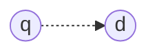
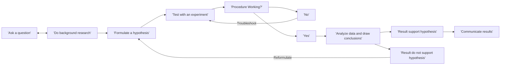

# Aula 11 - 28/04/2025 - Experimental Methods

## One Problem

- $f(q, d)$

## Many Solutions

- Similarity-based models
- Probabilistic models
- Extended models
- Machine-learned models

## Why Evaluate

- Lots of alternative solutions
  - Which one to choose?
  - How to improve upon them?
- Evaluation enables an informed choice
  - Rigor of science
  - Efficiency of practice

## What to evaluate?

- Three fundamental types of IR research
  - Systems (efficiency)
  - Methods (effectiveness)
  - Applications (user utility)
- Evaluation plays a critical role for all three

  - Our primary focus is on "methods" research

- [JV]
  - Geralmente é muito difícil avaliar um sistema de busca, dificilmente tendo uma teoria que explique bem.

## How to evaluate?

- Scientifically, of course!
  - [JV]
    - A Microsoft é um dos que mais divulga sobre as pesquisas internas que fazem.
    - Nem sempre dá pra publicar resultado negativo, mas para mestrado e doutorado até que daria.

## Asking questions

- What problem are you trying to solve?
  - Or in IR parlance, what task?
- Hard to solve an ill-defined task!
  - Is it a well-known task? Review the literature!
  - Is it unlike anything done before?

### Asking (new) questions

- Characterize the task
  - How is the system used?
  - What are the inputs? Outputs?
  - How do you define success?

## Formulating hypotheses

- A hypothesis must be falsifiable
  - Ideally concerning an isolated component
- e.g., _length normalization improves ranking_
- It either holds or does not...
  - ... with respect to the considered data (scope)
  - ... perhaps under certain conditions (extent)

## Performing experiments

- Key components
  - Experimental setup
  - Analysis of results
- Key concern: **reproducibility**

  - Must specify each and every detail needed for reproducing our method and the experiment

- [JV]
  - Segundo ele, computação é mais atrasado na parte científica porque na parte da medicina e biologia, se eles cometem um erro, as implicações são seríssimas.
  - Como facilitar a vida de quem desejará reproduzir o experimento?

## Experimental setup

- Research questions
- Evaluation methodology
- Evaluation benchmarks
- Reference comparisons
- Parameter tuning

## Research questions

- Methods are not devised arbitrarily
  - We always have a hypothesis (whether implicit or explicit) for why our work should improve
  - Even the best results are useless if nobody understands what you are trying to solve
- So, spell out your research questions!

## Evaluation methodology

- We want to know
  - What users consider relevant
- We can observe
  - What users tell us (explicit feedback)
  - What users do (implicit feedback)
- These are _noisy_ measurements
  - [JV] Situações usuais mas distintos do comportamento esperado: tipo o amigo que curte o vídeo não por gostar do vídeo mas por gostar de amigo.

---

- Prospective experiments
  - How well can we predict future preferences?
- Benchmarked using live user interactions
  - Poorly reproducible
  - Highly realistic

---

- Retrospective experiments
  - How well can we predict (hidden) past preferences?
- Benchmarked using static test collections
  - Highly reproducible
  - Poorly realistic

---

- Feedback

  - Implicit
  - Explicit

- Mode

  - Retrospective
  - Prospective

- Retrospective+Implicit: Counterfactual evaluation
- **Retrospective+Explicit:** Offline evaluation
  - [JV] Nessa disciplina, focaremos nessa
- Prospective+(Implicit|Explicit): Online evaluation

## Public test collections

- Text REtrieval Conference
  - TREC has collections on Web, blog, tweet, video, question-answering, legal documents, medical records, chemicals, genomics, ... search
  - <http://trec.nist.gov/tracks.html>
  - <http://trec.nist.gov/data.html>

## You can build your own

- Three core components
  - A corpus of documents
  - A set of users' queries
  - A map of users' relevance assessments

---

- Document corpus
  - Go crawl it!
- Queries
  - The more the better (e.g., at least 50)
  - Representative of the population (e.g., from a log)
- Relevance judgments

## How to judge relevance?

- Who does it?
  - Hired judges? Volunteers? Experts? Live users?
  - [JV]
    - Se estou em um caso de uso específico, qualquer um poderia avaliar o ranking? Não, só especialistas.
    - Mechanical alguma coisa na AWS
- What are the instructions?
  - Short queries? Long narratives?
- What is the level of agreement?
  - Redundancy to counter subjectivity

## What to judge for relevance

- Exhaustive assessment is not practical
  - Alternative: document sampling
- Stratified sampling via pooling
  - Top $k$ results from $m$ rankers merged
  - Unique (up to $km$) results submitted for judgment
- Generally robust for evaluating new rankers

## Reference comparisons (aka baselines)

- _My method achieves 0.9 precision_
  - Meaningless without a reference comparison
  - Rephrasing: is it better or worse?
- Choice of baseline depends on the hypothesis
  - Key question: what are you trying to show?

## Choosing baselines

- Vanilla baselines
  - Have the proposed effect turned off
    - **e.g.**, ranking without length normalization
- Competing baselines
  - Exploit the proposed effect in a different manner
    - **e.g.**, alternative length normalization

## Parameter tuning

- Your method may have parameters
  - Your baselines may also have parameters
    - **e.g.**, $b$ for pivoted length normalization
- Which parameters need tuning?
  - Which can stay fixed?
  - How to tune?

## Analysis of results

- Measure, compare, slice and dice results
  - Helps prove (or disprove) your hypotheses
  - Demonstrates how your methods or systems compare against the existing state-of-the-art
  - Provides fundamental insights into the underlying research problems being addressed

## Evaluation metrics

- General form: $\Delta (R, G)$
  - $R𝑅$: ranking produced by model $f$ for query $q$
  - $G$: ground-truth produced for query $q$
- Metrics should be chosen according to the task
  - Web search (precision) vs. legal search (recall) (more on next class)
    - [JV] O Recall seria trazer o que algum outro item relevante pro caso atual.

<!-- Cabelímetro -->

## Results significance

- Effectiveness varies across queries
  - Large average improvement may not be consistent
  - Might improve a lot on some queries, hurt on many

## Variable effectiveness

- A2
  - Average gain: 15%
  - Improved queries: 40
  - Harmed queries: 0
- A1
  - Average gain: 15%
  - Improved queries: 20
  - Harmed queries: 20

[IMG: Gráfico $\mathbb{R}^2$ onde o A1 tem maior variação, podendo ser muito bom, mas também um pouco ruim. Já no A2 é mais consistente e sempre melhor]

## Results significance (Aula 11)

- Effectiveness varies across queries
  - Large average improvement may not be consistent
  - Might improve a lot on some queries, hurt on many
- Improvements should be tested for significance
  - Statistical significance (see next class)
  - Practical significance

## Deeper analyses

- My method beats the baseline...
  - ... phew, let's call it a victory and go home! **# NOT**
- Deeper analyses may provide further insights
  - Why the method works
  - When the method works
  - And when it doesn't!

---

- Parameter sensitivity analysis
  - How sensitive is the method to its parameters?
- Breakdown analysis
  - How does it perform for different queries?
- Failure analysis
  - What are the main reasons for failure?

## Summary (Aula 11)

- Experimentation drives search innovation

  - Experiments should be economically practical
  - Experiments should be scientifically rigorous
  - Experiments should be reproducible
  - Experiments should provide insights

- [JV] Não conseguimos melhorar o que não conseguimos medir

## References (Aula 11)

- [[Aula_11.1]][Aula_11.1] Experimental methods for information retrieval Metzler and Kurland, SIGIR 2012
- [[Aula_11.2]][Aula_11.2] Introduction to Information Retrieval, Ch. 8 Manning et al., 2008
- [[Aula_11.3]][Aula_11.3] Search Engines: Information Retrieval in Practice, Ch. 8 Croft et al., 2009

[Aula_11.1]: https://dl.acm.org/doi/10.1145/2348283.2348534
[Aula_11.2]: https://www.amazon.com/Introduction-Information-Retrieval-Christopher-Manning/dp/0521865719
[Aula_11.3]: https://www.amazon.com/Search-Engines-Information-Retrieval-Practice/dp/0136072240
