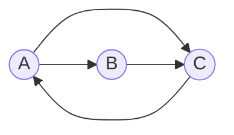

# Slide 14 - Quality Models

## O que se pode aprender com esse slide

- **Q:** Pra quê serve o Document Prior?
  - **R:** define a qualidade de um documento independente da query.
- **Q:** Quais são as métricas de qualidade? E o que significam?
  - **Autoridade:** Especialista vs pitaqueiro
  - **Objetivo:** educativo vs comercial vs fake news
  - **Credibilidade:** especialista vs malicioso
  - **Padrões de publicação:** jornalista vs tia no WhatsApp
  - **Originalidade:** A página é original ou é um recorte de outra página?
  - **Atualidade:** A página é atual ou é uma documentação antiga?
  - **Valor:** A informação é aprofundada ou superficial?
  - **Links:** Ela possui links para outras páginas de assuntos similares ou não? Várias páginas relacionadas linkam para ela?
  - **Layout:** a configuração da página a torna legível e fácil de navegar?
- **Q:** Quais são os critérios negativos?
  - **Spam:** páginas web foram maliciosamente geradas para terem alta qualidade artificialmente, não correspondendo com a qualidade real.
- **Q:** Qual a diferença entre on-document e off-document evidence?
  - **On-document evidence:** evidências que podem ser encontradas no próprio documento.
    - **Ex.:** Verbosidade, legibilidade, coesão, navegabilidade e suporte.
  - **Off-document evidence:** evidências que podem ser encontradas fora do documento, como links e cliques.
    - **Ex.:** Análise de links, taxa de cliques e PageRank.
- **Q:** Quais são as evidências on-document?
  - **Verbosidade:** Tamanho do documento, tamanho nominal, tamanho visível e tamanho do título.
  - **Legibilidade:** Tamanho do termo médio, taxa de stopwords e texto em tabelas.
  - **Coesão:** Baixa entropia
  - **Navegabilidade:** Nível do link e tipo da URL.
  - **Suporte:** Taxa de texto de âncora.
- **Q:** Quais são as evidências off-document?
  - **Análise de links:** URL e texto âncora.
  - **Autoridade:** páginas com mais links apontando para elas são mais relevantes.
  - **PageRank:** O PageRank é um algoritmo que mede a importância de uma página web com base na quantidade e qualidade dos links que apontam para ela.
  - **Click-Through Rate (CTR):** Taxa de cliques
- **Q:** O que é um Surfador Aleatório?
  - **R:** Um surfador aleatório é um modelo que simula o comportamento de um usuário navegando na web, escolhendo aleatoriamente entre seguir links ou ir para uma página aleatória.

## The Ranking Problem

- **Problema de Ranqueamento:** busca-se encontrar alguns critérios de avaliação para definir que alguns documentos são melhores que outros.

### Query Likelihood Model

- A Query Likelihood é dada pela equação: $f(q, d) = P(q | d) P(d)$, onde:

  - $P(q | d)$: de fato a query likelihood.
  - $P(d)$: document prior

- **Document Prior:** qualidade de um documento independente da query; Essa é também chamada de "Propriedade apriori".

- **Dúvidas:**
  - Qual a relação do $f(q, d)$ com o $P(q | d)$?
  - Seria uma qualidade esperada para cada dupla de query e documento?
  - De que forma isso se dá na prática?

### Alguns critérios de avaliação do document prior

- A ideia dos critérios que serão expostos, não é necessariamente definir uma métrica objetiva principal para o documento, mas sim um critério a mais para melhoria do ranqueamento.

- **Relevância:** Um documento web de qualidade tende a ter maior valor em sua probabilidade a priori (document prior).
- É importante que usemos esses fatores de qualidade de forma a melhorar a efetividade do ranqueamento. (Ex.: nDCG, MAP, etc.)

## Qualidade de documentos na web

A web é decentralizada e heterogênea, qualquer um pode criar uma página na web. Isso impacta em algumas características de qualidade de um documento.

- **Autoridade:** especialista vs pitaqueiro
- **Objetivo:** educativo vs comercial vs fake news
- **Credibilidade:** especialista vs malicioso
- **Padrões de publicação:** jornalista vs tia no WhatsApp

Para que a página tenha qualidade, vários fatores devem ser levados em consideração.

- **Originalidade:** A página é original ou é um recorte de outra página?
- **Atualidade:** A página é atual ou é uma documentação antiga?
- **Valor:** A informação é aprofundada ou superficial?
- **Links:** Ela possui links para outras páginas de assuntos similares ou não? Várias páginas relacionadas linkam para ela?
- **Layout:** a configuração da página a torna legível e fácil de navegar?

Justamente por toda essa heterogeneidade, a qualidade de um documento web pode ser vista como um espectro que varia entre páginas de alta qualidade e spam.

Atualmente, com a força do surgimento das LLMs, a geração de conteúdo de baixa qualidade tem aumentado, o que torna a avaliação de qualidade ainda mais importante, não se limitando apenas a verificar se é spam, mas incluindo também a verificação da profundidade e qualidade da informação.

A luta contra o spam é uma luta constante entre os criadores de conteúdo e os mecanismos de busca. Muitos criadores mal intencionados podem aproveitar dos métodos de ranqueamento para manipular os resultados de busca. No geral, os buscadores preferem seguir uma abordagem educativa, informando quais são os critérios de ranqueamento e quais seriam as boas práticas para a criação de conteúdo.

Essas boas práticas servem para indicar de que forma o buscador irá promover conteúdos de qualidade e rebaixar conteúdos de baixa qualidade. A avaliação da qualidade do documento pode variar entre **"evidências no documento" (_on-document_)** e **"evidências fora do documento" (_off-document_)**.

- **Avaliação de qualidade do documento**
  - **On-document evidence:** evidências que podem ser encontradas no próprio documento.
    - **Ex.:** Verbosidade, legibilidade, coesão, navegabilidade e suporte.
  - **Off-document evidence:** evidências que podem ser encontradas fora do documento, como links e cliques.
    - **Ex.:** Análise de links, taxa de cliques e PageRank.

### On-document evidence

#### Verbosidade

- **Tamanho do documento:** basicamente avalia a quantidade de tokens presentes em um documento
  - **Tamanho nominal:** tamanho total do documento
  - **Tamanho visível:** apenas aquele que é renderizado
  - **Tamanho do título:** mede o tamanho do título do documento

É importante considerar aqui, que não necessariamente um tamanho maior ou menor significa que o documento é bom ou ruim. Isso é relativo. Por exemplo, um título longo pode ser um copy-paste, enquanto um título curto pode ser desleixo. O mesmo vale para o tamanho do documento. Um documento muito longo pode ser maçante, enquanto um muito curto pode não ter informações suficientes.

#### Legibilidade

- **Tamanho do termo médio:** usualmente palavras mais longas representam maior representatividade do que se quer dizer.
- **Taxa de stopwords:** Quanto mais stopwords, menos informativo o documento. Porém, quanto menos, menos natural é.
- **Texto em tabelas:** Textos em tabelas geralmente são menos legíveis.

#### Coesão

- **Entropia:** uma página com baixa entropia (menos caos), tende a ser mais coesa.
  - **Fórmula:** $H(\theta_d) = - \sum_{t \in d} P(t|d) \log P(t|d)$
- **Dúvida:** E afinal, como que seria um texto com baixa entropia?
- **Comentário:** Ele não pareceu dar muito enfoque à fórmula.

#### Navegabilidade

- **Nível do link:** URLs com mais níveis tendem a significar que é mais difícil de serem alcançados.
- **Tipo da URL:** domínio, subdomínio, caminho ou arquivo. Usualmente a URL do domínio é a homepage, e que, idealmente, é a mais acessível.

#### Suporte

- **Taxa de texto de âncora:** Se tem uma taxa razoável, tende a significar bom embasamento. Excesso pode significar aleatoriedade e rasitude.

Uma das coisas comentadas em aula é que o uso de textos de âncora podem auxiliar no caso de alucinação de LLMs. Isso porque, se há bons documentos web que afirmam coisas similares, a chance de que o conteúdo seja verdadeiro é maior.

### Off-document evidence

Um outro critério de avaliação de qualidade é a evidência fora do documento.

O que a torna bastante interessante é que a evidência fora do documento é mais difícil de ser manipulada pelo criador de uma página maliciosa. Entretanto, ela não é imune a manipulação.

### Análise de links

Os links são a chave da navegação na web. Eles são a forma como as páginas se conectam entre si. E usualmente servem duas informações muito importantes:

- **URL:** O link para uma página específica.
- **Texto âncora:** O texto que representa o link.

Ao coletarmos os Textos Âncoras que levam a determinada página, passamos a ter uma coleção mais descritiva sobre quais são modos alternativos de se referir a essa página.

#### Autoridade

- **Autoridade:** Usualmente, páginas com mais links apontando para elas são mais relevantes.

Embora essa análise de links puros seja simples, outra ferramenta de análise, como o PageRank, pode ser utilizada para melhorar a análise de links.

##### PageRank

- **Modelo do Surfador Aleatório:** Escolha um valor $r$ entre 0 e 1; Se $r < \lambda$, vá para uma página aleatória; Se $r \geq \lambda$, siga um link aleatório a partir da página atual.

Segundo consta no Slide: O PageRank de uma página $u$ é a probabilidade de que o "surfista aleatório" esteja olhando para $u$ quando $t \to \infty$.

Sua fórmula é dada por:

$$
PR^{(t+1)} (u) = \frac{\lambda}{n} + (1 - \lambda) \sum_{v \in I_u} \frac{PR^{(t)} (v)}{|O_v|}
$$

Onde:

- $I_u$: inlinks de página $u$.
- $O_v$: outlinks de página $v$.

---

Eu pessoalmente entendi da seguinte forma:

(OBS: ISSO TUDO PARA $\lambda = 0$, O QUE SIGNIFICA QUE NÃO HÁ TELETRANSPORTE)

Considerando um grafo direcionado cujos arcos são referentes aos seus outlinks. O PageRank avaliará essas saídas como sendo fluxos probabilísticos. Assim, tendendo ao infinito, cada página estará em equilíbrio em que seu valor é referente ao somatório das frações de valores das páginas que apontam para ela.

##### Exemplo de execução do PageRank $(\lambda = 0)$

Como $\lambda = 0$, desligamos o teletransporte para uma página aleatória.

Na prática, uma página A com 4 saídas gerará para cada uma de suas saídas o valor de $Val_A / 4$, uma página B com 2 saídas gerará para cada uma de suas saídas o valor de $Val_B / 2$, e assim por diante.

- **Dúvida:** de que forma que isso não se torna um problema de 3 corpos?

Os valores de partida podem ser definidos aleatoriamente ou uniformemente. Pelo que eu entendi, quanto mais próximo estiverem dos pontos de equilíbrio, mais rápido será o processo de convergência.

- $PR^{(t+1)} (A) = \frac{PR^{(t)} (C)}{1}$
  - [JV] O PageRank de A no tempo $t+1$ é igual ao PageRank de C no tempo $t$ dividido pelo número de saídas de C.
- $PR^{(t+1)} (B) = \frac{PR^{(t)} (A)}{2}$
  - [JV] O PageRank de B no tempo $t+1$ é igual ao PageRank de A no tempo $t$ dividido pelo número de saídas de A.
- $PR^{(t+1)} (C) = \frac{PR^{(t)} (A)}{2} + \frac{PR^{(t)} (B)}{1}$

  - [JV] O PageRank de C no tempo $t+1$ é igual ao PageRank de A no tempo $t$ dividido pelo número de saídas de A mais o PageRank de B no tempo $t$ dividido pelo número de saídas de B.

|  $\times$  | $PR^{(t)}(A)$ | $PR^{(t)}(B)$ | $PR^{(t)}(C)$ |
| :--------: | ------------: | ------------: | ------------: |
|   $t=0$    |        $0.33$ |        $0.33$ |        $0.33$ |
|   $t=1$    |        $0.33$ |        $0.17$ |        $0.50$ |
|   $t=2$    |        $0.50$ |        $0.17$ |        $0.33$ |
|   $t=3$    |        $0.33$ |        $0.25$ |        $0.42$ |
|  $\dots$   |               |               |               |
| $t=\infty$ |        $0.40$ |        $0.20$ |        $0.40$ |

A convergência ocorre em uma distribuição estacionária.

- **Dúvida:** Talvez utilizar de algum valor residual para o PageRank gerasse uma convergência mais rápida. Talvez dividir pelo número de saídas somado a um, onde essa fração seria o valor residual?

##### Checagem de Convergência

Usualmente o critério de parada é definido como "a diferença entre o PageRank de dois passos consecutivos é menor que um valor $\epsilon$".

Matematicamente é dado por: $\|\overrightarrow{PR}^{(t)} − \overrightarrow{PR}^{(t−1)}\| < \epsilon$

Considere também que para um valor $\epsilon$ pequeno, a convergência será mais lenta e acurada, enquanto que para um valor $\epsilon$ grande, a convergência será mais rápida e menos acurada.

#### Click-Through Rate (CTR)

- **CTR:** Taxa de cliques

  - **Entendimento:** para cada documento, divide-se a soma de todas as vezes em que ele foi clicado pelo número de vezes que ele foi exibido.
  - **Fórmula:** $CTR(d) = \frac{\sum_{q \in L} 1_{K_q}(d)}{\sum_{q \in L} 1_{R_q}(d)}$
    - $q \in L$: uma query no log
    - $K_q$: documentos clicados para $q$
    - $R_q$: documentos exibidos para $q$

- **Dúvida:** CTR ainda é critério de Autoridade?
  - **Resposta GPT:** CTR não é um critério de autoridade tradicional.
    Ele é um sinal comportamental e implícito, que pode ser usado como feature em sistemas de aprendizado para ranqueamento, mas não substitui métricas de autoridade como PageRank.

## O que é Spam?

- **Spamming:** qualquer ação deliberada com o único objetivo de aumentar a posição de uma página web nos resultados de busca, desproporcional ao valor real dessa página
- **Spam:** páginas web que são resultado de spamming
- **Motivação:** o benefício de aparecer na primeira página de resultados é muito alto

### Taxonomia de um Web spam

- **Boosting Techniques:** Visam aumentar a topicalidade / autoridade; Elas aumentam sua qualidade nesses critérios.
  - **Term Spamming:** Inflar conteúdo para parecer relevante a muitas queries; Ex.: uso excessivo de hashtags
    - **Repetition:** Repetição uma ou poucas palavras específicas (ex.: grátis, barato)
      - _Objetivo:_ Subverter os esquemas de ranqueamento tf-idf;
        - _Dúvida:_ Não entendi bem como.
    - **Dumping:** Adição de várias palavras-chave não relacionadas.
      - _Objetivo:_ Aumentar a probabilidade de que a página seja relevante para queries váriadas
    - **Weaving:** Adiciona termos de spam em meio a conteúdo legítimo
    - **Phrase stitching:** Cola sentenças de fontes diferentes
  - **Link Spamming:** Criar estruturas de links que aumentam a autoridade; Ex.: criar um link farm para sua página
    - _Método:_ Usar de páginas acessíveis pelo spammer para criar links para suas páginas. (Ex.: comentários em blogs)
    - **Link Farms:** Ocorre quando o spammer criar outras páginas de spam justamente para criar links para suas outras páginas.
- **Hiding Techniques:** Visam esconder o uso de boosting; Elas não aumentam a qualidade, mas evitam ser detectadas.

  - **Content hiding:** Usar mesma cor do fundo para esconder o texto
  - **Cloaking:** Retornar diferentes páginas para crawlers e browsers

- **Dúvida:** Weaving e Phrase stitching não seriam métodos de Hiding?

### Detectando Spam

Para o caso do **Term Spamming**, analisa-se o texto com classificadores estatísticos, além de detectar documentos semelhantes.

- _Dúvida:_ o que seria essa análise estatística de classificadores?

Para o caso do **Link Spamming**, utiliza-se a propagação de confiança, onde páginas de determinado tópico tendem a linkar para páginas de mesmo tópico; mas segue sendo uma área aberta para pesquisa.

## Como combinar a relevância com a qualidade?

- **Relevância:** $P(q | d)$
- **Qualidade:** $P(d)$

- _Dúvida:_ É isso mesmo?

Considerando a qualidade como um valor estático, temos alguns benefícios:

- Podemos computá-los offline
- Scores pré-computados podem ser utilizados...

  - Como multiplicadores em modelos de espaço vetorial
  - Como priors em modelos probabilísticos
  - Como uma feature em modelos baseados em features

- _Dúvida:_ Qual que é mesmo esse modelo de Feature e esses probabilísticos? Já vimos?

### How effective is it? (Bendersky et al., 2011)

- _Dúvida:_ Como funciona o nDCG? O que é MRF? O que é Quality Bias?

- **nDCG:** Normalized Discounted Cumulative Gain
- **MRF:** Markov Random Field
- **Quality Bias:** O ranqueamento é influenciado pela qualidade do documento.

## Resumão

- A definição de qualidade é subjetiva e os documentos são heterogêneos, podem ser bons ou ruins em diversos casos.
- Essa definição de qualidade pode ser muito útil para queries que busquem conteúdo de alta qualidade.
- Ajuda a combater comportamentos negativos como spam e fakes.

## References

- [2011_Bendersky][2011_Bendersky] Quality-biased ranking of web documents - Bendersky et al., WSDM 2011
- [2002_Kraaij][2002_Kraaij] The importance of prior probabilities for entry page search - Kraaij et al., SIGIR 2002
- [1999_Page][1999_Page] The PageRank citation ranking: bringing order to the Web - Page and Brin, Tech report 1999

[2011_Bendersky]: https://doi.org/10.1145/1935826.1935849
[2002_Kraaij]: https://doi.org/10.1145/564376.564383
[1999_Page]: http://ilpubs.stanford.edu:8090/422/1/1999-66.pdf

---

- [2005_Craswell][2005_Craswell] Relevance weighting for query independent evidence - Craswell et al., SIGIR 2005
- [2011_Castillo][2011_Castillo] Adversarial web search - Castillo and Davison, FnTIR 2011
- [2017_SIGKDD][2017_SIGKDD] Fake news detection on social media - Shu et al., SIGKDD Expl. 2017

[2005_Craswell]: https://doi.org/10.1145/1076034.107610
[2011_Castillo]: http://dx.doi.org/10.1561/1500000021
[2017_SIGKDD]: https://doi.org/10.1145/3137597.3137600
