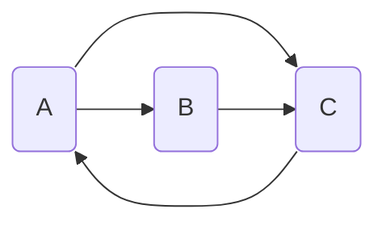
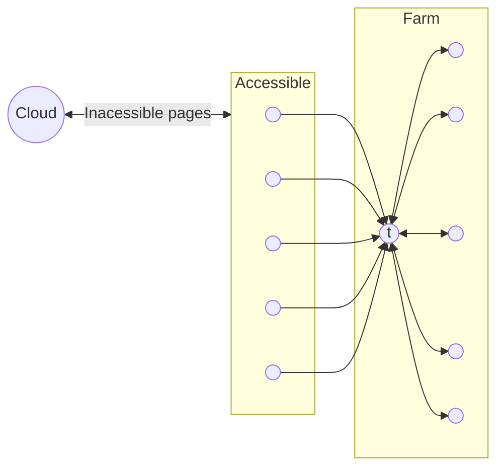
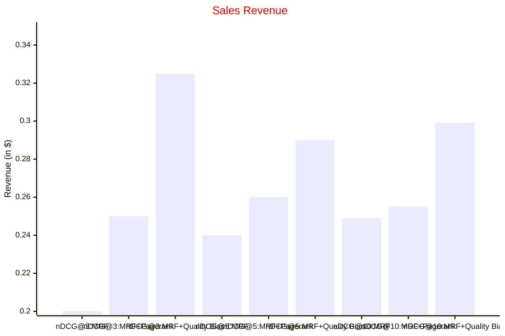

# Slide 14 - Quality Models

## The Ranking Problem

```mermaid
graph LR

  q(q)
  d(d)

  q .-- d
```

- $f(q, d)$

## Query Likelihood Model

- $f(q, d) \approx P(q, d)$

  - $= P(q|d) P(d)$ Bayres' rule

- Two core components
  - $P(q|d)$: query likelihood
  - $P(d)$: document prior

## The Ranking Problem (2)

```mermaid
graph LR

  q(q)
  d(d)

  q .-- d
```

- $f(q, d)$

---

```mermaid
graph LR

  q(q)
  d(d)

  q .-- d
```

- $f(d)$

## Quality as prior relevance

- High quality of the web document content increases the a priori probability of the document being relevant
  - a.k.a. document prior
- Quality factors should be combined in a way that directly improves the retrieval effectiveness
  - e.g., nDCG or MAP

## Document quality in web search

- Web is decentralized and heterogeneous
  - Different authority
  - Different goals
  - Different credibility
  - Different publishing standards

---

- Quality of a web page is determined by many factors
  - Original, up-to-date content of genuine value
  - Links to related resources
  - Layout for easy reading and navigation
- Continuous spectrum from high-quality pages to spam
  - Most web documents are somewhere in between

---

> As pure web spam has decreased over time, attention has shifted instead to sites with shallow or low-quality content.
>
> - Matt Cutts, 2011

---

- Document quality in search engines
  - Promote high-quality content
  - Demote low-quality content
- Two broad sources of quality evidence
  - On-document evidence
  - Off-document evidence

## On-document evidence

- Verbosity
- Readability
- Cohesiveness
- Navigability
- Support

### Verbosity

- Document nominal length (Singhal et al., 1996)
  - Full length in tokens
- Document visible length (Zhu & Gauch, 2000)
  - Content actually rendered
- Document title length (Bendersky et al., 2011)
  - Measures descriptiveness of page metadata

### Readability

- Average term length (Kanungo & Orr, 2009)
  - Longer terms denote thoughtful selection
- Stopwords ratio/coverage (Ntoulas et al., 2006)
  - Correlated with informativeness
- Fraction of table text (Bendersky et al., 2011)
  - High fraction denotes poor readability

### Cohesiveness

- Entropy of the page content (Bendersky et al., 2011)
  - Lower entropy denotes better focus
    - $H(\theta_d) = - \sum_{t \in d} P(t|d) \log P(t|d)$

### Navigability

- URL length and depth (Kraaij et al., 2002)
  - Lower length and depth denote easier navigation
- URL type (domain, subdomain, path, file)
  - Homepages tend to be of type domain

### Support

- Fraction of anchor text (Ntoulas et al., 2006)
  - Reasonable amount conveys factuality
  - Excess denotes shallowness

## Off-document evidence

- On-document evidence provides valuable evidence about the quality of the document
  - Also prone to manipulation by the document author
- Off-document evidence isn't immune, but is less biased
  - Hyperlink structure
  - Click-through data

## Link analysis

- Links are a key component of the Web
  - Important for navigation, but also for search Two complementary sources of information
    - `<a href="http://example.com" > Example website </a>`
  - "Example website": anchor text
  - "<http://example.com>": destination link

## Authority

- Billions of web pages, more or less informative
  - Links can be viewed as information about the popularity (authority?) of a web page
- Inlink count could be used as a simple measure
  - Link analysis algorithms like PageRank provide more reliable ratings (less susceptible to link spam)

## Random surfer model

- Choose a random number $r$ between 0 and 1
  - If $r < \lambda$: go to a random page (avoid getting stuck)
  - If $r \geq \lambda$: follow a random link from the current page
- Repeat

## PageRank

- PageRank of page $u$ is the probability that the "random surfer" will be looking at $u$ as $t \to \infty$
  - $PR^{(t+1)} (u) = \frac{\lambda}{n} + (1 - \lambda) \sum_{v \in I_u} \frac{PR^{(t)} (v)}{|O_v|}$
- $I_u$: inlinks of page $u$
- $O_v$: outlinks of page $v$

### PageRank example $(\lambda = 0)$



- $PR^{(t+1)} (A) = \frac{PR^{(t)} (C)}{1}$
- $PR^{(t+1)} (B) = \frac{PR^{(t)} (A)}{2}$
- $PR^{(t+1)} (C) = \frac{PR^{(t)} (A)}{2} + \frac{PR^{(t)} (B)}{1}$

|     X      | $PR^{(t)}(A)$ | $PR^{(t)}(B)$ | $PR^{(t)}(C)$ |
| :--------: | ------------: | ------------: | ------------: |
|   $t=0$    |          0.33 |          0.33 |          0.33 |
|   $t=1$    |          0.33 |          0.17 |          0.50 |
|   $t=2$    |          0.50 |          0.17 |          0.33 |
|   $t=3$    |          0.33 |          0.25 |          0.42 |
|  $\dots$   |               |               |               |
| $t=\infty$ |          0.40 |          0.20 |          0.40 |

## Convergence check

- Typical stopping criteria
  - $||\overrightarrow{PR}^{(t)} − \overrightarrow{PR}^{(t−1)}|| < \epsilon$
- Setting $\epsilon$
  - Small $\epsilon$: slow convergence, accurate PR
  - Large $\epsilon$: fast convergence, inaccurate PR

## Click-through rate

- Global click likelihood
  - $CTR (d) = \frac{\sum_{q \in L} 1_{K_q}(d)}{\sum_{q \in L} 1_{R_q}(d)}$
  - $q \in L$: a query in the log
  - $K_q$: documents clicked for $q$
  - $R_q$: documents displayed for $q$

## What is web spam?

- Spamming = any deliberate action solely in order to boost a web page's position in search engine results, incommensurate with that page's real value
  - Spam = web pages that are the result of spamming
- Approximately 10-15% of web pages are spam
  - High premium to appear on the first page of results

## Web spam taxonomy

- Boosting techniques
  - Aim at scoring high for topicality / authoritativeness
- Hiding techniques
  - Aim at hiding the use of boosting

## Boosting techniques

- Term spamming
  - Inflate content to appear relevant to many queries
- Link spamming
  - Creating link structures that boost authority

## Term spamming

- Repetition
  - Repeat one or a few specific terms (e.g., free, cheap)
  - Goal is to subvert tf-idf ranking schemes
- Dumping
  - Add a large number of unrelated terms
  - Goal is to match a variety of queries

---

- Weaving
  - Randomly stick spam terms along legitimate content
- Phrase stitching
  - Glue together sentences from different sources

## Link spamming

- Spammer's inaccessible pages
  - Most of the Web
- Spammer's accessible pages
  - e.g., blog comments pages
- Spammer's own pages
  - Completely controlled by spammer



## Link farms

- Spammer's goal
  - Maximize the authority of target page $t$
- Spammer's approach
  - Get many links from accessible pages to page $t$s
  - Construct "link farm" to get multiplier effect

## Hiding techniques

- Content hiding
  - Use same color for text and page background
- Cloaking
  - Return different page to crawlers and browsers

## Detecting spam

- Term spamming
  - Analyze text using statistical classifiers
  - Also useful: near duplicate detection
- Link spamming
  - Trust propagation (ham pages link to ham pages)
  - Open research area

## How to combine relevance and quality?

## Quality as a static score

- Query-independent scoring
  - Typically computed offline
- Precomputed scores leveraged in multiple ways
  - As a multiplier in vector space models
  - As a prior in probabilistic models
  - As a feature in feature-based models

## How effective is it? (Bendersky et al., 2011)



## Summary

- Document quality can be heterogeneous
  - Quality models can help distinguish between
- documents with similar relevance scores
  - Also useful for queries that explicitly seek for high-
- quality content (authority, readability)
  - And to combat adversarial behavior (spam, fakes)

## References

- [[Link]][2011_Bendersky] Quality-biased ranking of web documents - Bendersky et al., WSDM 2011
- [[Link]][2002_Kraaij] The importance of prior probabilities for entry page search - Kraaij et al., SIGIR 2002
- [[Link]][1999_Page] The PageRank citation ranking: bringing order to the Web - Page and Brin, Tech report 1999

[2011_Bendersky]: https://doi.org/10.1145/1935826.1935849
[2002_Kraaij]: https://doi.org/10.1145/564376.564383
[1999_Page]: http://ilpubs.stanford.edu:8090/422/1/1999-66.pdf

---

- [[Link]][2005_Craswell] Relevance weighting for query independent evidence - Craswell et al., SIGIR 2005
- [[Link]][2011_Castillo] Adversarial web search - Castillo and Davison, FnTIR 2011
- [[Link]][2017_SIGKDD] Fake news detection on social media - Shu et al., SIGKDD Expl. 2017

[2005_Craswell]: https://doi.org/10.1145/1076034.107610
[2011_Castillo]: http://dx.doi.org/10.1561/1500000021
[2017_SIGKDD]: https://doi.org/10.1145/3137597.3137600

## Coming next... Feedback Models
