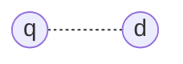
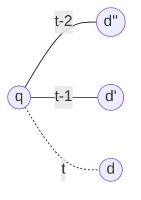
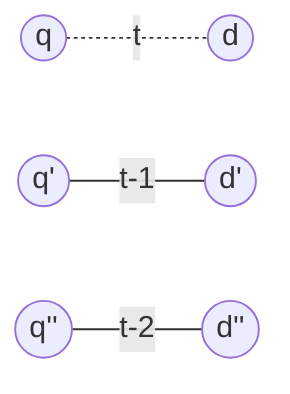
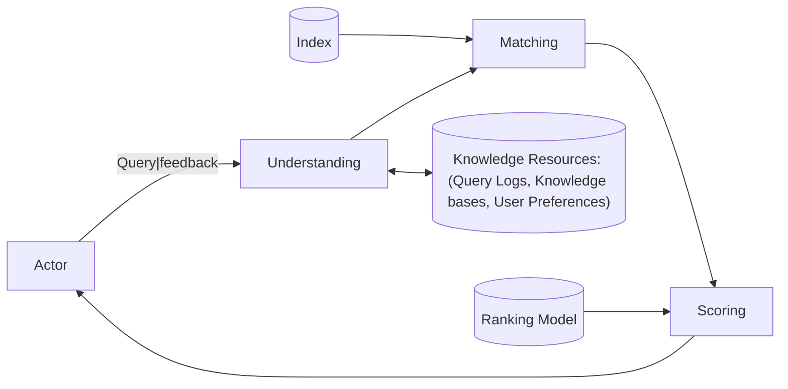

# Aula 15 - Feedback Models

## The ranking problem

[Imagem: um círculo vermelho com o rótulo "q" que representa a query e 25 círculos azuis com tamanhos variados que representam os documentos.]

- [JV]
  - O que queremos?
    - Dada uma consulta e um conjunto de documentos, como determinar quais documentos são mais relevantes para a consulta?

---

```mermaid
graph
  q((q))
  d1((""))
  d2((""))
  d3((""))
  d4((""))
  d5((""))

  q .- d1
  q .- d2
  q .- d3
  q .- d4
  q .- d5
```

---



- $f(q, d)$

---


- $f(q, d, \textbf{c})$

- [JV]
  - Queremos querer saber coisas baseadas em um contexto

## Exploiting interactions



- $f(q, d, \textbf{c})$

- [JV]
  - Queremos encontrar o melhor documento $d$ em um tempo $t$ porém baseado nos resultados de tempos anteriores $t-1$ e $t-2$.

---



- $f(q, d, \textbf{c})$

- [JV]
  - Porém, o usuário faz queries distintas em tempos distintas.

## Eliciting feedback



- query
  - feedback
- Understanding
  - Feedback
- Query logs
  - Knowledge bases
  - User preferences
- $d_7$ 3.5
  - $d_2$ 2.4
  - $d_3$ 1.7
  - $d_9$ 0.5
  - $d_4$ 0.3
- relevance judgments
  - clicks
- Matching
  - Scoring
- Index

  - Ranking Model

- [JV]
  - Primeiro entendemos a query e logs são armazenados no log
  - É feito o matching com o Index
  - Os resultados matched são Scored
  - E então apresentados de forma ranqueada pro usuário
  - Agora que vem a diferença:
    - analisaremos quals foram os clicks do usuário. De que forma ele interagiu sobre os resultados apresentados?
    - Isso é um feedback que retornará à query understanding

---

- Explicit feedback
  - Explicit relevance judgments
    - [JV] nem sempre os usuários querem ativamente ajudar as máquinas de busca
  - Reliable, but costly
    - [JV] Pra sistemas médicos, por exemplo, seria caro ter um especialista para poder analisar os resultados.
- Implicit feedback
  - Positive-only "judgments" (e.g., clicks, dwell time)
    - [JV] Gera resultados abundantes durante a interação do usuário com o sistema
  - Noisy and biased, but cheap and abundant
    - [JV]
      - Ruidosa porque o usuário pode clicar em um resultado que não é relevante, voltar atrás e mudar para outro; Ou então ele gostou mais deseja mais
      - Não entendi bem o envieasado.

## Simulating feedback

```mermaid
graph LR
```

- query
  - feedback
  - pseudo relevance judgments
- Understanding
  - Matching
  - Scoring
- Knowledge Resources

  - Query logs
  - Knowledge bases
  - User preferences

- [JV] A criação de uma pseudo relevância serve para ter uma estimativa de como que o usuário se comportará dado determinado resultado. Serve para computar métricas de feedback. Usaremos isso para avaliar qual modelo de ranqueamento é melhor.

---

- Pseudo-relevance feedback
  - Top-$k$ results are assumed to be relevant
  - Very sensitive to ranking quality, but automatic

## Exploiting feedback

- Machine-learned ranking

  - User feedback can be treated as supervision for learning effective ranking models
  - See classes on **_Learning to Rank_**

---

- Query expansion
  - Feedback documents can help enhance the user's query by providing related expansion terms
  - [JV] Uma forma de reordenar o ranking para melhorar os resultados é expandindo a consulta. Para analisar os resultados, podemos comparar o ranqueamento inicial com o ranqueamento final.
- Example: **[information retrieval]**
  - Relevant or pseudo-relevant documents may provide related terms like **"search engine"**, **"ranking"**
  - [JV]
    - Dessa forma, tentamos amenizar o mismatch entre o vocabulario do usuário e o vocabulário dos documentos.
    - E como definir quais termos adicionar?
      - Podemos fazer uma ranqueamento de palavras e adicionar os termos mais relevantes/próximos das palavras de origem.

## Feedback in vector space models

- General idea: query modification
  - Adding new (weighted) terms
    - [JV]
      - temos uma lista de vocabulário. Para cada termos, temos seus pesos.
      - Quando faz-se a expansão de consulta, adiciona-se novos termos e seus pesos. Ou,então, ajusta-se os pesos dos termos já existentes.
      - A ideia é que essa modificação vetorial leve o resultado para mais próximo do espaço vetorial em que os documentos relevantes estão.
  - Adjusting weights of old terms
- Rocchio (1971): most well-known approach
  - Also effective and robust in practice

## Rocchio method

[Imagem: Rocchio method visualization with + and - symbols around a central query point]

- [JV]
  - **Ideia:** Poderia-se usar o k-means para definir quais são os grupos de documentos mais relevantes? Poderiamos definir os centroides dos documentos...
  - **Imagem:** se a consulta inicial pegaria em um raio, idealmente desejamos que a query seja movida para uma região cujo raio retornasse mais documentos relevantes.

---

- Standard operation in vector space

- [JV]

  - $q_m$ = vetor final
  - $q$ = vetor inicial
  - $C_r$ = centroid of relevant documents | Os vetores médios
  - $\alpha$: Quanto de peso vou dar pro inicial?
  - $\beta$: Quanto de peso vou dar pros documentos relevantes?
  - $\gamma$: Quanto de peso vou dar pros documentos não relevantes?
  - Então é basicamente:
  - $\vec{v}_f = \alpha \vec{v}_i + \beta \vec{v}_{Centroide\ Relevantes} - \gamma \vec{v}_{Centroide\ Não\ Relevantes}$

- **Modified query**
  - $$\vec{q}_m = \alpha \vec{q} + \frac{\beta}{|G|} \sum_{d_i \in G} d_i - \frac{\gamma}{|G|} \sum_{d_j \in G} d_j$$
- **Original query**
- **Rel docs**
- **Non-rel docs**

## Rocchio example

- $$V = \{ news, about, presidential, campaign, food, text\}$$
- $$\vec{q} = \{1, 1, 1, 1, 0, 0\}$$

| Sign | Docs  | $\lbrack$ | news | about | pres. | campaign | food | text | $\rbrack$ |
| ---: | ----- | --------- | ---: | ----: | ----: | -------: | ---: | ---: | --------- |
|    - | $d_1$ | $\lbrack$ |  1.5 |   0.1 |   0.0 |      0.0 |  0.0 |  0.0 | $\rbrack$ |
|    - | $d_2$ | $\lbrack$ |  1.5 |   0.1 |   0.0 |      2.0 |  2.0 |  0.0 | $\rbrack$ |
|    + | $d_3$ | $\lbrack$ |  1.5 |   0.0 |   3.0 |      2.0 |  0.0 |  0.0 | $\rbrack$ |
|    + | $d_4$ | $\lbrack$ |  1.5 |   0.0 |   4.0 |      2.0 |  0.0 |  0.0 | $\rbrack$ |
|    - | $d_5$ | $\lbrack$ |  1.5 |   0.0 |   0.0 |      6.0 |  2.0 |  0.0 | $\rbrack$ |

---

| Sign | Docs  | $\lbrack$ | news | about | pres. | campaign | food | text | $\rbrack$ |
| ---: | ----- | --------- | ---: | ----: | ----: | -------: | ---: | ---: | --------- |
|    - | $d_1$ | $\lbrack$ |  1.5 |   0.1 |   0.0 |      0.0 |  0.0 |  0.0 | $\rbrack$ |
|    - | $d_2$ | $\lbrack$ |  1.5 |   0.1 |   0.0 |      2.0 |  2.0 |  0.0 | $\rbrack$ |
|    + | $d_3$ | $\lbrack$ |  1.5 |   0.0 |   3.0 |      2.0 |  0.0 |  0.0 | $\rbrack$ |
|    + | $d_4$ | $\lbrack$ |  1.5 |   0.0 |   4.0 |      2.0 |  0.0 |  0.0 | $\rbrack$ |
|    - | $d_5$ | $\lbrack$ |  1.5 |   0.0 |   0.0 |      6.0 |  2.0 |  0.0 | $\rbrack$ |

| Sign | Docs  | news | about | pres. | campaign |  food | text |
| ---: | ----- | ---: | ----: | ----: | -------: | ----: | ---: |
|    + | $C_r$ |  1.5 |   0.0 |   3.5 |      2.0 |   0.0 |  0.0 |
|    - | $C_n$ |  1.5 | 0.067 |   0.0 |    2.667 | 1.333 |  0.0 |

<!-- Definir equações -->

- [JV] As equações são dadas pelas médias dos relevantes e dos não relevantes. afinal, $C_r$ e $C_n$ são os centroides dos documentos relevantes e não relevantes, respectivamente.

---

| Sign | Docs  | news | about | pres. | campaign |  food | text |
| ---: | ----- | ---: | ----: | ----: | -------: | ----: | ---: |
|    + | $C_r$ |  1.5 |   0.0 |   3.5 |      2.0 |   0.0 |  0.0 |
|    - | $C_n$ |  1.5 | 0.067 |   0.0 |    2.667 | 1.333 |  0.0 |

<!-- Definir equações -->

<!-- Ainda mais equações -->

- $\vec{q}_m = \alpha \vec{q} + \beta \cdot C_r - \gamma \cdot C_n$

## Rocchio in practice

- [JV] Empiricamente alguns padrões foram observados:

  - Não só nos aproximamos dos positivos, mas também nos afastamos dos negativos; Porém, os positivos tendem a ser muito mais coesos do que os negativos. Então os negativos ficam mais esparsos. Eles tendem a ter vocabulários pouco coesos. Sendo assim, que peso dar para esse afastamento?
  - Mas e em relação a clusters de documentos devido a palavras homônimas? Teríamos dois clusters de documentos relevantes, o centroide deles pode nos levar para um local caótico, não?

- Non-relevant documents lack coherence
  - Keep low weight for negative examples $(\gamma)$
  - [JV]
    - Tende-se então a dar maior peso ao $\beta$ do que ao $\gamma$, dado o comentário anterior.
- Training set is small and noisy and may be biased
  - Keep relatively high weight on the original query $(\alpha)$
  - [JV]
    - O mais preciso que se tem é a consulta do usuário, então é interessante manter um peso alto para ela.

## Feedback in language models

- Query likelihood model
  - $$f(q, d)= P(q|\theta_d)$$
  - $$f(q, d) \propto \log P(q|\theta_d)$$
  - $$f(q, d)= \sum_{t \in q} tf_{t, q} \log P(t|\theta_d)$$
  - [JV]
    - O log tende a nos dar valores de magnitude maiores, o que evita risco de underflow
    - Consideramos apenas um loop sobre palavras únicas, então coloca-se um contador de frequência para cada palavra. Isso no $tf_{t, q}$.
- Difficulty
  - Query as fixed sample (documents modeled instead)

## Extended approaches

- d
- query
  - likelihood
- document
  - likelihood
- θ_d
  - model comparison
- θ_q

- [JV]

  - **Query likelihood:** dado um conjunto de documentos, qual é a probabilidade de gerar a consulta? Para isso, geramos um modelo de linguagem para os documentos.
  - Podemos então a partir do modelo de linguagem dos documentos, gerar uma consulta possível.
  - E então, com essa consulta possível, analisa-se o:
  - **Document likelihood:** dado um conjunto de consultas, qual é a probabilidade de gerar o documento?
  - Esse grafo é apenas para ilustrar os caminhos possíveis de se fazer a comparação entre os modelos de linguagem. Porém minha dúvida é:
    - E se eu deixar isso rodando infinitamente, eu acabaria gerando uma convergência? Um "essa minha base de documentos é mais ideal para responder quais tipos de consultas?"

- [JV]
  - Query likelihood é meio ruim para comparar feedback porque não dá pra estimar isso
  - O problema do document likelihood é que ele não é normalizado e cada um deles tem um tamanho diferente.

## Relevance models

- Language model representing information need
  - Query and feedback documents are samples
- $$P(d|\theta_G):$$probability of generating the text in a document \(d\) given a relevance model \(\theta_G\)
  - [JV] Com isso estamos computando a verossimilhança de um documento dado um modelo de linguagem.
  - Kind of document likelihood model (ext. of \(P(d|\theta_q)\))
    - [JV]
      - Por que usar a probabilidade de um documento dado um modelo de linguagem dos documentos vs comparar com o modelo vindo da query?
      - **Resposta:** por causa da não normalização da Bag of Words.
  - Less effective than query likelihood - hard to compare documents as samples with different lengths

## Divergence-based ranking

- Estimate relevance model from query and feedback
  - Rank documents by similarity to relevance model
- Kullback-Leibler divergence (KL-divergence)

  - $$f(q, d) = -D\_{KL}(\theta_G || \theta_d)$$

- [JV]
  - $d$ é um documento candidato. Usaremos $\theta_G$ como um proxy para...

---

- $$f(q, d) = -D_{KL}(\theta_G || \theta_d)$$
- $$= -\sum_t P(t | \theta_G) \log \frac{P(t | \theta_G)}{P(t | \theta_d)}$$
- $$= \sum_t P(t | \theta_G) \log P(t | \theta_d) - \sum_t P(t | \theta_G) \log P(t | \theta_G)$$
  - [JV]
    - Temos todo o vocabulário de palavras, e depois o log da divisão entre os dois modelos de linguagem.
    - Como é uma divisão de logs, ele se torna uma subtração e que se subdivide em dois somatórios.
    - Esse segundo termo independe do documento, sendo assim, ele é irrelevante para o ranking.
    - Com isso, não geramos mais o score exato, porém o novo score é equivalente ao antigo, sendo então ordem-conservante. E por isso $\propto$.
- _document independent_

---

- $$f(q, d) \propto \sum_{t} P(t|\theta_G) \log P(t|\theta_d)$$
  - Without feedback, under MLE: $$P(t|\theta_G) \propto tf_{t, q}$$
    - [JV]
      - Em caso de ausência de feedback, acabamos voltar a analisar o $tf_{t, q}$, o que me faz retornar à equação de query likelihood. Então essa anállise de modelo que temos visto é uma generalização do modelo de query likelihood.
  - Relevance model degenerates to query likelihood

## Estimating relevance models

- Probability of pulling a word $t$ out of the "bucket" representing the relevance model depends on the query terms we have just pulled out
- $$P(t|\theta_G) \approx P(t|q)$$
- $$= \frac{P(t, q)}{P(q)}$$
  - [JV]
    - Probabilidade Conjunta / Probabilidade Marginal
    - Por X motivo a Probabilidade Marginal será desconsiderada por aquele mesmo critério de "dá pra tirar e não muda a ordem de ranqueamento"

---

- $$P(t, q) = \sum_{d \in G} p(d)P(t, q|d)$$
  - [JV] Aqui analisamos qual é a probabilidade daquele termo da consulta para aqueles documentos que receberam o feedback positivo.
- $$= \sum_{d \in G} p(d)P(t|q, d)P(q|d)$$
  - [JV]
    - Consideraremos que $p(t | q, d) \approx p(t | d)$, assim podemos converter um no outro.
- $$\approx \sum_{d \in G} p(d)P(t|d) \prod_{t_i \in q} P(t_i|d)$$
  - [JV]
    - Ele explicou mais alguma coisa que não prestei atenção
    - Interpretando a fórmula:
      - $P(d)$: poderíamos considerar que são uma distribuição uniforme.
        - Então, se $P(d)$ é uniforme, tipo $1/5$ dado $5$ elementos, basicamente estamos calculando a média de $P(t|d)$.
    - Acaba sendo então:
      - $\frac{1}{|G|} \sum_{d \in G} P(t|\theta_d)$
      - Isso aqui gera um ranking de palavras que poderíamos usar para expandir a consulta.

---

- $$P(t, q) \approx \sum_{d \in G} P(d)P(t|d) \prod_{t_i \in q} P(t_i|d)$$
  - Assuming uniform $P(d)$
  - $P(t, q)$ is an average of query likelihood scores across feedback documents, weighted by $P(t|d)$

## Example from top 10 docs

| _president lincoln_ | _abraham lincoln_ | _fishing_ | _tropical fish_ |
| ------------------- | ----------------- | --------- | --------------- |
| lincoln             | lincoln           | fish      | fish            |
| president           | america           | farm      | tropic          |
| room                | president         | salmon    | japan           |
| bedroom             | faith             | new       | aquarium        |
| house               | guest             | wild      | water           |
| white               | abraham           | water     | species         |
| america             | new               | caught    | aquatic         |
| guest               | room              | catch     | fair            |
| serve               | christian         | tag       | china           |
| bed                 | history           | time      | coral           |
| washington          |                   |           |                 |
| old                 |                   |           |                 |
| office              |                   |           |                 |
| war                 |                   |           |                 |
| long                |                   |           |                 |
| abraham             |                   |           |                 |

## Example from top 50 docs

| _president licoln_ | _abraham lincoln_ | _fishing_ | _tropical fish_ |
| ------------------ | ----------------- | --------- | --------------- |
| lincoln            | lincoln           | fish      | fish            |
| president          | president         | water     | tropic          |
| america            | america           | catch     | water           |
| new                | abraham           | reef      | storm           |
| national           | war               | fishermen | species         |
| great              | man               | river     | boat            |
| white              | civil             | new       | sea             |
| war                | new               | year      | river           |
| washington         | history           | time      | country         |
| clinton            | two               | bass      | tuna            |
| house              |                   |           |                 |
| history            |                   |           |                 |
| time               |                   |           |                 |
| center             |                   |           |                 |
| kennedy            |                   |           |                 |
| room               |                   |           |                 |

## Summary

- Acquiring feedback
  - Explicit, implicit, simulated (pseudo) feedback
    - [JV] Nos dois primeiros há dependência do usuário e gera modelos personalizados para o usuário, diferente do segundo. "Como personalizar ranking a partir de feedback?"
- Exploiting feedback via query expansion
  - Rocchio for VSM
    - [JV] aproxima a query para o centroide dos documentos relevantes
  - Feedback language models for LM
    - [JV] aproxima a query para o modelo de linguagem dos documentos relevantes

## Challenges

- Long queries are inefficient for typical search engines
  - [JV] Embora expandir queries possa ajudar, ela, sendo longa demais, pode acabar necessitando mais processamento do que o necessário. Até posso aprimorar a consulta, mas se eu expandir demais, posso acabar encontrando lixo. No geral acabo procurando as top 2~3 palavras. Se expandir demais, posso acabar encontrando páginas que nem tenham os termos que eu busquei.
  - Only reweight certain prominent terms
- Users are often reluctant to provide explicit feedback
  - [JV] Os usuários dificilmente vão querer ajudar o sistema de busca. Eles não estão ali para isso. Ele exemplificou falando sobre o email recebido por empresas como Mercado Livre que manda email pedindo feedback.
  - Effective pseudo-relevance feedback is challenging
  - Implicit feedback is abundant, yet often biased
- Feedback is also useful as a learning signal

## References

- Text Data Management: A Practical Introduction to Information Retrieval and Text Mining, Ch. 6 - [Zhai and Massung, 2016][2016_Zhai]
- Introduction to Information Retrieval, Ch. 9 - [Manning et al., 2008][2008_Manning]
- Search Engines: Information Retrieval in Practice, Ch. 7 - [Croft et al., 2009][2009_Croft]

[2016_Zhai]: http://www.morganclaypoolpublishers.com/catalog_Orig/product_info.php?products_id=954
[2008_Manning]: https://www.amazon.com/Introduction-Information-Retrieval-Christopher-Manning/dp/0521865719
[2009_Croft]: https://www.amazon.com/Search-Engines-Information-Retrieval-Practice/dp/0136072240

---

- Relevance feedback in information retrieval - [Rocchio, 1971][1971_Rocchio]
- Relevance based language models - [Lavrenko and Croft, SIGIR 2001][2001_Lavrenko]
- A survey of automatic query expansion in information retrieval - [Carpineto and Romano, ACM Comp. Surveys 2012][2012_Carpineto]

[1971_Rocchio]: https://sigir.org/files/museum/pub-08/XXIII-1.pdf
[2001_Lavrenko]: https://doi.org/10.1145/383952.383972
[2012_Carpineto]: https://doi.org/10.1145/2071389.2071390

## Coming next: Diversification Models

- Rodrygo L.T.Santos
- <rodrygo@dcc.ufmg.br>

## Perguntas

- [JV]
  - Mas e em relação a clusters de documentos devido a palavras homônimas? Teríamos dois clusters de documentos relevantes, o centroide deles pode nos levar para um local caótico, não?
    - Poderia ter uma forma de disambigua por contexto com um transformer.
  - E se eu deixar isso rodando infinitamente, eu acabaria gerando uma convergência? Um "essa minha base de documentos é mais ideal para responder quais tipos de consultas?"
    - Talvez seria um tipo de expectation maximization.
  - Se eu faço uma consulta, tenho o resultado, dou meu feedback; Ele conseguiria gerar então qual seria a consulta ideal para eu encontrar o que eu encontrei?
    - Até pode, mas com grande risco de gerar uma alucinação com acúmulo de erros.
