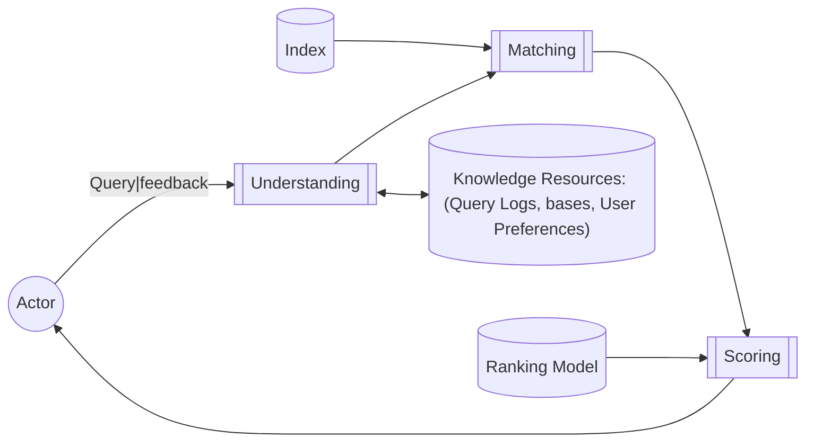
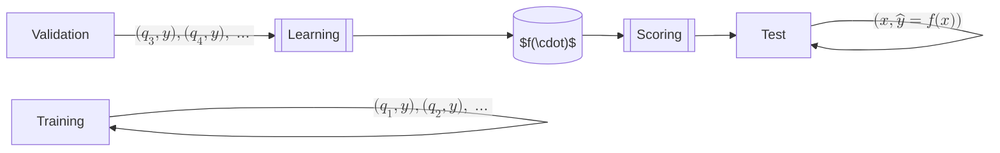
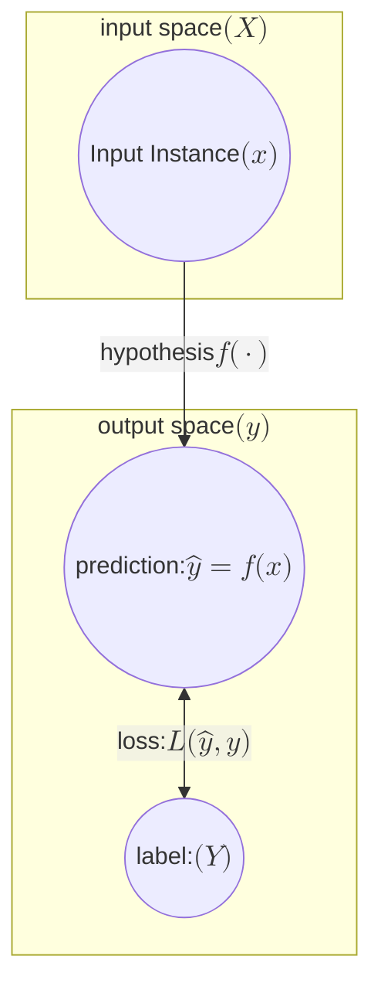
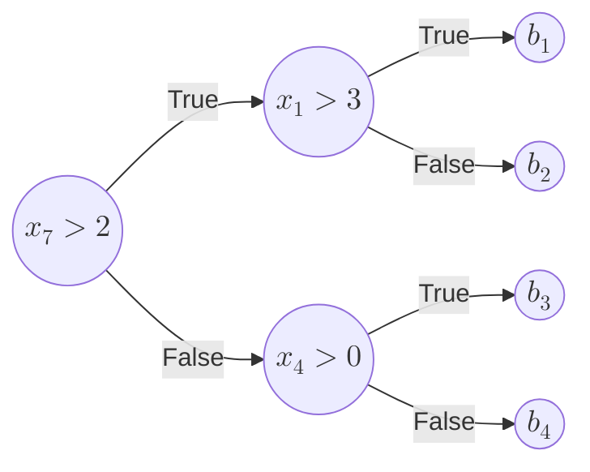
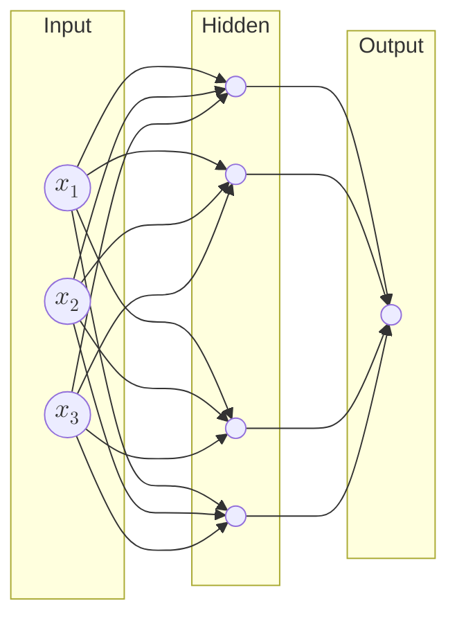
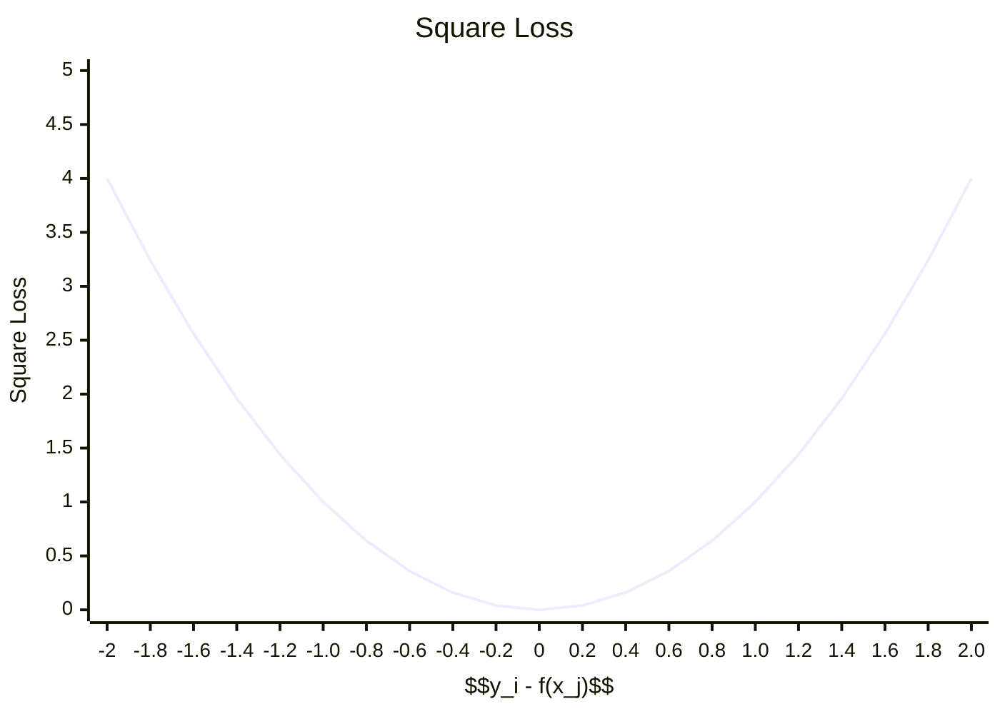

# Aula 17 - 19/05/2025 - Learning to Rank: Fundamentals

## The ranking problem

- q -. d
- f(q, d)

### Many solutions

- Topicality models
  - VSM, BM, LM, DFR, MRF, LSI, DESM, ...
- Quality models
  - PageRank, in-links, spam, ...
- No silver bullet

  - Different models excel at different scenarios

- [JV] Existem casos em que uma solução vai bem em um método, mas vai mal em outro. Existe a possibilidade de tentar combinar as soluções em uma melhor

#### How to combine multiple models?

##### Ensembling the cues

- Linear combination?
  - [JV]
    - Mas que peso dar?
      - Depende.
      - Possibilidade 1: valor complementar
  - $f(q, d) = \alpha_1 f_{BM25}(q, d) + \alpha_2 f_{PR}(q, d)$
- How to fit $\alpha_1$ and $\alpha_2 = (1 - \alpha_1)$?

  - $\{\alpha_1 = 0.3, \alpha_2 = 0.7\} \to \{MAP = 0.2, nDCG = 0.6\}$
  - $\{\alpha_1 = 0.5, \alpha_2 = 0.5\} \to \{MAP = 0.1, nDCG = 0.5\}$
  - $\{\alpha_1 = 0.7, \alpha_2 = 0.3\} \to \{MAP = 0.4, nDCG = 0.7\}$ ✅

- [JV]
  - MAP; nDCG
    - Média desses valores para um conjunto de testes
  - Como condensar esses vários scores em um só?

#### What if we have thousands of models?

- > Mr. Singhal has developed a far more elaborate system for ranking pages, which involves more than 200 types of information, or what Google calls "signals."
- Saul Hansell, New York Times, June 2007
- [JV] Grande custo computacional

## The ranking problem (2)

- q -. d
- f(q, d)

### Learning to rank

- q -. q
- f(x)

---

- Feature-based representation
  - Individual models as ranking "features"
- Discriminative learning
  - Effective models learned from data
  - Aka machine-learned ranking

---

- Actively researched over the last couple of decades
  - Both by academia as well as industry players
  - [JV]
    - RI já pesquisa sobre isso há anos. Pelo menos desde a década de 90.
    - Parte do trabalho passou a ser engenharia de features, que acabou sendo mais uma das entradas no vetor de métricas de relevância.
- Why didn't it happen earlier?
  - Limited availability of training data
  - Poor machine learning techniques
  - Too few features to show value

### Query processing overview

- [JV] A pergunta é: como fazer esse modelo de ranqueamento?

## Discriminative learning framework

[Imagem: Diagram showing training, validation, and test data flow through scoring and learning components]

- [JV] Tem vários $q_1$ porque cada um deles estaria fazendo referência a um par de consulta e documento.

- [JV]
  - Para determinados scores X, temos um rótulo Y.
  - Esse Rótulo Y seria um nível de relevância de determinado documento para uma determinada consulta.
  - Várias dessas instâncias rotuladas são usadas para treinar o modelo.
  - Outras dessas instâncias são usadas para testar o modelo. (Validação)
  - Esses dados são usados para haver o aprendizado. Após esse aprendizado de padrões, o modelo pode ser usado para dar os scores para novos documentos, onde teremos um label $\hat{y} = f(x)$.
  - Esse processo de aprendizado pode ser caro, mas na hora de aplicar o modelo já treinado, é mais barato.
  - O problema de que esse aprendizado seja feito de modo offline é que, se ele não for re-treinado, ele se torna obsoleto. Faria sentido se houvesse uma evolução contínua do modelo.
  - Outro detalhe é que essa função aprendida é genérica. Uma alternativa seria um aprendizado por reforço especializado para um usuário específico.

### Building Blocks

- Goal is
  - $f: x \to y$
- That minimizes some loss function
  - $\mathcal{L}: f(x) \times y \to \mathcal{R}$
    - $x$: input space
    - $y$: output space
    - $\mathcal{F}$: hypothesis space
    - $\mathcal{L}$: loss function
    - $\mathcal{O}$: optimizer
    - R: número real
    - [JV] Para cada função e exemplos rotulados, a função de perda avalia a função do ranking.

---

[Imagem: Diagram showing input space X, output space Y, hypothesis f(·), and prediction process]

- [JV]
  - O Diagrama mostra o conjunto dos inputs que levam ao espaço de outputs;
  - A Loss function calcula a distância entre o predito e o esperado.

#### Input space ($\mathcal{X}$)

- LTR takes as input feature vectors
  - $x \in \mathcal{X}$
  - $x = \Phi(q, d)$
    - [JV] $q$: query
    - [JV] $d$: document
    - [JV] $\Phi$: feature extraction function
- [JV] Example features:
  - $f_{BM25.title}(q, d)$
  - $f_{BM25.body}(q, d)$
  - $f_{BM25.anchor}(q, d)$
  - $f_{PageRank}(q, d)$
    - [JV]
      - A função de extração de features é a função que vai pegar os documentos e as consultas e vai gerar um vetor de valores em
      - Existe uma ideia de que a Google por exemplo pode ter reduzido o tamanho do vetor de features ao substituir algumas features por grupos de LLMs.
      - Ele brincou sobre cobrar uma questão na prova sobre essa mudança dos vetores de features do google.

##### Ranking features

- Query-dependent (depend on $\langle q, d \rangle$)
  - BM25, LM, PL2, ...
- Query-independent (depend on $d$)
  - PageRank, readability, spaminess, ...
  - [JV] No geral serve como critério de desempate. Um Boost, uma promoção.
- Query features (depend on $q$)

  - Query length, query type, ...

- [JV]
  - Em qual dos casos poderíamos usar uma LLM?
    - Bom, nas 3. Mas em qual delas seria mais interessante?
    - Nas Query-Independent, podendo processar offline, e os diversos scores dos documentos podem ser armazenados e consultá-los é muito eficiente.
    - Já os Query Features são feitos online em sua maioria, pois depende da informação do usuário

#### Output space ($\mathcal{Y}$)

- LTR may produce different outputs
  - $y \in Y$
- Each scalar $y$ labels a training instance

##### Data labeling alternatives

- Labeling of individual documents
  - Binary judgments (non-rel, relevant)
    - $y \in \{0,1\}$
  - Graded judgments (non-rel, ..., perfect)
    - $y \in \{0,1,2,3,4,5\}$
    - [JV]
      - Esse daqui tende a ter uma semântica que facilida aos humanos que irão verificar esse output. Ex.: "É perfeitamente o que o usuário procurava", "Não é exato, mas atende bem", etc.

---

- Labeling of pairs of documents
  - Implicit judgments
    - $d_1$
    - $d_2$
    - $d_3$ ✔️
    - $d_4$
    - $d_5$
      - [JV] Não necessariamente esse clique significa que o usuário foi bom, mas é um indicativo de que o usuário gostou do resultado e que foi mais relevante que os outros. Principalmente com relação aos anteriores.
    - $d3 \succ d_1$
    - $d3 \succ d_2$
    - ~~$d3 \succ d_4$?~~
    - ~~$d3 \succ d_5$?~~

---

- Creation of list
  - List (or permutation) of items is given
  - Ideal, but difficult to implement

#### Hypothesis Space ($\mathcal{F}$)

- Goal is to learn a ranking model
  - $f : x \to y$
- A hypothesis $f \in \mathcal{F}$ could be any function
  - Linear functions
  - Non-linear functions (trees, networks)

---

$$
f(x) =
\begin{bmatrix}
  w_1 & w_2 & w_3 & w_4 \\
\end{bmatrix}
\times
\begin{bmatrix}
  x_1 \\ x_2 \\ x_3 \\ x_4 \\
\end{bmatrix}
+
b
$$

- Linear hypotheses: $f(x) = w^T x + b$
  - $w$ is a weight vector
  - $b$ is a scalar bias
  - [JV] $f(x)$ retorna um escalar

---

- Tree-based hypotheses: $f(x) = \sum_k b_k 1(x \in R_k)$

  - $k$ is one of the leaves in the tree
  - $b_k$ is the value predicted in region $R_k$
  - $1(\cdot)$ is the indicator function

- [JV]
  - O Random Forest/Ensemble de árvores, seria rodar essa árvore de regressão simples só que várias e ao mesmo tempo e calcular a média dos resultados.

---

- Neural network hypotheses

  - $f(x) = \sigma_2(W_2\sigma_1(W_1x + b_1) + b_2)$
    - $1^{st}$ layer output: $\sigma_1(W_1x + b_1)$
    - $2^{nd}$ layer output: $\sigma_2(W_2 \cdot \text{output of } 1^{st} \text{ layer} + b_2)$
  - $W_k$ is a weight matrix
  - $b_k$ is a bias vector
  - $\sigma_k$ is an activation function

  - [JV]
    - Cada aresta é um peso que é multiplicado ao input. E a junção de todas essas arestas representaria uma matriz.
    - Sigma é uma "função de ativação" que ajuda a encontrar "padrões mais sofisticados"
    - W_2 seriam os pesos da segunda camada

## How to find the best $f(x)$?

- Look for the one with minimum loss

### Loss function $(\mathcal{L})$

- Loss as a measure of error
  - $\mathcal{L}(\hat{y}, y) = \mathcal{L}(f(x), y)$
- Many options once again
  - 0-1 loss: $\mathcal{L}(\hat{y}, y) = 1(y \neq f(x))$
  - Absolute loss: $\mathcal{L}(\hat{y}, y) = |y - f(x)|$
  - Square loss: $\mathcal{L}(\hat{y}, y) = (y - f(x))^2$

### Example: square loss

- How to find $f(x)$ that gives the minimum loss?
- **Hint:**
  - $f(x; w)$ is actually parameterized by some $w$

### Optimizer

- Coordinate methods
  - Line search, one coordinate at a time
- Gradient methods
  - Walk downhill, all coordinates together
- Boosting methods
  - Upweight difficult examples

## Learning algorithms

[Imagem: Timeline of learning to rank algorithms from 1999-2008]

1. Query refinement (WWW 2008)
2. ListNet (ICML 2007)
3. SVM-MAP (SIGIR 2007)
4. Nested Ranker (SIGIR 2006)
5. LambdaRank (NIPS 2006)
6. Frank (SIGIR 2007)
7. MPRank (ICML 2007)
8. MHR (SIGIR 2007)
9. RankBoost (JMLR 2003)
10. LDM (SIGIR 2005)
11. RankNet (ICML 2005)
12. Ranking SVM (ICANN 1999)
13. IRSVM (SIGIR 2006)
14. Discriminative model for IR (SIGIR 2004)
15. SVM Structure (JMLR 2005)
16. GPRank (LR41R 2007)
17. QBRank (NIPS 2007)
18. GBRank (SIGIR 2007)
19. AdaRank (SIGIR 2007)
20. McRank (NIPS 2007)
21. SoftRank (LR41R 2007)
22. CCA (SIGIR 2007)
23. RankCosine (IP&M 2007)
24. ListMLE (ICML 2008)
25. Supervised Rank Aggregation (WWW 2007)
26. Relational ranking (WWW 2008)

---

- **Pointwise**
  - $X$: single documents
  - $Y$: scores or class labels
- **Pairwise**
  - $X$: document pairs
  - $Y$: partial orders
- **Listwise**
  - $X$: document collections
  - $Y$: ranked document list

### Pointwise approaches

- Reduce ranking to regression or classification
  - Assume relevance is query-independent
- In practice, relevance is query-dependent
  - Utility of a feature may also be query-dependent
  - By putting documents associated with different queries together, the training process may be hurt

### Pairwise approaches

- Reduce ranking to classification on document pairs associated with the same query
  - No longer assume independent relevance
- Unique properties of ranking not fully covered
  - Number of instance pairs varies across queries
  - Importance of errors varies across ranking positions

### Listwise approaches

- Perform learning directly on document list
  - Treats ranked lists as learning instances
- Two major approaches
  - Define listwise loss functions
  - Directly optimize IR evaluation measures (current state-of-the-art)

## Recap

- Goal is to learn a ranking model
  - $f: \mathcal{X} \to \mathcal{Y}$
- That minimizes some loss function
  - $\mathcal{L}: f(\mathcal{X}) \times \mathcal{Y} \to \mathcal{R}$
- $\mathcal{X}$: input space
- $\mathcal{Y}$: output space
- $\mathcal{F}$: hypothesis space
- $\mathcal{L}$: loss function
- $\mathcal{O}$: optimizer

## Summary

- Learning to rank has been around for a few decades, but has only recently become hot
  - More data, better resources, better algorithms
- Machine learned ranking over many features easily beats traditional hand-designed ranking models
  - Lots of open directions

## Open directions

- Deep learning
  - Feature learning (vs. feature engineering)
- Online learning
  - Incremental, exploration-exploitation models
- Structured learning
  - Diversity, context-awareness

## References

- [[2009_Liu][Link_2009_Liu]] Learning to rank for information retrieval - Liu, FnTIR 2009
- [[2011_Liu][Link_2011_Liu]] Learning to rank for information retrieval - Liu, 2011
- [[2014_Li][Link_2014_Li]] Learning to rank for information retrieval and natural language processing - Li, 2014

[Link_2009_Liu]: http://doi.org/10.1561/1500000016
[Link_2011_Liu]: http://doi.org/10.1007/978-3-642-14267-3
[Link_2014_Li]: https://doi.org/10.1007/978-3-031-02155-8

## Coming next: Learning to Rank: Pointwise
