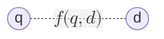
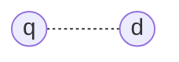

# Learning to Rank: Pointwise

## The ranking problem

- $f(q, d)$

## Learning to rank

- $f(x)$
	- [JV] Agora estamos analisando várias heurísticas com features que geram esse ranking automaticamente e com qualidade.

---

- Feature-based representation
  - Individual models as ranking "features"
- Discriminative learning
	- [JV] No geral técnicas supervisionadas; cada entrada para uma classe de relevância
  - Effective models learned from data
  - Aka machine-learned ranking

## Building blocks

- Goal is to learn a ranking model
  - $f : \mathcal{X} \to \mathcal{Y}$
	  - [JV] $f$ é uma família de funções que levam as features em $X$ para as rotulações de relevância $Y$
- That minimizes some loss function
  - $\mathcal{L} : f(\mathcal{X}) \times \mathcal{Y} \to \mathbb{R}$
	  - [JV] A Loss Function analisa quanto de erro entre o rótulo encontrado pela função $f$ e o rótulo real. Idealmente buscamos uma Loss function que tenda a gerar erro zero.
- Ideally, we would like a low test error
  - We settle for a good training error / capacity trade-off
	  - [JV] Uma forma de evitar o overfitting é forçar ele a manter um certo para que ele comporte receber novos testes q retornar um rótulo satisfatório.

## What is a learning algorithm?

- Given
  - A family of functions $\mathcal{F}$ (e.g., linear, trees, neural nets)
  - A measure of loss $L$ (error + capacity)
	  - [JV] Não quero apenas uma função que minimiza o erro, mas também o que terá maior capacidade de generalização.
- Learning can be cast as an optimization problem
  - $f^* = \text{argmin}_{f \in \mathcal{F}} L(f, \text{train})$
  - $= \text{argmin}_{f \in \mathcal{F}} \text{Err}(f, \text{train}) + \lambda \text{Reg}(f)$
	  - [JV]
		  - Essa Regularização serve para auxiliar na métrica de quão generalizável a função é.
		  - Qual o efeito prático da regularização?
			  - Qual é preferído: o que tem spikes ou é mais regular?
			  - Os que têm mais spikes terá maior valor de normal, sendo então penalizado pelo regularizador.

## Classical algorithms

- Linear learning algorithms
  - Regression (LASSO, Ridge reg.)
  - Classification (logistic reg., linear SVM, AdaBoost)
- Non-linear learning algorithms
  - Neural networks
  - (Boosted) regression trees

### Linear learning algorithms

- $\mathcal{F}$ is the set of linear functions
  - $f_w(x) = w^T x, \text{ where } x \in \mathbb{R}^d, \, w \in \mathbb{R}^d$
- $x$: $d$-dimens. feature vector describing an example
- $w$: weight vector defining the function $f_w$
- $f_w(x)$ is the prediction of $f_w$ for example $x$
	- [JV] para evitar que as equações lineares exploitem os pesos, podemos definir um limite aos pesos ($w$)

---

- Most typical regularizers
  - L2 regularization, $||w||_{2}^{2} = \sum_j w_j^2$ (prefer "flat" weights)
	  - [JV] são pesos mais bem distribuídos
  - L1 regularization, $||w||_ 1 = \sum_j |w_j|$ (prefer "sparse" weights)
	  - [JV]
		  - Além de distribuir, acaba zerando pesos de várias features.
		  - Se o $w$ for esparso, pode-se fazer uma seleção de features de tal modo que algumas não precisem ser computadas.

<!--
#### Classical algorithms (2)

- Linear learning algorithms
  - **Regression (LASSO, Ridge reg.)**
  - Classification (logistic reg., linear SVM, AdaBoost)
- Non-linear learning algorithms
  - Neural networks
  - (Boosted) regression trees
-->

#### Linear learning for regression

- [JV] O que é um problema de regressão?

- Ordinary least squares
  - $\mathcal{L}(w) = \frac{1}{2} \sum_{i=1}^m (f_w(x^{(i)}) - y^{(i)})^2$
	  - [JV] Computa o erro do rotulador
		  - Existe também um tipo de mínimos quadrados alternado e que é usado pra Sistemas de Recomendação
- Ridge regression
  - Add L2 regularization ($+\lambda ||w||_2^2$)
- LASSO
  - Add L1 regularization ($+\lambda ||w||_1$)

- [JV] São algoritmos muito tradicionais e podem ser usados pra resolver nosso problema.

---

- Ordinary least squares
  - $\mathcal{L}(w) = \frac{1}{2} \sum_{i=1}^m (f_w(x^{(i)}) - y^{(i)})^2$
	  - [JV] Pra modelos que não admite uma solução analítica, pode-se usar o cálculo de gradiente.
		  - "Se eu aumento ou reduzo um cabelímetro no peso, de que forma isso muda o meu ranqueamento?"
- Typical optimization strategy
  - Compute the gradient of $\mathcal{L}(\cdot)$ as $\nabla \mathcal{L}(\cdot)$
  - Take a step (iterate) in the opposite direction
    - $w = w - \alpha \nabla \mathcal{L}(w)$, where $\alpha$ is the learning rate
	    - [JV] Como a função gradiente indica o erro, caminharei no sentido oposto. E o $\alpha$ é quão grande será esse passo.

##### Computing gradients

- Gradient as a $d$-dimers. vector of partial derivatives
  - $\nabla \mathcal{L}(w) = \left( \frac{\partial \mathcal{L}(w)}{\partial w_1}, \frac{\partial \mathcal{L}(w)}{\partial w_2}, ..., \frac{\partial \mathcal{L}(w)}{\partial w_d} \right)$
- How to compute each partial derivative?
	- [JV] Na prova, se precisar de algum conhecimento de cálculo, ele daria uma colinha.
  - Manual derivation... $d$ may be very large!
  - Automatically

---

- Ordinary least squares
  - $\mathcal{L}(w) = \frac{1}{2} \sum_{i=1}^m (f_w(x^{(i)}) - y^{(i)})^2$
- For a given dimension $k$
  - $\frac{\partial}{\partial w_k} \mathcal{L}(w) = \frac{\partial}{\partial w_k} \frac{1}{2} \sum_{i=1}^m (f_w(x^{(i)}) - y^{(i)})^2$

---

[EQUAÇÃO]
	- [JV]
		- Primeiro faz a derivada parcial do todo
		- Carrega a derivada pra dentro
		- regra da cadeia
		- A derivada de uma constante é zero
		- Agora fazendo a derivada só desse item único final

[Imagem: Partial derivative calculation steps for gradient computation]

---

- $\frac{\partial}{\partial w_k} f_w(x^{(i)}) = \frac{\partial}{\partial w_k} w^T x^{(i)}$
	- $w^T x^{(i)}$ é um produto interno que pode ser analisado como um somatório
- $= \frac{\partial}{\partial w_k} \sum_{j=1}^d w_j x_j^{(i)}$
- $= \frac{\partial}{\partial w_k} \left( w_k x_k^{(i)} + \sum_{j\neq k} w_j x_j^{(i)} \right)$
	- [JV] Essa segunda parte acaba sendo vista como uma constante.
- $= x_k^{(i)}$

---

- $\frac{\partial}{\partial w_k} \mathcal{L}(w) = \sum_{i=1}^m (f_w(x^{(i)}) - y^{(i)}) \frac{\partial}{\partial w_k} f_w(x^{(i)})$
- $= \sum_{i=1}^m (f_w(x^{(i)}) - y^{(i)}) x_k^{(i)}$
  - $(f_w(x^{(i)}) - y^{(i)})$: **prediction error**
  - $x_k^{(i)}$: $k^{th}$ **feature score**
	  - [JV] Esse somatório me retornará um escalar. $f_w$ é um cálculo de produto interno.

---

[EQUAÇÃO]

- $m = |D|$: batch gradient descent
	- [JV] A cada grupo de acúmulo de erros, atualizo o erro
- $m = c \ll |D|$: mini-batch gradient descent
	- [JV] A cada pequeno grupo de acúmulo de erros, atualizo o erro
- $m = 1$: stochastic gradient descent
	- [JV] A cada erro, atualizo o erro

<!--
#### Classical algorithms (3)

- Linear learning algorithms
  - Regression (LASSO, Ridge reg.)
  - **Classification (logistic reg., linear SVM, AdaBoost)**
- Non-linear learning algorithms
  - Neural networks
  - (Boosted) regression trees
-->

#### Linear learning for classification

- Prediction
  - $f_w(x)=w^Tx>0$
    - $> 0$ predicts +1
	    - [JV] Relevante
    - $\leq 0$ predicts -1
	    - [JV] Não relevante
- Classification error
	- $\mathcal{L}(w) = \frac{1}{m} \sum_{i=1}^{m} 1 (y^{(i)} f_w(x^{(i)}) < 0 )$
		- [JV]
			- Estou multiplicando o label esperado pela predição.
			- Os dois caras têm que ter sinais diferentes, isso ocorre quando o rótulo e a predição são distintos, assim resultando em algo negativo, o que retorna verdadeiro, assim somando 1 à loss.
  - Problem: non-differentiable!

##### Upper-bounding classification error

[Imagem: Graph showing classification error and various loss functions]
- [JV] "Se acertei a direção, não importa a magnitude"

[Imagem: Gráfico]
- **Classification Error:** $1(y f_w(x) < 0)$
	- [JV] Esse tipo de classificação não nos permite caminhar com o $\nabla$

---

[Imagem: Gráfico]
- **Logistic loss:** $\log (1 + \exp(-y f_w(x)))$

---

[Imagem: Gráfico]
- **Hinge loss:** $\max (0, 1 - yf_w(x))$

---

[Imagem: Gráfico]
- **Exponential loss:** $\exp(-yf_w(x))$

##### Linear learning for classification (2)

- Logistic regression
  - Logistic loss + L1 or L2 regularizer
	  - [JV]
		  - Podemos usar essas opções como blocos de LEGO para montar uma ótima.
		  - Pra quem tá mexendo com Machine Learning, uma alternativa é ir analisando justamente pelos building blocks
- Support Vector Machines (SVM)
  - Hinge loss + L2 regularizer
- AdaBoost
  - Exponential loss + L1 regularizer

<!--
### Classical algorithms (4)

- Linear learning algorithms
  - Regression (LASSO, Ridge reg.)
  - Classification (logistic reg., linear SVM, AdaBoost)
- Non-linear learning algorithms
  - Neural networks
  - (Boosted) regression trees
-->

### Non-Linear Learning Algorithms [JV]

#### Neural networks

- [JV]
	- Nem sempre os pesos são lineares. Às vezes algumas features dependem de outras features.
- Composable functions through several layers
	- [JV] Compoundable?
  - Inspired by biological neural networks
- Each layer performs a linear operation potentially followed by a non-linear activation
  - $l_0 = x \text{ and } l_i = \sigma_i(W_i l_{i-1} + b_i)$
	  - $\sigma_i$: activation weights biases
	  - $W_i$: Pesos
	  - $b_i$: Viéses
  - [Imagem] sigmoid function

##### Example: shallow (2-layer) network

[Imagem: Diagram of neural network layers and connections]

[JV: Adicionar depois a parte matemática explicativa disso daqui]

- $f_w(x) = \ell_2$
- $\ell_0 = x$
- $\ell_1 = \sigma_1(W_1\ell_0 + b_1)$
- $\ell_2 = \sigma_2(W_2\ell_1 + b_2)$

##### Example: deep (5-layer) network

- $\ell_0 = x$
- $\ell_1 = \sigma_1(W_1\ell_0 + b_1)$
- $\ell_2 = \sigma_2(W_2\ell_1 + b_2)$
- $\ell_3 = \sigma_3(W_3\ell_2 + b_3)$
- $\ell_4 = \sigma_4(W_4\ell_3 + b_4)$
- $\ell_5 = \sigma_5(W_5\ell_4 + b_5)$
- $f_w(x) = \ell_5$

- [JV]
	- Pode-se fazer um teste em modelos. Testar funções de ativação. Eles são hiperparâmetros e podem ser modificados semi-arbitrariamente
	- NAS: busca automática de arquiteturas.

##### Neural network learning

- Parameters ($W_i$'s and $b_i$'s) learned via gradient descent
  - Find $\{W_i, b_i\}$ which minimize loss
- Works with any differentiable loss
  - Cross-entropy commonly used
  - L2 regularization on $\{W_i, b_i\}$
- Architecture selected using validation data

<!--

### Classical algorithms (5)

- Linear learning algorithms
  - Regression (LASSO, Ridge reg.)
  - Classification (logistic reg., linear SVM, AdaBoost)
- Non-linear learning algorithms
  - Neural networks
  - (Boosted) regression trees

-->

#### Regression trees

- Examples travel the tree from the root to one leaf
- Each node performs a test on the input $x$
- Each leaf corresponds to a prediction $f(x)$
- [JV] A criação dessa árvore precisa ser feita previamente.

[Imagem: Decision tree structure with test conditions]

##### Greedy learning

1. Start with a tree containing only the root
2. Splitting: for each node with depth < max depth
   - Find best test and create two leaves from the node
   - Find best prediction for these two leaves
3. Rep. #2 until no more nodes with depth < max depth

- [JV] Ter uma árvore mais profunda é mais cara, mas também tem mais granularidade.

---

[Imagem: árvore de decisão]

- Best split: $x_2 > 0.5$
- Best predictions:
  - $f(x) = 0.7$ if $x_2 > 0.5$
  - $f(x) = 0.2$ otherwise

- [JV] Mas quais critérios são usados para gerar o resultado da função e qual característica utilizar?

[Imagem: Decision tree growing process]

##### Splitting a node

- Given all $S_k$ examples reaching node $k$, find:
  - $i, \tau$: defining the test $x_i > \tau$
	  - [JV] Deseja-se encontrar $i$ e $\tau$ tais que minimizem o loss encontrado nos itens separados pelos nós distintos pela feature $i$ de valor $\tau$
- Let
  - $S_k^l \equiv S_k : x_i \leq \tau$ and $S_k^r \equiv S_k : x_i > \tau$
- Minimize: $\mathcal{L} = \sum_{(x,y) \in S_k^l} \left( \overline{y}^l - y \right)^2 + \sum_{(x,y) \in S_k^r} \left( \overline{y}^r - y \right)^2$
	- [JV] o cálculo da loss function é separado entre o cálculo dos itens que vão pra esquerda e os que vão pra direita.
- Where:
  - $\overline{y}^l \equiv \frac{1}{|S_k^l|} \sum_{(x,y) \in S_k^l} y$
	  - $f(x)$ is the left branch
  - $\overline{y}^r \equiv \frac{1}{|S_k^r|} \sum_{(x,y) \in S_k^r} y$
	  - $f(x)$ is the right branch

##### Regression trees: Advantages and Disadvantages [JV]

- Advantages
  - Low computation cost for prediction
  - Easy to interpret
- Disadvantages
  - Only models piece-wise constant functions
  - Learning deep trees requires lots of examples
- [JV] Nas árvores é fácil acabar tendo overfitting
	- Ao invés de ter uma árvore grandona, podemos ter uma ensembles, ou seja, florestas de árvores pequenas.

##### Gradient Boosted Regression Trees (GBRTs)

- A GBRT is an ensemble of regression trees
  - $f(x) = \sum_{t=1}^T h_t(x)$, where $h_t$ is a regression tree
  - [JV] Cada nova árvore visa atacar o que o anterior não foi tão bom.
	  - Ao adicionar uma nova árvore, aumenta-se o ensemble
- Advantages
  - Models more complex functions than a single tree
  - Learning many shallow trees requires less training data than learning one deep tree

##### Gradient boosting

- For $t = 1, ..., T$
  - Current model:
    - $f_t = \sum_{i=1}^{t-1} h_i$
  - Learn $h_t^*$ to "correct" $f_t$
    - $f_{t+1} = f_t + h_t^* \approx y$
    - $\therefore h_t^* \approx y - f_t$ (residual)
  - $h_t^* = \text{argmin}_{h_t} \sum_{(x,y)} (h_t(x) - (y - f_t(x))^2$
    - $= \text{argmin}_{h_t} \sum_{(x,y)} (h_t(x) - (-\alpha \nabla L(f_t))^2$

	- [JV] Por ser um algoritmo guloso ele justamente não se importa muito com o risco de acabar entrando num ciclo de otimizações e overshoot nas tentativas de correção

## Summary

- Pointwise approaches borrowed from other tasks
  - Regression, classification, ordinal classification
	  - [JV] Pointwise é mais específico
- Straightforward, yet not quite suited for ranking
  - Ranking requires getting relative scores right
  - Higher positions matter more than lower positions
  - All queries are equally important

## References

- Learning to rank for information retrieval - Liu, FnTIR 2009
- Learning to rank for information retrieval - Liu, 2011
- Learning to rank for information retrieval and natural language processing - Li, 2014

---

- Learning for Web rankings - Grangier and Paiement, 2011
- Stanford's CS229 lecture notes - Ng, 2017
- TensorFlow and deep learning without a PhD - Gorner, 2017

---

- Mathematics for machine learning - Deisenroth et al., 2018

## Coming next: Learning to Rank: Pairwise and Listwise
