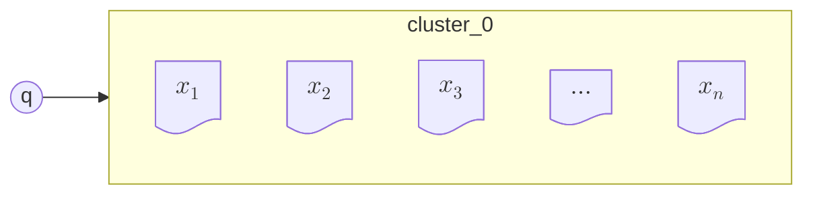
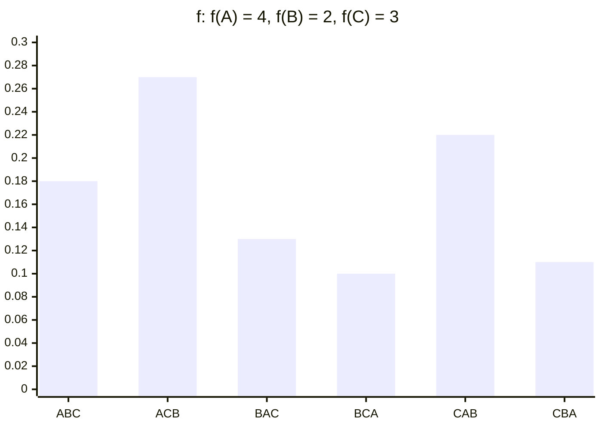
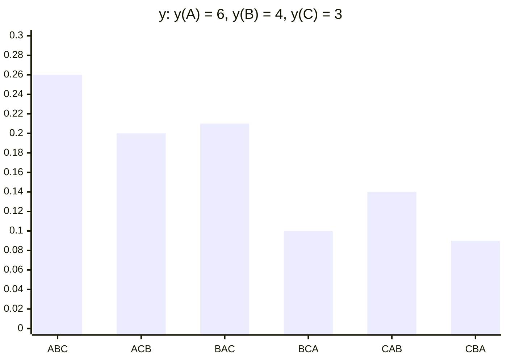
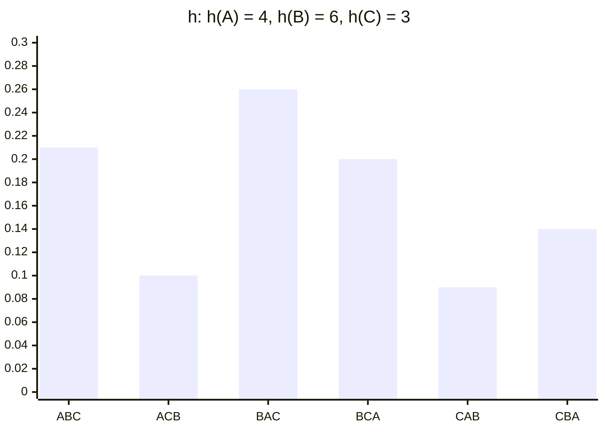

# Aula 18 - 21/05/2025 - Learning to Rank: Algorithms; Learning to Rank: Pairwise and Listwise

- [JV]
  - São áreas ativas há décadas
  - Ele vai liberar a próxima atividade na quarta feira

## The ranking problem

- q -. d
- f(q, d)
- [JV] Aprendizado supervisionado

## Learning to rank

- q -. d
- $f(x)$

---

- Feature-based representation
  - Individual models as ranking "features"
- Discriminative learning
  - Effective models learned from data
  - Aka machine-learned ranking
- [JV]
  - Combina várias features para gerar um ranking final
  - Junta várias ideias de aprendizado de máquina

## Pointwise approach

- Several approaches
  - Regression-based
  - Classification-based
  - Ordinal regression-based
- [Representation:]
  - $q \to x_1, x_2, x_3, \ldots, x_n$
  - $\{(x_1, y_1), (x_2, y_2), (x_3, y_3), \ldots, (x_n, y_n)\}$
- [JV]
  - Cada documento é tratado como uma instância independente.
  - Durante o treinamento já definimos quais documentos são relevantes para dadas consultas.
  - Temos pares: (vetor de features, relevante ou não) para cada query
  - Já temos várias abordagens funcionais
  - porém "Dá pra melhorar" ™️

### Limitations of the pointwise approach

- Ranking requires getting relative scores right
  - Pointwise approaches learn absolute scores
- Higher positions should matter more than lower ones
  - Pointwise loss functions are agnostic to positions
- Queries should be equally important
  - Queries with many relevant documents dominate
- [JV]
  - A limitação é a tentativa de dar um score, mas isso não necessariamente gera uma boa função de ranking.
  - Poderia penalizar mais os que estão no topo e menos os que estão no fundo.
  - Deve-se também considerar os possíveis erros de classificação dos documentos nas várias consultas

## Pairwise approach

- Pairwise classification-based
  - RankNet
  - RankBoost
  - Ranking SVM
  - IR-SVM
- [Training data format]
  - $\{(x_1, x_2, 1), (x_2, x_1, 0), (x_1, x_3, 1), (x_3, x_1, 0), \ldots, (x_{n-1}, x_n, 1), (x_n, x_{n-1}, 0)\}$
- [JV] Pelo que entendi, basicamente tá definindo uma ranqueamento por "O primeiro é melhor que o segundo? Sim ou não."

### Pairwise classification-based [JV]

#### RankNet (Burges et al., ICML 2005)

- Shallow (2-layer) neural network
  - Sigmoid activations
- Gradient descent optimizer

<!-- Celoko, não compensa -->

<!--
graph LR
  A((" "))
  B01((" "))
  B02((" "))
  B03((" "))
  B04((" "))
  B05((" "))
  B06((" "))
  B07((" "))
  B08((" "))
  B09((" "))
  B10((" "))
  B11((" "))
  B12((" "))
  B13((" "))
  C01[" "]
  C02[" "]
  C03[" "]
  C04[" "]
  C05[" "]
  C06[" "]
  C07[" "]
  C08[" "]
  C09[" "]
  C10[" "]
  C11[" "]
  C12[" "]
  C13[" "]
  C14[" "]
  C15[" "]
  C16[" "]
  C17[" "]
  C18[" "]
  C19[" "]
  C20[" "]
  C21[" "]
  C22[" "]
  C23[" "]
  C24[" "]
  C25[" "]
  C26[" "]
  C27[" "]
  C28[" "]
  C29[" "]
  C30[" "]

  A --\> B01 & B02 & B03 & B04 & B05 & B06 & B07 & B08 & B09 & B10 & B11 & B12 & B13

B01 --\> C01 & C02 & C03 & C04 & C05 & C06 & C07 & C08 & C09 & C10
B01 --\> C11 & C12 & C13 & C14 & C15 & C16 & C17 & C18 & C19 & C20
B01 --\> C21 & C22 & C23 & C24 & C25 & C26 & C27 & C28 & C29 & C30

B02 --\> C01 & C02 & C03 & C04 & C05 & C06 & C07 & C08 & C09 & C10
B02 --\> C11 & C12 & C13 & C14 & C15 & C16 & C17 & C18 & C19 & C20
B02 --\> C21 & C22 & C23 & C24 & C25 & C26 & C27 & C28 & C29 & C30

B03 --\> C01 & C02 & C03 & C04 & C05 & C06 & C07 & C08 & C09 & C10
B03 --\> C11 & C12 & C13 & C14 & C15 & C16 & C17 & C18 & C19 & C20
B03 --\> C21 & C22 & C23 & C24 & C25 & C26 & C27 & C28 & C29 & C30

B04 --\> C01 & C02 & C03 & C04 & C05 & C06 & C07 & C08 & C09 & C10
B04 --\> C11 & C12 & C13 & C14 & C15 & C16 & C17 & C18 & C19 & C20
B04 --\> C21 & C22 & C23 & C24 & C25 & C26 & C27 & C28 & C29 & C30

B05 --\> C01 & C02 & C03 & C04 & C05 & C06 & C07 & C08 & C09 & C10
B05 --\> C11 & C12 & C13 & C14 & C15 & C16 & C17 & C18 & C19 & C20
B05 --\> C21 & C22 & C23 & C24 & C25 & C26 & C27 & C28 & C29 & C30

B06 --\> C01 & C02 & C03 & C04 & C05 & C06 & C07 & C08 & C09 & C10
B06 --\> C11 & C12 & C13 & C14 & C15 & C16 & C17 & C18 & C19 & C20
B06 --\> C21 & C22 & C23 & C24 & C25 & C26 & C27 & C28 & C29 & C30

B07 --\> C01 & C02 & C03 & C04 & C05 & C06 & C07 & C08 & C09 & C10
B07 --\> C11 & C12 & C13 & C14 & C15 & C16 & C17 & C18 & C19 & C20
B07 --\> C21 & C22 & C23 & C24 & C25 & C26 & C27 & C28 & C29 & C30

B08 --\> C01 & C02 & C03 & C04 & C05 & C06 & C07 & C08 & C09 & C10
B08 --\> C11 & C12 & C13 & C14 & C15 & C16 & C17 & C18 & C19 & C20
B08 --\> C21 & C22 & C23 & C24 & C25 & C26 & C27 & C28 & C29 & C30

B09 --\> C01 & C02 & C03 & C04 & C05 & C06 & C07 & C08 & C09 & C10
B09 --\> C11 & C12 & C13 & C14 & C15 & C16 & C17 & C18 & C19 & C20
B09 --\> C21 & C22 & C23 & C24 & C25 & C26 & C27 & C28 & C29 & C30

B10 --\> C01 & C02 & C03 & C04 & C05 & C06 & C07 & C08 & C09 & C10
B10 --\> C11 & C12 & C13 & C14 & C15 & C16 & C17 & C18 & C19 & C20
B10 --\> C21 & C22 & C23 & C24 & C25 & C26 & C27 & C28 & C29 & C30

B11 --\> C01 & C02 & C03 & C04 & C05 & C06 & C07 & C08 & C09 & C10
B11 --\> C11 & C12 & C13 & C14 & C15 & C16 & C17 & C18 & C19 & C20
B11 --\> C21 & C22 & C23 & C24 & C25 & C26 & C27 & C28 & C29 & C30

B12 --\> C01 & C02 & C03 & C04 & C05 & C06 & C07 & C08 & C09 & C10
B12 --\> C11 & C12 & C13 & C14 & C15 & C16 & C17 & C18 & C19 & C20
B12 --\> C21 & C22 & C23 & C24 & C25 & C26 & C27 & C28 & C29 & C30

B13 --\> C01 & C02 & C03 & C04 & C05 & C06 & C07 & C08 & C09 & C10
B13 --\> C11 & C12 & C13 & C14 & C15 & C16 & C17 & C18 & C19 & C20
B13 --\> C21 & C22 & C23 & C24 & C25 & C26 & C27 & C28 & C29 & C30
-->

---

- Pairwise prediction probability:
  - $\hat{y}_{uv} = f(x_u, x_v) = \frac{\exp(f(x_u) - f(x_v))}{1 + \exp(f(x_u) - f(x_v))}$
    - (logistic function)
- Cross entropy loss:
  - $\mathcal{L}(f; x_u, x_v, y_{uv}) = -y_{uv} \log \hat{y}_{uv} - (1 - y_{uv}) \log (1 - \hat{y}_{uv})$
    - $y_{uv}$: relevant
    - $\hat{y}_{uv}$: predicted relevant
    - $1 - y_{uv}$: not relevant
    - $1 - \hat{y}_{uv}$: predicted not relevant
- [JV] Na entrada são as features de um único documento por vez. Porém essa função é aplicada paralelamente para os documentos $x_u$ e $x_v$
  - Os outputs da rede neural são números reais
  - Cross Entropy Loss (Entropia Cruzada)
    - Busca minimizar a entropia da rede.
    - Consideremos o label como "1" para $x_u > x_v$ verdadeiro.
    - Na prática, só uma das parcelas da equação vai ser ativada e calculada, porque o $y$ só será 1 ou 0.
    - Se acerta, não penaliza nada.
    - Analisar para $\{0, 1\}^2$
    - Quando erra, o log de algo próximo a 0 tende a infinito.
  - A ideia é que use-se o par para treinar a função pairwise, que será o resultado final: uma função de ranqueamento.

#### Ranking SVM (Herbrich et al., ALMC 2000; Joachims, KDD 2002)

```mermaid
xychart-beta
  title "Hinge Loss"
  x-axis "$$y_{u, v}(f(x_u) - f(x_v))$$" [-2, -1, 0, 1, 2]
  y-axis "Hinge Loss" 0 --> 3
  line [3, 2, 1, 0]
```

- Hinge loss:
  - $\mathcal{L}(f; x_u, x_v, y_{uv}) = \max(0, 1 - y_{uv}(f(x_u) - f(x_v)))$
- Nice properties inherited from standard SVM
  - Good generalization via margin maximization
  - Non-linear models via kernel trick
- [JV]
  - Busca encontrar uma "superfície de separação de mais alta margem"
  - Multiplicar rótulos positivos e negativos, se previu certo, dá positivo, senão, negativo ($1 \cdot 1$ vs $-1 \cdot -1$)
  - Na Hinge loss, mesmo quando acerta ainda há loss; Só após uma margem de segurança que passa a não ter loss.
  - É importante lembrar que às vezes os rótulos são 0 e 1, às vezes são -1 e 1.

##### Kernel Trick

- [Imagens mt maneiras de mudança de dimensão]
  - [JV]
    1. A imagem original mostra 3 círculos concêntricos onde cada um deles é de uma cor. O mais interno é preto, o segundo é vermelho e o mais externo é verde.
    2. A segunda imagem mostra uma distribuição de vulcão, onde o grupo preto se encontra centralizado embaixo, o vermelho está um pouco acima, e o verde um pouco mais espalhado no topo.
    3. A terceira imagem parece estar em formato de maçã, onde o grupo preto está no topo em uma faixa horizontal, o vermelho está abaixo dele também em uma faixa horizontal, e o verde está abaixo dos outros dois grupos, mas mais denso.

#### Limitations of the pairwise approach

- Pairwise labels ignore graded relevance
  - $(x_1, x_2, 1)$, regardless of the grades of $x_1$ and $x_2$
- Query dominance exacerbated
  - A query with more documents will have exponentially more pairs
- Ranking positions still not taken into account
  - Swaps at the top are more important than at the bottom
- [JV] Ignora-se o quão intensas são as relações entre os itens

## Can we optimize ranking metrics directly?

- [JV] Por que usar Loss functions e não a própria função?

### Ranking metrics generally non-differentiable

```mermaid
xychart-beta
  title "step function"
  x-axis "$$f_\theta(x)$$" [0, 1, 1, 3, 3, 4, 4, 5, 5, 7]
  y-axis "nDCG" 0 --> 5
  line [2, 2, 4, 4, 3, 3, 1.8, 1.8]
```

- Piecewise constant functions

  - **Flat:** zero derivative
  - **Discontinuous:** undefined derivative

- [JV]
  - Piecewise constant functions
  - O nDCG por exemplo não é diferenciável
  - Quando o score nDCG reduz, significa que um menos relevante foi posto na frente de um mais relevante.
  - Nos degraus, as derivadas são zero. Se usamos modelos que usam a derivada como passo de correção, não daria certo. O mesmo quando tem salto, que aí é indeterminado (?)

### LambdaRank (Burges, NIPS 2006)

- An extension of RankNet
  - Ranking evaluation metrics (which are position-based) are directly used to define the gradient with respect to each document pair in the training process
- Why is it feasible to directly define the gradient?
- [JV]
  - Evolução do RankNet
  - Pode gerar esse gradiente esperado

---

- [Imagem]
  - a imagem descreve dois documentos, $x_1$ e $x_2$, onde o $x_1$ está mais no topo e tem um maior potencial de subir no ranking do que o $x_2$.
  - Ao redor deles estão vários documentos irrelevantes.
  - E então é apresentada a fórmula:
    - $\frac{\partial L}{\partial s_1} = \frac{\partial L}{\partial s_2}$
- [JV] Geralmente alterações em documentos mais relevantes terão maior impacto do que os que estão mais abaixo.

---

- Gradient determines magnitude of updates
  - $w = w - \alpha \nabla \mathcal{L}(w)$
- Vector $\nabla \mathcal{L} \left( \frac{\partial \mathcal{L}(w)}{\partial w_1}, \frac{\partial \mathcal{L}(w)}{\partial w_2}, \ldots, \frac{\partial \mathcal{L}(w)}{\partial w_d} \right)$
  - $\frac{\partial}{\partial w_k} \mathcal{L}(w) = \sum_{\langle u, v \rangle} \lambda_{uv} x_k^{(i)}$
  - $\lambda_{uv}$$: gradient magnitude (prediction error)
  - $x_k^{(i)}$: $k^{th}$ feature score
- [JV] Verifica-se o impacto de um swap entre documentos

---

- Lambda function
  - An arbitrary surrogate for the gradient magnitude, assuming no particular loss function
  - $\lambda_{uv} \equiv \frac{2^{y_u} - 2^{y_v}}{1 + \exp(f(x_u) - f(x_v))} |\Delta\text{nDCG}(x_u, x_v)|$
- [JV] Delta nDCG é a intensidade do swap entre documentos

### LambdaMART (Wu et al., Tech. Report 2008)

- MART = Multiple Additive Regression Trees
  - Commercial name for gradient boosted trees
- Boosted tree version of LambdaRank
  - Lambda functions guide the construction of weak learners (regression trees) via boosting
  - $h_t^* = \text{argmin}_{h_t} \sum_{(x,y)} (h_t(x) - (-\alpha \nabla L(f_t))^2)$
- [JV] Gera uma nova árvore que maximiza a lambda function relacionado ao nDCG

## Listwise approach

- Metric-specific loss
  - Optimize evaluation metrics
- Non-metric-specific loss
  - Optimize other listwise functions
- [JV] Duas famílias: otimização por métrica de avaliação como nDCG



- $\{(x, y)\}$

### Metric-specific listwise ranking

- It is natural to directly optimize what is used to evaluate the ranking results, but not trivial
  - Evaluation metrics such as nDCG and MAP are non-continuous and non-differentiable
  - Most optimization techniques were developed to handle continuous and differentiable cases
- [JV] Como tornar uma loss function diferenciável? Pensar num proxy.

<!-- Where did it even come from? -->

<!--
### Challenges in metric-specific ranking

- Evaluation metrics (nDCG, MAP) are non-differentiable
- Solutions:
  - Soften metrics (SoftRank)
  - Genetic programming (RankGP)
  - Boosting (AdaRank)
-->

#### SoftRank (Taylor et al., WSDM 2008)

- Key idea: "soften" the evaluation metric
  - [JV] Ideia: suavizar o score em uma variável aleatória de distribuição.
- Score $s_i$ as a random variable

  - $P(s_i) = N(s_i \mid f(x_i), \sigma_s^2)$

- [Imagens]
  - [Imagem 1]
    - Scores $s \times P(s)$: Scores fixos em:
      - $s_1 = -0.1$
      - $s_2 = 0$
      - $s_3 = 0.4$
  - [Imagem 2]
    - Scores $s \times P(s)$: Scores suavizados em curvas de sino.

---

- We've constructed a score distribution per rank
  - Non-deterministic scores make it possible to find a document in any ranking position
- Map score distribution to rank distribution
- [Imagem]

  - [Imagem 1]
    - Distribuição de scores sem suavização
  - [Imagem 2]
    - Distribuição de scores suavizada

- [JV] O softrank, com a distribuição, amostram-se várias vezes e daí consegue-se uma média, não entendi exatamente de que forma no final vira uma função amena.

---

```mermaid
xychart-beta
  title "step function"
  x-axis "$$f_\theta(x)$$" [0, 1, 1, 3, 3, 4, 4, 5, 5, 7]
  y-axis "**soft** nDCG" 0 --> 5
  line [2, 2, 4, 4, 3, 3, 1.8, 1.8]
```

- [Imagem]

  - Imagine que o gráfico acima tem uma curva mais suave passando próximo à linha

- Now each document has a non-deterministic position
  - Each draw results in a permut
  - Each permut. has a given nDCG
- Compute SoftNDCG as the expected nDCG over all possible permutations (smooth and differentiable)
- Optimize via gradient descent

### Metric-specific listwise ranking (2)

- Workarounds
  - Soften or upper-bound non-smooth objective
- Optimize the non-smooth objective directly
  - Use genetic programming (RankGP)
  - Use ranking evaluation metric to update the training data distribution via boosting (AdaRank)

#### AdaRank (Xu and Li, SIGIR 2007)

- **Algorithm 2:** Learning Algorithms for AdaRank
  - **Input:** document group for each query
  - **Given:** initial distribution $\mathcal{D}_1$ on input queries [1]
  - **For** $t = 1, \dots, T$
    - Train weak ranker $f_t(\cdot)$ based on distribution $\mathcal{D}_t$ [2]
    - Choose $\alpha_t = \frac{1}{2} \log \frac{\sum_{i=1}^n \mathcal{D}_t(i) (1 + M(f_t, x^{(i)}, y^{(i)}))}{\sum_{i=1}^n \mathcal{D}_t(i) (1 - M(f_t, x^{(i)}, y^{(i)}))}$ [2]
    - Update $\mathcal{D}_{t+1} (i) = \frac{\exp(-M(\sum_{s=1}^t \alpha_s f_s,x^{(i)},y^{(i)}))}{\sum_{j=1}^n \exp(-M(\sum_{s=1}^t \alpha_s f_s,x^{(j)},y^{(j)}))}$ [3]
  - **Output:** $\sum_{t} \alpha_t f_t(\cdot)$
- [JV] Comentários sobre o código
  - [1] Training set biased by query difficulty
  - [2] Single-feature weak ranker
  - [3] Weighted Accuracy of $f_t$
  - [4] Update difficulty estimates

### Non-metric-specific listwise ranking

- Defining listwise loss functions based on the understanding of unique properties of ranking
- Representative algorithms:
  - ListNet
  - ListMLE
  - BoltzRank

#### Ranking loss is non-trivial

- An example
  - Function $f: f(A) = 4, f(B) = 2, f(C) = 3$ (ACB)
  - Function $h: h(A) = 4, h(B) = 6, h(C) = 3$ (BAC)
  - Ground-truth $y: y(A) = 6, y(B) = 4, y(C) = 3$ (ABC)
- Which function ($f$ or $h$) is closer to the ground-truth?

  - According to nDCG, $f$ should be closer to $y$!

- [JV] Em termos absolutos eles são igualmente bons ou ruins

#### ListNet (Cao et al., ICML 2007)

- Given $f: f(A) = 4, f(B) = 2, f(C) = 3$
  - Deterministically: $P(ACB) = 1$
- What if other permutations have a non-zero probability?
  - For a $k$-permutation $\pi_k$ under function $f$
  - $P_f(\pi_k) = \frac{f(\pi_1)}{\sum_{i=1}^{k} f(\pi_i)} \times \frac{f(\pi_2)}{\sum_{i=2}^{k} f(\pi_i)} \times \ldots \times \frac{f(\pi_{k-1})}{\sum_{i=k-1}^{k} f(\pi_i)}$
- [JV]
  - Calcular scores sobre permutações.
  - o f(B)/f(B) daria 1, por isso tá omitida.
  - Em teoria da informação, pode-se comparar a divergência entre distribuições

---

- Given $f: f(A) = 4, f(B) = 2, f(C) = 3$
  - Deterministically: $P(ACB) = 1$
- What if other permutations have a non-zero probability?
  - Probabilistically: $P(ACB) = \frac{f(A)}{f(A) + f(C) + f(B)} \times \frac{f(C)}{f(C) + f(B)} = \frac{4}{4+2+3} \times \frac{2}{2+3} = 0.27$

### Distance between ranked lists







- $D(P_y || P_f) = 0.10$
- $D(P_y || P_h) = 0.14$
- $f$ is closer!

### KL Divergence Loss

- Loss function = KL-divergence between two permutation probability distributions $\varphi = \exp$
  - $\mathcal{L}(f; x, y) = D(P_\varphi(y) || P_\varphi(f(x)))$
  - $P_\varphi(y)$: ground-truth probability distribution
  - $P_\varphi(f(x))$: predicted probability distribution
- Neural net model, gradient descent optimizer
- [JV] Quanto maior a divergência, pior é.

## Summary

- Listwise approaches more closely model ranking
  - Take all the documents associated with the same query as one learning instance
  - Ranking position is visible to the loss function
- State-of-the-art on standard benchmarks (LETOR)

  - Particularly effective for top-heavy evaluation

- [JV]
  - Comparar pares vs comparar listas
  - "Escolher o martelo mais adequado pro problema"
  - Podemos otimizar função de ranking pelo caso de uso?
  - LETOR: fornecem datasets para benchmarks

## RankLib tutorial

- RankLib v2.18
  - `0: MART (gradient boosted regression tree)`
  - `1: RankNet`
  - `2: RankBoost`
  - `3: AdaRank`
  - `4: Coordinate Ascent`
  - `6: LambdaMART`
  - `7: ListNet`
  - `8: Random Forests`
- [JV] Uma das primeiras e mais robustas

---

- [SourceForge](https://sourceforge.net/p/lemur/wiki/RankLib%20How%20to%20use/)
  - [JV] PA3: usaremos ferramentas prontas e teremos uma competição no Kaggle
- Usage example:

```bash
java -jar bin/RankLib-2.18.jar \
  -train MQ2008/Fold1/train.txt \
  -validate MQ2008/Fold1/vali.txt \
  -test MQ2008/Fold1/test.txt \
  -ranker 6\
  -metric2t NDCG@10 \
  -metric2T ERR@10 \
  -save mymodel.txt
```

## References

- [[2011 Liu]][2011_Liu] Learning to rank for information retrieval Liu, 2011
- [[2014 Li]][2014_Li] Learning to rank for information retrieval and natural language processing Li, 2014
- [[2011 Grang]][2011_Grang] Learning for Web rankings Grangier and Paiement, 2011

[2011_Liu]: https://doi.org/10.1007/978-3-642-14267-3
[2014_Li]: https://doi.org/10.1007/978-3-031-02155-8
[2011_Grang]: https://david.grangier.info/tutorials/rankings/grangier-sept-2011.pdf

## Coming next: Neural Models
