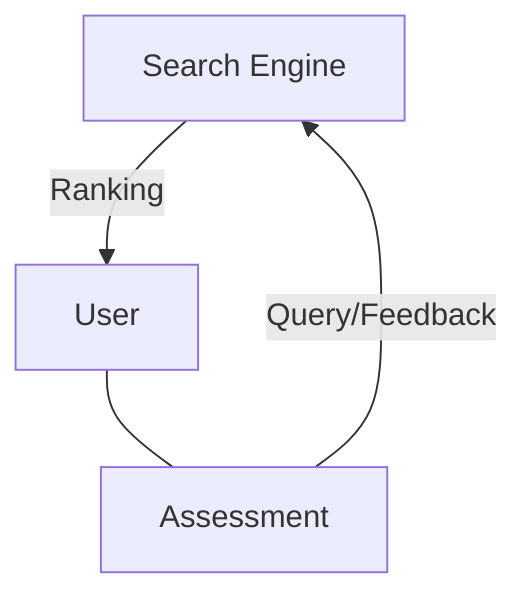

# Information Retrieval Online Learning to Rank

## The ranking problem

- [Image: Diagram showing query q processed by function f(q,d) to output document d]

### Learning to rank

- [Image: Diagram showing query q processed by function f(x) to output document d]

---

- Feature-based representation
  - Individual models as ranking "features"
- Discriminative learning
  - Effective models learned from data
  - Aka machine-learned ranking

#### Discriminative learning framework

- [Image: Training workflow diagram with queries q1-q3 for training, learning function f(·), validation/test on queries q4-qk]

  - Training: Queries $q_1, q_2$ com rótulos $y$
  - Validation: Query $q_3$ com rótulo $y$
  - $Validation \to Learning \to f(·) \to Scoring \to Test$
  - Test: Queries $x$, rótulos $\hat{y} = f(x)$, onde $x$ são as queries $q_4, q_5, ..., q_k$

##### Drawbacks

- Scalability
  - Relevance labels are costly
  - More so if expert labels are needed
- Realism
  - Hired judges aren't real users
    - [JV] Eles estão em um contexto diferente dos usuários reais.
  - Real users' preferences are contextualized

---

[Image: Idosos usando computador (representando rotuladores humanos)]

###### Contextualized preferences

- Context has a significant influence on search behavior
  - Addressing all possible settings individually through supervised learning is not feasible
- Can't sacrifice users while learning ranking models
  - Need to look for scalable methods that can learn effective rankings without expensive tuning

## Online learning to rank

- Learn directly from natural interactions with users
  - Typically implicit feedback (e.g., clicks)
- Update learned models incrementally
  - Sequential as opposed to batch learning
- Continuously adapt as interactions progress
  - From "random" to fine-tuned rankings

---



## Reinforcement learning

```mermaid
graph TD
  A[Search Engine (agent)]
  B[User (environment)]
  C[Assessment (reward $r_t$)]

  A -->|Ranking (action $a_t$)| B
  B --- C
  C -->|Query/Feedback (state $s_t$)| A
```

---

- At each discrete time step $t$
  - Agent observes state $S_t$
  - Agent selects action $a_t$
  - Environment provides reward $r_t$
  - Environment moves to a new state $S\_{t+1} $
- Goal is to maximize cumulated reward as $t \to \infty $

---

[Image: Google DeepMind Challenge Match - AlphaGo vs Lee Sedol]

## Exploration-exploitation trade-off

- Exploration
  - Reward is only provided for the selected action
  - We want to uncover other rewarding actions
- Exploitation
  - Pure exploration risks selecting unrewarding actions
  - We want to maximize total reward in the long run

## Reinforcement learning for ranking

- Online learning to rank as a bandit problem
  - State ($s_t$) does not depend on past actions
- Multi-armed bandits (MAB)
  - State is not provided

---

[Image: Multi-armed bandit machine illustration]

---

- Online learning to rank as a bandit problem
  - State ($s_t$) does not depend on past actions
- Multi-armed bandits (MAB)
  - State is not provided
- Contextual bandits
  - State (context vector) is provided

## Multi-armed bandits

- No state (e.g., query or user profile) is provided
  - Fits well with non-personalized recommendation
- Example: homepage news recommendation
  - New user arrives, recommender returns a news story ($a_t$) to show, observes whether user clicks ($r_t$)
  - Goal: maximize clicks in a given period

### Example: $\epsilon$-greedy

- Simple strategy
  - Explore with probability $\epsilon \in [0,1]$
  - Exploit with probability $1 - \epsilon$
- Often works well in practice
  - With hyperparameter $\epsilon$ suitably tuned

### Example: UCB

- True reward distribution of an action is unknown
  - We can only observe samples $r$ of it
  - Each observed sample increases our confidence
- Idea: explore actions with large confidence bounds
  - Try the action $a_x$ that maximizes $\bar{r_x} + \sqrt{(2 \ln n)/n_x}$
    for an average reward $\bar{r_x}$ after $n_x$ observations

### Contextual bandits

- State (context) does not depend on past actions
  - Fits well with independent user searches
- Example: (stateless) web search
  - User submits a query ($s_t$)  
    ◦ Search engine displays a ranking ($a_t$)  
    ◦ Observes if/where the user clicks ($r_t$)
  - Goal: maximize ranking quality in a given period

---

- $k$-armed contextual bandits
  - Find the best among $k$ ranking models
    (e.g., $k - 1$ candidate models vs. current best model)
- Continuous-armed contextual bandits
  - Find the best among infinite ranking models
    (i.e., feature-based ranking models)

## How to infer ranking quality implicitly?

- **Problem:** Rewards aren't directly measurable

### Absolute metrics

- Document-level
  - Click rate, click models
- Ranking-level
  - Reciprocal rank, CTR@k, time-to-click, abandonment
- Session-level
  - Queries per session, session length, time to first click

### Relative metrics

- Absolute document-level metrics are biased
  - Position bias: top ranked document favored
  - Presentation bias: highlighted documents favored
- Relative document-level metrics are less affected
  - Click-skip, fair pairs
- Better: relative ranking-level metrics!

#### Interleaved comparisons [Joachims, KDD 2002]

- Blend results from both conditions into a single ranking
- [Image: Diagram showing ranking A vs. B blended into AB]

---

- Hide provenance from the user and collect feedback
- [Image: Diagram showing user interacting with blended ranking AB]

---

- Assign credit based on clicks
  - e.g., B wins over A
- [Image: Diagram showing credit assignment to ranking B]

#### Dueling bandit gradient descent (DBGD) [Yue et al., ICML 2009]

- [Image: Diagram comparing two rankings with different document orders]
  - Gráfico $\mathbb{R}^3: PageRank \times BM25 \times #Clicks$
  - Um vetor vai a um ponto no XY com altura 1, e outro vetor vai a um outro ponto no XY com altura 2 a uma distância do primeiro ponto.
- [Image: Distribuição dos itens nos dois rankings que são mesclados]

---

- [Image: Mesma imagem que antes com as colunas, mas sem as colunas]

---

- **ALGORITHM 2:** Dueling Bandit Gradient Descent (DBGD)
- **Require:** $\alpha, \delta, \mathbf{w}_0^0$
  - **for** $t \to 1...\infty$ **do**
    - $q_t \to receive\_query(t)$ `// obtain a query from a user`
    - $l_0 \to generate\_list(\mathbf{w}_t^0, q_t)$ `// ranking of current best`
    - $u_t^1 \to sample\_unit\_vector()$
    - $w_t^1 \to \mathbf{w}_t^0 + \delta u_t^1$ `// create a candidate ranker`
    - $l_1 \to generate\_list(\mathbf{w}_t^1, q_t)$ `// exploratory ranking`
    - $m_t, t_t \to TDI\_interleave(1)$ `// interleaving and teams`
    - $c_t \to receive\_clicks(m_t)$ `// show interleaving to the user`
    - $b_t \to TDI\_infer(t_t, c_t)$ `// set of winning candidates`
  - **if** $\mathbf{w}_t^0 \in b_t$ **then**
    - $\mathbf{w}_{t+1}^0 \to \mathbf{w}_t^0$ `// if current best wins or ties`
  - **else**
    - $\mathbf{w}_{t+1}^0 \to \mathbf{w}_t^0 + \alpha u_t^1$ `// update $\alpha$ step towards candidate`

---

- DBGD explores one direction at a time
  - Exploring multiple directions could improve efficiency
- Interleaving requires pairwise comparisons
  - Quadratic on the number of candidate models
- Multileaving to the rescue
  - Credit clicks independently, declare winner(s)

## Multileave gradient descent (MGD) [Schuth et al., WSDM 2016]

- [Image: Diagram showing multiple interleaved rankings]

---

- **Winner takes all (MGD-W)**
  - Randomly choose one of the winning models
- **Mean winner (MGD-M)**
  - Use the average of the winning models
- [Image: PageRank X BM25]

---

- **ALGORITHM 10:** Multileave Gradient Descent (MGD)
- **Require:** $n, \alpha, \delta, w^0_t, update(w, \alpha, \{b\}, \{u\})$
  - **for** $t \gets 1..\infty$ **do**
    - $q_t \gets receive\_query(t)$ `// obtain a query from a user`
    - $l_0 \gets generate\_list(w^0_t, q_t)$ `// ranking of current best`
    - **for** $i \gets 1...n$ **do**
      - $u^i_t \gets sample\_unit\_vecgetsr()$
      - $w^i_t \gets w^0_t + \delta u^i_t$ `// create a candidate ranker`
      - $l^i_t \gets generate\_list(w^i_t, q_t)$ `// exploratory ranking`
    - $m_t, t_t \gets TDM\_multileave(l_t)$ `// multileaving and teams`
    - $c_t \gets receive\_clicks(m_t)$ `// show multileaving to the user`
    - $b_t \gets TDM\_infer(t_t, c_t)$ `// set of winning candidates`
  - **if** $w^0_t \in b_t$ **then**
    - $w^0_{t+1} \gets w^0_t$ `// if current best among winners, no update`
  - **else**
    - $w^0_{t+1} \gets update(w^0_t, \alpha, b_t, u_t)$ `// Algorithm 11 or 12`

## Summary

- Online learning helps improve implicit metrics
  - Explicit metrics still important – don't fire assessors!
- Research on MAB mostly focused on absolute feedback
  - Relative feedback methods improve sensitivity
- Inter- and multileaving further improves
  - Orders of magnitude faster convergence

## Open directions

- Choosing among infinitely many models
  - Probabilistic multileave gradient descent
- Online learning of non-linear models
  - e.g., regression trees, neural networks
- Online learning from offline data
  - Counterfactual learning to rank

## References

- Fast and reliable online learning to rank for information retrieval
  [Hofmann, PhD thesis 2013](https://khofm.wordpress.com/wp-content/uploads/2013/04/thesis-katja-hofmann-online-learning.pdf)
- Search engines that learn from their users
  [Schuth, PhD thesis 2016](https://anneschuth.nl/thesis/)

---

- Online learning to rank for information retrieval
  [Grotov and de Rijke, SIGIR 2016](https://doi.org/10.1145/2911451.2914798)
- Interactively optimizing information retrieval systems as a dueling bandits problem
  [Yue and Joachims, ICML 2009](https://doi.org/10.1145/1553374.1553527)

## Coming next... Seminars
