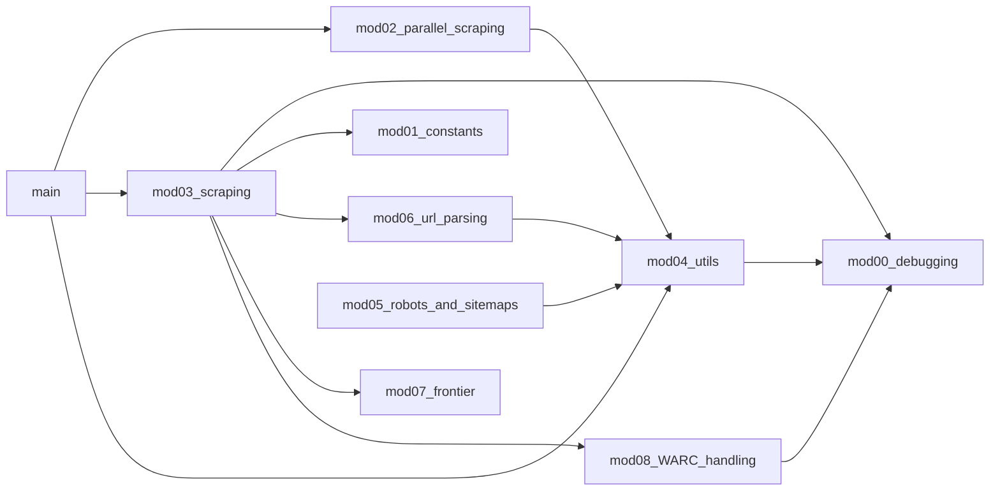

# Importing

```mermaid
flowchart LR
    main --> mod02_parallel_scraping
    main --> mod03_scraping
    main --> mod04_utils

    mod02_parallel_scraping --> mod04_utils

    mod03_scraping --> mod00_debugging
    mod03_scraping --> mod01_constants
    mod03_scraping --> mod06_url_parsing
    mod03_scraping --> mod07_frontier
    mod03_scraping --> mod08_WARC_handling

    mod04_utils --> mod00_debugging

    mod05_robots_and_sitemaps --> mod04_utils

    mod06_url_parsing --> mod04_utils

    mod08_WARC_handling --> mod00_debugging
```
